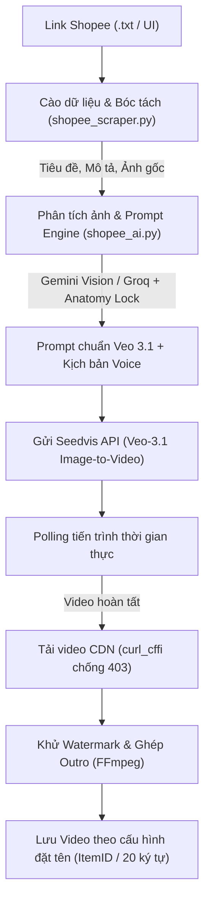
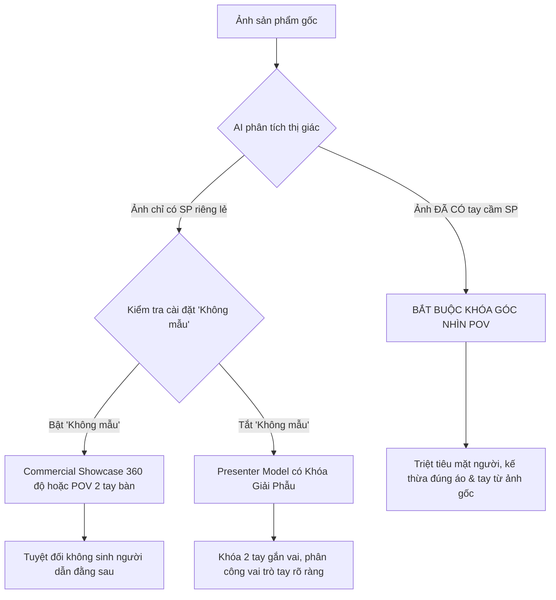

# TÀI LIỆU TOÀN DIỆN HỆ THỐNG AUTOSEEDVIS (VEO 3.1)
**Hệ thống Tự động hóa Toàn diện Sản xuất Video Shopee Affiliate bằng Trí tuệ Nhân tạo**

---

## 1. TỔNG QUAN KIẾN TRÚC HỆ THỐNG

### 1.1 Mục tiêu & Phạm vi
`AutoSeedvis` là giải pháp phần mềm độc lập chuyên dụng nhằm tự động hóa 100% quy trình sản xuất video ngắn (TikTok, Reels, Shopee Video) từ danh sách link sản phẩm Shopee. 

Hệ thống tích hợp trực tiếp:
- **Cào dữ liệu Shopee thông minh**: Vượt tường lửa DataDome WAF, tải ảnh gốc độ nét cao và toàn bộ mô tả chi tiết sản phẩm.
- **Prompt Engineering thông minh bằng AI**: Sử dụng Gemini Multimodal Vision (hoặc Groq Llama 3) soi ảnh gốc, phân tích mô tả sản phẩm để viết kịch bản viral và prompt chi tiết cho Veo 3.1.
- **Khóa giải phẫu bàn tay & góc nhìn logic (Anatomy & Perspective Lock)**: Triệt tiêu hoàn toàn lỗi 3 tay, tay ma lơ lửng, bàn tay dị tật hoặc thừa thiếu ngón.
- **Tạo video qua Seedvis API (Google Veo 3.1)**: Điều phối đa luồng, polling trạng thái thời gian thực.
- **Xử lý hậu kỳ tự động**: Tải video vượt rào cản CDN, tự động xóa logo/watermark và ghép nối outro 12s bằng FFmpeg.



### 1.2 Cấu trúc Thư mục Codebase
```
E:\ThinAptm0707\AutoSeedvis\
├── app.py                  # Giao diện chính (CustomTkinter), luồng worker điều phối
├── shopee_scraper.py       # Module cào dữ liệu Shopee, bypass DataDome WAF
├── shopee_ai.py            # AI Prompt Engine (Gemini Vision / Groq) + Khóa giải phẫu
├── shopeevideo.py          # Thư viện template prompt, transform POV & TTS fallback
├── watermark_remover.py    # Xử lý khử logo/watermark video
├── engine.py               # Định nghĩa model và thông số video
├── prompt_templates.py     # Template prompt mở rộng
├── log.txt                 # Nhật ký phiên làm việc (tự động xóa trắng khi khởi động)
├── settings.json           # Cấu hình lưu trữ phiên làm việc
└── temp_render/            # Thư mục đệm ảnh, video tạm (tự dọn dẹp định kỳ)
```

---

## 2. THUẬT TOÁN CÀO DỮ LIỆU SHOPEE & BYPASS WAF (`shopee_scraper.py`)

### 2.1 Xử lý và Chuẩn hóa Link Shopee
Hệ thống chấp nhận tất cả các định dạng URL của Shopee:
- Dạng rút gọn: `https://s.shopee.vn/xxxxxx` (tự động giải mã redirect theo dõi `Location` header).
- Dạng chi tiết: `https://shopee.vn/product/{shop_id}/{item_id}`.
- Dạng slug: `https://shopee.vn/{product-slug}-i.{shop_id}.{item_id}`.

Thuật toán Regex bóc tách `item_id`:
```python
import re
m = re.search(r'product/\d+/(\d+)|-i\.\d+\.(\d+)', url)
item_id = m.group(1) or m.group(2) if m else None
```

### 2.2 Kỹ thuật TLS Fingerprint Impersonation (Bypass DataDome WAF)
Shopee bảo vệ website bằng tường lửa DataDome WAF, phân tích dấu vân tay TLS JA3/JA4. Các thư viện như `urllib` hay `requests` thông thường đều bị chặn mã HTTP 403. 

`shopee_scraper.py` sử dụng `curl_cffi` với kiến trúc giả lập trình duyệt Chrome thật:
```python
from curl_cffi import requests as cffi_requests

headers = {
    "User-Agent": "facebookexternalhit/1.1 (+http://www.facebook.com/externalhit_uatext.php)",
    "Accept": "text/html,application/xhtml+xml,application/xml;q=0.9,image/avif,image/webp,*/*;q=0.8",
    "Accept-Language": "vi-VN,vi;q=0.9,en-US;q=0.8,en;q=0.7",
}

# Impersonate chrome124: bắt chước 100% bắt tay TLS và thuật toán mã hóa
resp = cffi_requests.get(url, headers=headers, impersonate="chrome124", timeout=15)
```
*Ghi chú*: Việc kết hợp User-Agent crawler mạng xã hội (`facebookexternalhit/1.1`) với `impersonate="chrome124"` giúp Shopee render sẵn OpenGraph HTML tĩnh thay vì bắt duyệt qua trang xác thực DataDome Javascript.

### 2.3 Bóc tách OpenGraph Meta Tags & Mô tả Sản phẩm
Shopee sử dụng React Single Page Application (SPA), thẻ meta có thể đảo thứ tự thuộc tính `content` và `property`. Regex linh hoạt 2 chiều:
```python
# Hỗ trợ cả <meta property="og:title" content="..."> và <meta content="..." property="og:title">
title_m = re.search(r'<meta[^>]+property=["']og:title["'][^>]+content=["']([^"']+)["']', html)
if not title_m:
    title_m = re.search(r'<meta[^>]+content=["']([^"']+)["'][^>]+property=["']og:title["']', html)

# Bóc tách ảnh đại diện độ phân giải gốc
img_m = re.search(r'<meta[^>]+property=["']og:image["'][^>]+content=["']([^"']+)["']', html)
if not img_m:
    img_m = re.search(r'<meta[^>]+content=["']([^"']+)["'][^>]+property=["']og:image["']', html)

# Bóc tách mô tả sản phẩm
desc_m = re.search(r'<meta[^>]+property=["']og:description["'][^>]+content=["']([^"']+)["']', html)
if not desc_m:
    desc_m = re.search(r'<meta[^>]+content=["']([^"']+)["'][^>]+name=["']description["']', html)
```

---

## 3. THUẬT TOÁN SINH PROMPT AI & KHÓA GIẢI PHẪU CHỐNG DỊ TẬT (`shopee_ai.py`)

### 3.1 Nguyên nhân Gây Lỗi Biến Dạng / 3 Tay Trong Video AI
Khi sinh video từ ảnh tĩnh bằng Google Veo 3.1:
1. **Xung đột góc nhìn**: Ảnh sản phẩm Shopee thường là ảnh chụp **đôi bàn tay đang cầm sản phẩm (góc nhìn thứ nhất POV)**. Nếu prompt yêu cầu *"Một cô gái đang ngồi sau bàn giới thiệu..."*, Veo 3.1 sẽ giữ nguyên 2 bàn tay đang cầm đồ từ ảnh gốc, đồng thời vẽ thêm cô gái ở đằng sau với 2 cánh tay mới ➔ Kết quả: **3 hoặc 4 cánh tay**, một cánh tay vô chủ thò từ ngoài khung hình vào cầm sản phẩm.
2. **Khuyết tật ngón tay / Chi dính liền**: AI sinh video cố gắng biến đổi chuyển động của ngón tay nếu không có chỉ thị khóa khớp và số lượng ngón cố định.

### 3.2 Tích hợp Gemini Multimodal Vision (Soi Ảnh Đầu Vào Trực Tiếp)
Thay vì gửi text mù quáng, `shopee_ai.py` đọc ảnh gốc sang Base64 và truyền trực tiếp vào Gemini qua `inline_data`:
```python
parts = []
if image_b64:
    parts.append({"inline_data": {"mime_type": "image/jpeg", "data": image_b64}})
parts.append({"text": system_prompt})

payload = {
    "contents": [{"parts": parts}],
    "generationConfig": {"temperature": 0.7}
}
```

### 3.3 Thuật toán Phân loại Góc nhìn & Chế độ "Không Mẫu"
Gemini được lập trình để tự động thực thi 3 quy tắc quyết định:



#### A. Nếu Ảnh Gốc Đã Có Sẵn Bàn Tay (POV):
- **Bắt buộc góc nhìn POV**: Tiếp tục chuyển động từ góc nhìn thứ nhất nhìn xuống mặt bàn.
- **Kế thừa đặc điểm**: AI nhận diện màu áo, tay áo (ví dụ: áo len đen dệt kim), màu da và móng tay từ ảnh gốc để mô tả nhất quán trong video.
- **Loại bỏ hoàn toàn người dẫn**: `ABSOLUTELY DO NOT ADD A PRESENTER'S FACE, HEAD, OR BODY IN THE BACKGROUND!` ➔ Triệt tiêu 100% lỗi 3 tay.

#### B. Nếu Ảnh Chỉ Có Sản Phẩm & Bật "Không Mẫu" (`no_model=True`):
- Hệ thống tự động chuyển phong cách sang **Commercial Product Showcase**:
  - Camera lia góc mượt mà, xoay 360 độ quanh sản phẩm.
  - Ánh sáng studio làm nổi bật đường nét, chất liệu, tính năng.
  - Không có bất kỳ bóng người hay khuôn mặt nhân tạo nào.

#### C. Nếu Sử Dụng Người Mẫu (Presenter Model):
Áp dụng **Khóa giải phẫu bàn tay (Hand & Anatomy Lock)**:
- **Giới hạn 2 tay**: Đúng 2 cánh tay gắn liền tự nhiên vào vai. Đúng 2 bàn tay với đủ 5 ngón riêng biệt.
- **Phân vai rõ ràng cho từng tay (Logic vật lý)**:
  - *Cầm 2 tay*: Cả 2 tay của chính người mẫu giữ 2 bên cạnh sản phẩm ngang ngực.
  - *Cầm 1 tay*: Tay trái cầm chắc phần đáy sản phẩm; tay phải cử chỉ nhẹ nhàng hoặc chạm vào bề mặt. Hai cánh tay luôn gắn liền với cơ thể.
  - *Cấm kỵ*: Tuyệt đối không sinh tay thứ ba từ rìa màn hình thò vào giữ hộ đồ vật.

### 3.4 Bộ Từ Khóa Negative Prompt Chuyên Sâu
Tích hợp trực tiếp vào mọi prompt gửi sang Veo 3.1:
```
NEGATIVE DIRECTIVES: extra limbs, extra hands, extra arms, third arm, disembodied hand, 
floating limbs, phantom hands, reaching hands from off-screen, six fingers, four fingers, 
mutated fingers, fused digits, deformed hands, broken wrists, detached limbs, unnatural joints, 
malformed limbs, cartoon, anime, illustration, CGI, text overlays, watermarks.
```

### 3.5 Khai thác Sâu Mô tả Chi tiết Sản phẩm (Product Description)
Gemini phân tích trường `description` cào được từ Shopee:
1. **Trích xuất 2-3 điểm bán đắt giá (USPs)**: Ví dụ: chất liệu TPU chống bẩn, đệm nhung bảo vệ lưng máy, viền nhô cao chống trầy camera.
2. **Trình diễn tương tác vật lý (Physical Proof)**: Mô tả thao tác tay nắn thử độ đàn hồi, miết tay qua lớp nhung, gắn thử vào điện thoại.
3. **Kịch bản Voiceover Viral**: Sinh câu thoại tự nhiên, giàu cảm xúc, kêu gọi hành động (CTA) khéo léo chuẩn format TikTok.

### 3.6 Cơ chế Xoay vòng Round-Robin & Tự Động Failover
- Danh sách API Keys được bảo vệ bởi `threading.Lock()` và xoay vòng tuần tự (`_gemini_key_rr_idx`).
- Ưu tiên gọi các model có quota dồi dào: `gemini-flash-lite-latest` → `gemini-flash-latest`.
- Khi gặp HTTP 429 hoặc hết hạn mức, tự động chuyển sang API key tiếp theo hoặc chuyển sang Groq / Offline Template mà không làm dừng hàng đợi.

---

## 4. QUY TRÌNH KẾT NỐI & ĐIỀU PHỐI SEEDVIS API (`app.py`, `engine.py`)

### 4.1 Cấu trúc Gửi Yêu Cầu (Generate Video)
Endpoint: `POST https://seedvis.com/api/v1/developer/generations`
Headers:
```python
headers = {
    "Authorization": f"Bearer {api_key}",
    "Content-Type": "application/json",
    "Idempotency-Key": str(uuid.uuid4()),
    "User-Agent": "Mozilla/5.0 (Windows NT 10.0; Win64; x64) AppleWebKit/537.36 ...",
}
```
Payload:
```json
{
    "model": "Veo-3.1",
    "prompt": "<AI_PROMPT_GENERATED>",
    "mode": "image-to-video",
    "image": {
        "data": "<BASE64_IMAGE_DATA>",
        "file_name": "image.jpg"
    },
    "aspect_ratio": "9:16",
    "duration": "8s",
    "count": 1,
    "upscale_video": "none"
}
```

### 4.2 Cơ chế Polling Tiến trình & Hiển thị Thời gian Thực
Hệ thống poll kết quả mỗi 6 giây qua endpoint `next.url` hoặc polling URL mặc định.
- Cập nhật thời gian chờ trực tiếp lên ô hàng đợi: `⏳ [Tên SP]  [Đang tạo (42s)...]` bằng thẻ màu xanh lá `#00E676`.
- Thiết lập thời gian timeout an toàn 10 phút (600 giây).

### 4.3 Tải Video Thành phẩm Vượt Rào cản Cloudflare CDN
Link video trả về từ Seedvis CDN được bảo vệ bởi Cloudflare và kiểm tra User-Agent. Thư viện chuẩn `urllib` sẽ bị lỗi `HTTP 403 Forbidden`.
Giải pháp của AutoSeedvis:
```python
from curl_cffi import requests as cffi_requests

dl_headers = {
    "User-Agent": "Mozilla/5.0 (Windows NT 10.0; Win64; x64) AppleWebKit/537.36 (KHTML, like Gecko) Chrome/124.0.0.0 Safari/537.36"
}
v_resp = cffi_requests.get(video_url, headers=dl_headers, impersonate="chrome124", timeout=120)
if v_resp.status_code == 403:
    # Fallback gửi kèm Authorization Bearer
    dl_headers["Authorization"] = f"Bearer {api_key}"
    v_resp = cffi_requests.get(video_url, headers=dl_headers, impersonate="chrome124", timeout=120)

with open(final_vid, "wb") as vf:
    vf.write(v_resp.content)
```

---

## 5. HẬU KỲ VIDEO: XÓA LOGO & GHÉP NỐI (`watermark_remover.py`, FFmpeg)

### 5.1 Khử Watermark Logo Seedvis
- Khi tùy chọn `🧹 Xóa logo` được bật, module `watermark_remover.py` sử dụng FFmpeg xử lý vùng góc phải dưới của video (nơi Seedvis chèn logo), làm mờ/nội suy điểm ảnh xung quanh để video xuất ra sạch sẽ tuyệt đối.

### 5.2 Ghép Outro Ảnh 12s
- Khi tùy chọn `🎞 Ghép ảnh (12s)` được bật, module thực hiện kéo dài video thêm 3.5 - 4 giây hiển thị ảnh sản phẩm kết màn bằng lệnh FFmpeg:
```bash
ffmpeg -y -i input.mp4 -loop 1 -t 3.5 -i product_image.jpg   -filter_complex "[0:v]setpts=PTS-STARTPTS[v0];[1:v]scale=1080:1920:force_original_aspect_ratio=increase,crop=1080:1920,setpts=PTS-STARTPTS[v1];[v0][v1]concat=n=2:v=1:a=0[outv]"   -map "[outv]" -c:v libx264 -preset superfast output_12s.mp4
```

---

## 6. TÍNH NĂNG GIAO DIỆN & TIỆN ÍCH NGƯỜI DÙNG (`app.py`)

### 6.1 Lazy Import & Tiến trình Realtime
- **Nhập link siêu tốc**: Dán hàng trăm link Shopee vào ô Textbox hiển thị ngay lập tức, không làm đơ ứng dụng. Khi đến lượt dòng nào xử lý, worker mới cào dữ liệu và tải ảnh của dòng đó.
- **Thẻ Process màu xanh lá `#00E676`**: Các trạng thái `[Cào Shopee...]`, `[Tải ảnh...]`, `[Sinh prompt...]`, `[Gửi Seedvis...]`, `[Đang tạo (18s)...]` được vẽ động ở cuối mỗi dòng text với tag màu riêng biệt, không làm giật thanh cuộn UI.

### 6.2 Cơ chế Đặt Tên Video Tùy biến
Giao diện cung cấp menu `🏷️ Đặt tên` lưu trực tiếp vào `settings.json`:
1. **`ItemID (mặc định)`**: Trích xuất mã định danh số của sản phẩm (ví dụ: `41901130099.mp4`). Tiện lợi cho quản lý cơ sở dữ liệu và cắm tool affiliate.
2. **`20 ký tự tên SP`**: Lấy 20 ký tự đầu của tên sản phẩm, lọc sạch ký tự đặc biệt (ví dụ: `Op_Lung_iPhone_TPU_C.mp4`).
3. **`Tên đầy đủ SP`**: Giữ toàn bộ tên sản phẩm đã được làm sạch ký tự cấm của hệ điều hành.
- Thuật toán chống trùng lặp: Tự động đánh số `_1`, `_2` nếu file đã tồn tại.

### 6.3 Nút Thử Nghiệm Prompt Tức Thì (`🧪 Test prompt`)
- Cho phép người dùng bấm kiểm tra ngay lập tức prompt AI được sinh ra như thế nào dựa trên cấu hình hiện tại (Kiểu review, Không mẫu, Ngôn ngữ, Gemini/Groq) mà **không tốn quota tạo video của Seedvis**.
- Kết quả và kịch bản voiceover in trực tiếp ra ô nhật ký.

### 6.4 Quản lý Bộ nhớ Tự Động & File Nhật Ký
- **Tự dọn dẹp thư mục tạm (`temp_render`)**: 
  - Luồng ngầm kiểm tra định kỳ mỗi 5 phút, tự xóa sạch các file ảnh/video tạm cũ hơn thời gian cấu hình (mặc định 60 phút).
  - Tự động xóa sạch toàn bộ thư mục tạm khi đóng ứng dụng.
- **Nhật ký tự làm sạch (`log.txt`)**: Mỗi lần mở phần mềm, file `log.txt` tự động được xóa trắng và ghi lại thời gian khởi động, đi kèm tiền tố timestamp `[HH:MM:SS]` cho từng hành động.

### 6.5 Cơ chế Tự Nạp "Prompt Mẫu từ TXT"
- **Tùy chọn linh hoạt trong AI Prompt**: Cung cấp menu `["Gemini", "Groq", "Prompt A + B", "Prompt mẫu từ txt"]`.
- **Tự tải file TXT lên (`📁 Tải file TXT` / `📁 Chọn TXT`)**:
  - Người dùng có thể bấm nút để duyệt file `.txt` chứa danh sách các prompt tùy chỉnh (mỗi dòng 1 prompt).
  - Tự động hiển thị số lượng prompt đã nạp: `(N prompt)`.
- **Hộp soạn thảo & Xem trước trực tiếp (`Prompt mẫu (TXT)`)**:
  - Tích hợp ô Textbox ngay trên giao diện cho phép xem, chỉnh sửa, thêm/bớt hoặc dán prompt trực tiếp mà không cần sửa file gốc.
  - Tự động lưu toàn bộ danh sách prompt mẫu vào `settings.json` để giữ nguyên khi mở lại phần mềm.
- **Hỗ trợ placeholder thông minh**:
  - Tự động thay thế `{product}`, `{product_name}`, `{name}`, `{title}` bằng tên sản phẩm thật.
  - Tự động thay thế `{scene}` bằng bối cảnh được chọn và `{duration}` bằng thời lượng clip.
  - Nếu không có placeholder (prompt độc lập), hệ thống sử dụng nguyên văn nội dung prompt.
- **Cơ chế điều phối luân phiên (Round-Robin)**:
  - Tự động chia đều các prompt trong file cho các sản phẩm trong hàng đợi (`idx % len(prompts)`).
  - Nếu người dùng chọn Kiểu review là `🎲 Random`, prompt sẽ được bốc ngẫu nhiên từ file.

---

## 7. BẢNG THAM SỐ CẤU HÌNH (`settings.json`)

| Khóa Cấu Hình | Kiểu Dữ Liệu | Mặc Định | Ý Nghĩa / Tác Dụng |
| :--- | :--- | :--- | :--- |
| `seedvis_api_key` | string | `""` | Khóa API Seedvis (dạng `sv_live_...`) |
| `seedvis_threads` | int | `2` | Số luồng tạo video đồng thời |
| `gemini_keys` | list[str] | `[]` | Danh sách API key Google Gemini |
| `groq_keys` | list[str] | `[]` | Danh sách API key Groq Cloud |
| `custom_prompts` | list[str] | `[]` | Danh sách các prompt mẫu được nạp từ file .txt |
| `shopee_prompt_txt_path`| string | `""` | Đường dẫn file .txt chứa prompt mẫu đã chọn |
| `shopee_aspect` | string | `"Dọc 9:16 (TikTok)"` | Tỉ lệ khung hình video xuất ra |
| `shopee_duration` | string | `"8s"` | Độ dài clip sinh từ Veo 3.1 (`8s`, `16s`, `24s`) |
| `shopee_lang` | string | `"Tiếng Việt"` | Ngôn ngữ đọc thoại và kịch bản |
| `shopee_review_style`| string | `"🎲 Random"` | Phong cách review (POV, Ngồi, Unbox, UGC...) |
| `shopee_ai_prompt` | string | `"Gemini"` | Công cụ sinh prompt (`Gemini`, `Groq`, `Prompt A + B`, `Prompt mẫu từ txt`) |
| `shopee_naming` | string | `"ItemID (mặc định)"`| Kiểu đặt tên file video |
| `shopee_no_model` | bool | `true` | Bật/tắt chế độ không dùng người mẫu ảo |
| `shopee_remove_wm` | bool | `true` | Tự động xóa logo Seedvis ở video thành phẩm |
| `shopee_ghep_anh` | bool | `false` | Tự động ghép outro ảnh 12s |
| `shopee_auto_clean_temp`| bool| `true` | Tự động dọn dẹp file tạm theo thời gian |
| `shopee_temp_cleanup_min`| string | `"60"` | Chu kỳ thời gian giữ file tạm (phút) |
| `shopee_out_dir` | string | `""` | Thư mục đích lưu trữ video xuất ra |

---

## 8. HƯỚNG DẪN BUILD FILE THỰC THI ĐỘC LẬP (`autoseedvis.exe`)

Phần mềm đã được cấu hình và đóng gói hoàn chỉnh thành file `.exe` duy nhất (Single Standalone Executable):

### 8.1 Lệnh Build Chuẩn PyInstaller
```powershell
& "C:\Users\thinc\AppData\Local\Programs\Python\Python312\Scripts\pyinstaller.exe" --noconfirm --onefile --windowed `
  --name "autoseedvis" `
  --icon "logo.ico" `
  --add-data "logo.ico;." `
  --add-data "logo.png;." `
  --collect-all "customtkinter" `
  --collect-all "curl_cffi" `
  --collect-all "PIL" `
  --collect-all "pystray" `
  --hidden-import "pystray._win32" `
  --exclude-module "torch" `
  --exclude-module "torchvision" `
  --exclude-module "scipy" `
  --exclude-module "pandas" `
  --exclude-module "matplotlib" `
  --exclude-module "PyQt5" `
  --exclude-module "PyQt6" `
  --exclude-module "PySide6" `
  --exclude-module "ultralytics" `
  --exclude-module "playwright" `
  --exclude-module "selenium" `
  --exclude-module "mitmproxy" `
  app.py
```

### 8.2 Vị trí File Thành Phẩm
- **Đường dẫn**: `E:\ThinAptm0707\AutoSeedvis\autoseedvis.exe` (và trong thư mục `dist\autoseedvis.exe`).
- **Dung lượng**: ~95-99 MB (đã tích hợp đầy đủ CustomTkinter UI Dark Mode, cURL-cffi TLS Impersonate, Gemini Vision API, Pillow, Khay hệ thống System Tray Pystray).
- **Hành vi khi chạy**:
  - Không hiện cửa sổ đen cmd (`--windowed`).
  - Tự động nhận diện đường dẫn thực thi `sys.executable` để đọc/ghi file `settings.json`, `log.txt`, và thư mục đệm `temp_render\` ngay tại thư mục chứa file `.exe`.
  - Hỗ trợ thu nhỏ xuống khay hệ thống (System Tray).

---
*Tài liệu được cập nhật tự động và đồng bộ trực tiếp với mã nguồn Thìn Aptm / AutoSeedvis.*
