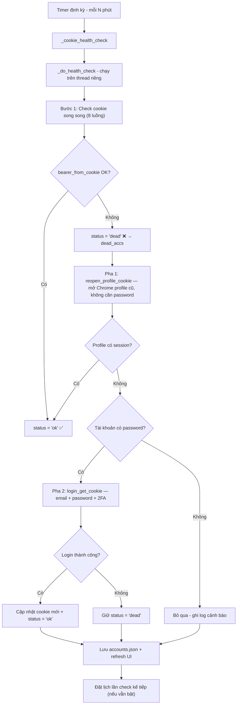
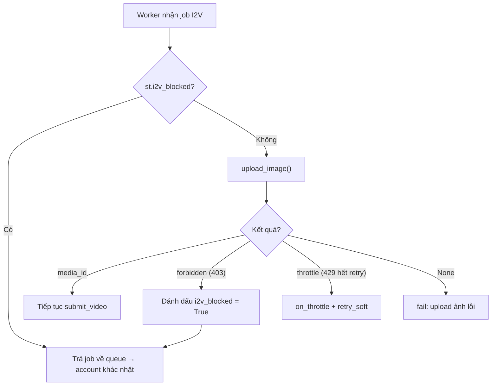
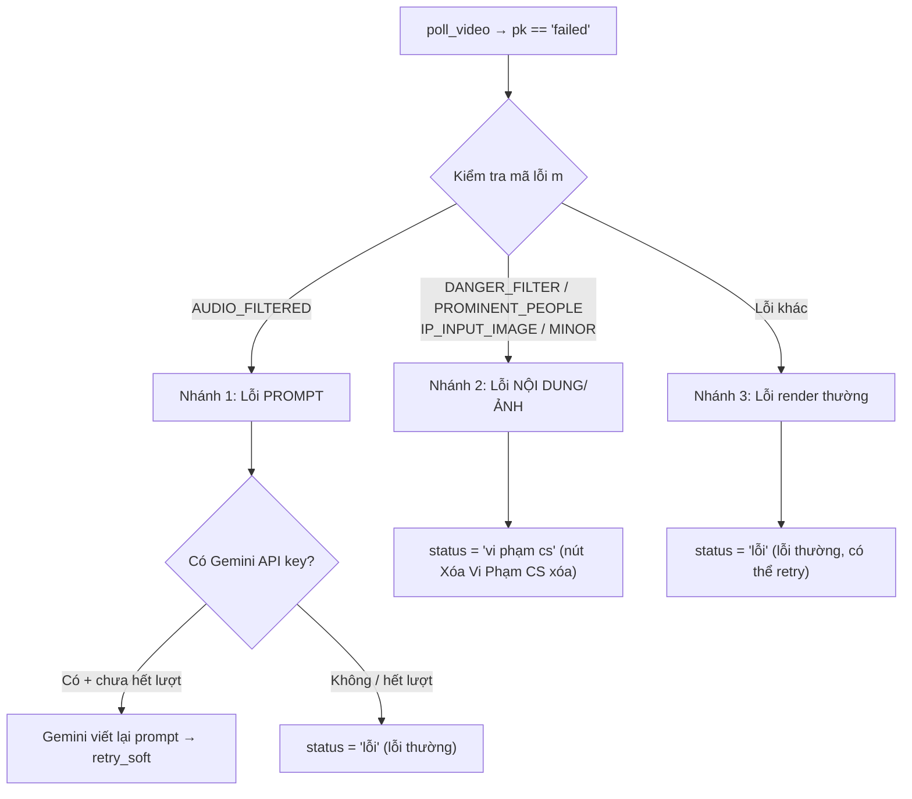
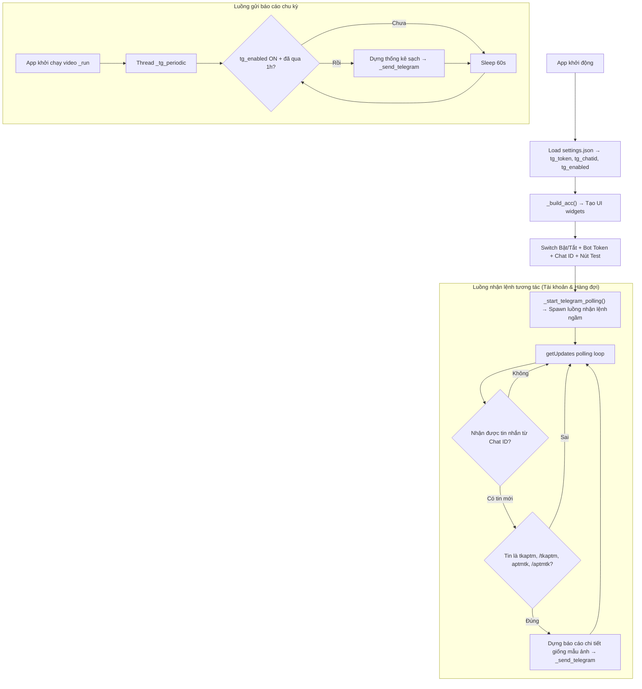
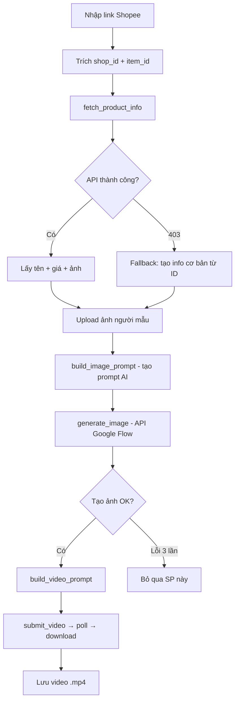
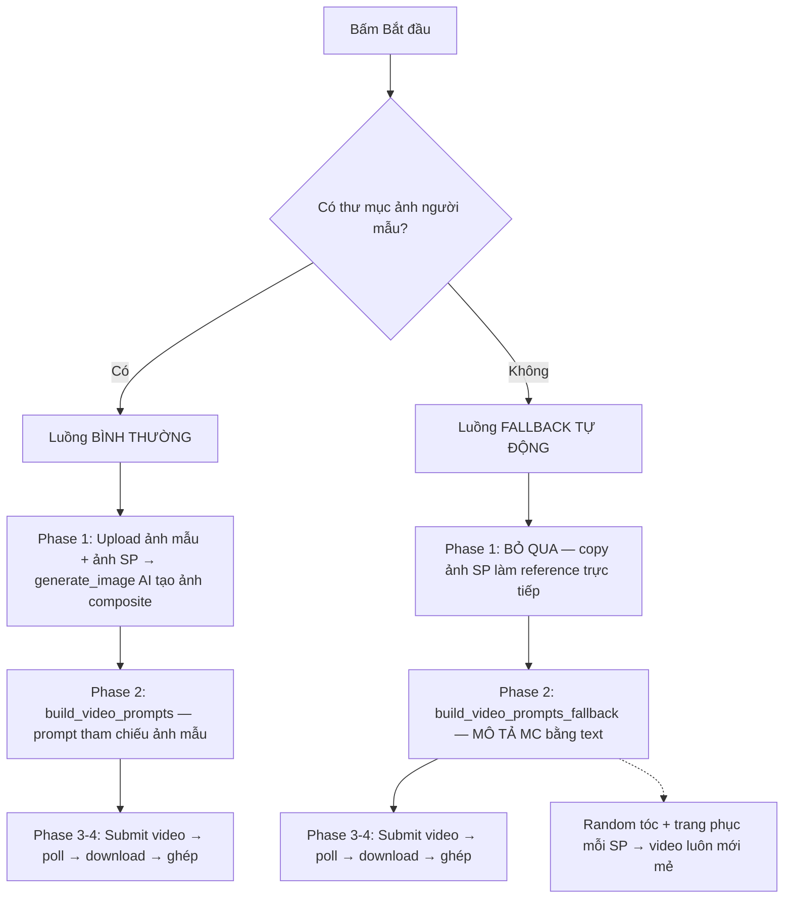
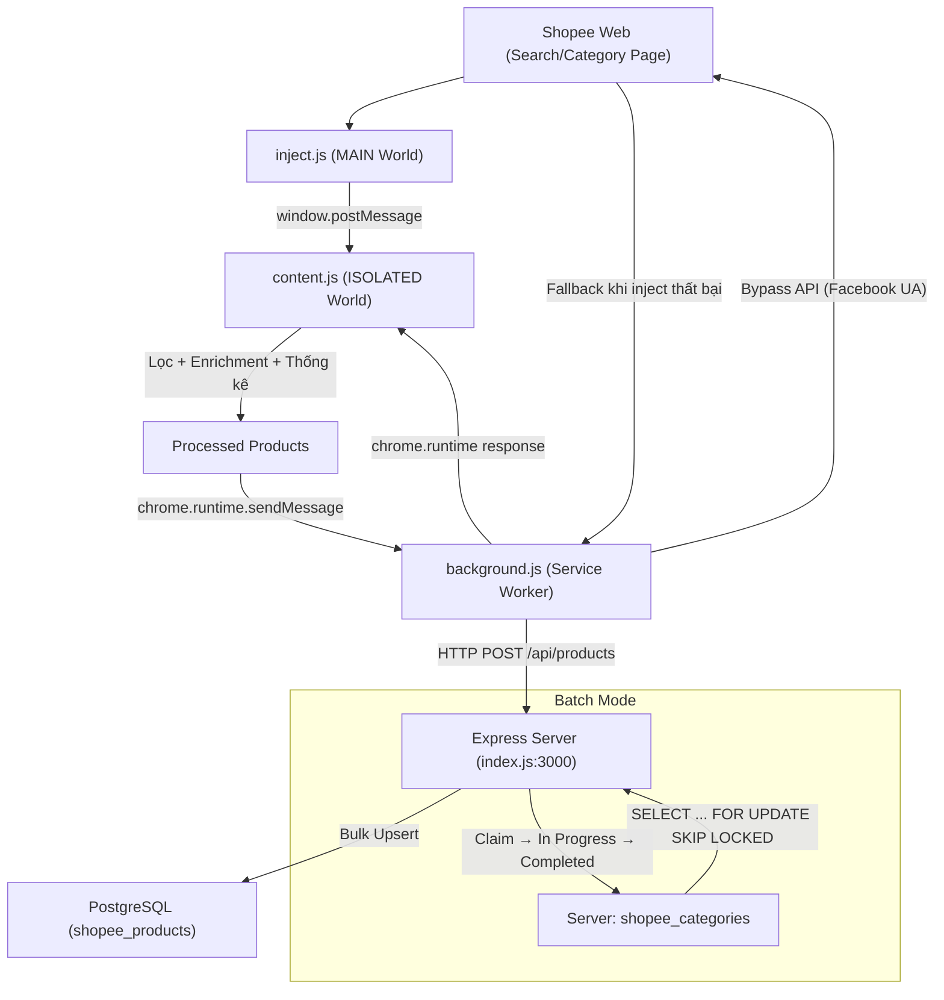
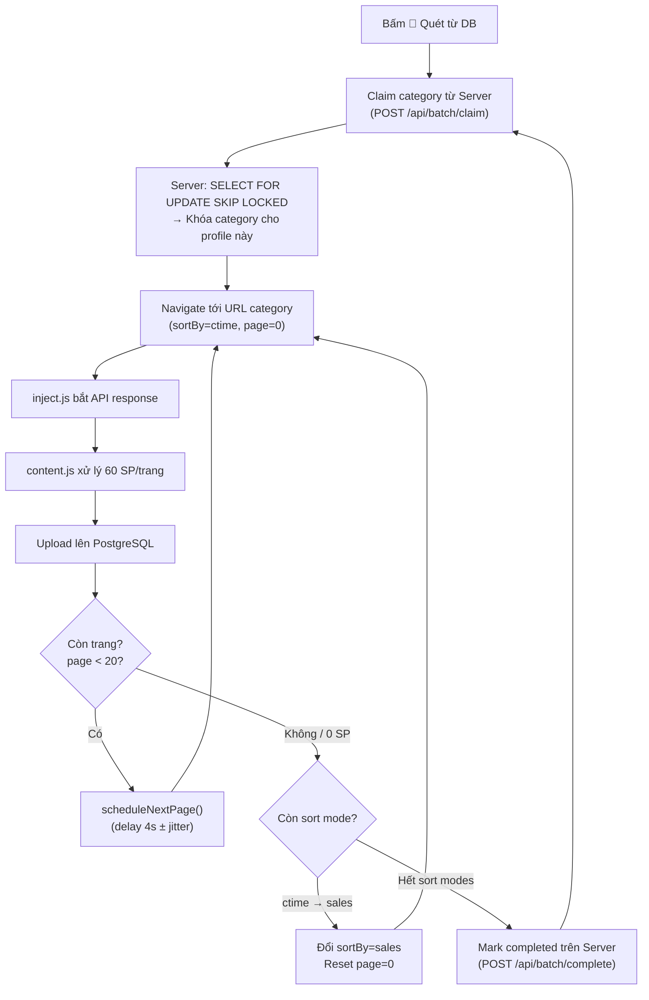

# Phân tích Thiết kế & Thuật toán Dự án Thìn Aptm

Tài liệu này phân tích chi tiết về kiến trúc, luồng hoạt động và các thuật toán cốt lõi của công cụ **Thìn Aptm** — giải pháp tự động tạo video Google Labs (Flow/Veo 3.1) đa luồng.

---

## 1. Cấu trúc Dự án & Các Thành phần Chính

Dự án được xây dựng bằng Python với cấu trúc module hóa rõ ràng:

*   **[thin_aptm.py](file:///E:/ThinAptm0707/thin_aptm.py)**: 
    *   Thành phần Giao diện người dùng (GUI) được viết bằng thư viện `customtkinter`.
    *   Quản lý danh sách tài khoản, cấu hình tác vụ và hàng đợi công việc.
    *   Điều phối đa luồng qua mô hình **1 hàng đợi chung + N×wpa worker threads** — mỗi worker pull job khi rảnh (work-stealing tự nhiên).
    *   Tích hợp thuật toán AIMD (Additive Increase, Multiplicative Decrease) để tự động điều chỉnh tốc độ submit/tài khoản.
    *   Phân loại lỗi chi tiết: AUDIO_FILTERED (Gemini rewrite), DANGER_FILTER/PROMINENT_PEOPLE (vi phạm cs), i2v_blocked (cấm upload ảnh).
*   **[login.py](file:///E:/ThinAptm0707/login.py)**:
    *   Thực hiện nhiệm vụ xác thực với Google Labs (3 cách).
    *   *Cách 1 — Thủ công (`manual_login`):* Mở trình duyệt Chromium độc lập qua `DrissionPage` để người dùng tự đăng nhập và quét cookie.
    *   *Cách 2 — Tự động (`login_get_cookie`):* Tự động nhập thông tin tài khoản, mật khẩu và sinh mã OTP qua thuật toán TOTP (`pyotp`) từ Secret Key 2FA để vượt qua bước bảo mật.
    *   *Cách 3 — Profile re-login (`reopen_profile_cookie`):* Mở Chrome với profile CŨ (giữ session Google) → Google tự đăng nhập lại → lấy cookie mới mà KHÔNG cần password. Cơ chế giống Chiến Hust.
*   **[engine.py](file:///E:/ThinAptm0707/engine.py)**:
    *   Lõi API tương tác trực tiếp với máy chủ Google (`aisandbox-pa.googleapis.com`).
    *   Chịu trách nhiệm chuyển đổi cookie thành Bearer Token, tải ảnh lên (I2V), submit tác vụ tạo video, thăm dò trạng thái (polling) và tải video kết quả.
*   **`accounts.json`**:
    *   Cơ sở dữ liệu lưu trạng thái tài khoản dưới dạng JSON bao gồm: Email, password, 2FA secret, cookie hiện tại và tình trạng hoạt động (`ok`, `dead`, `new`).

---

## 2. Quy trình Hoạt động (Operational Flow)

Hệ thống vận hành theo 3 giai đoạn khép kín từ khâu chuẩn bị tài khoản đến xuất bản video:

### Giai đoạn A: Đăng ký & Xác thực Tài khoản
1.  **Đăng nhập thủ công:**
    *   Hệ thống khởi tạo Chromium với tham số `co.auto_port()` để chạy cổng riêng biệt không đụng độ Chrome cá nhân.
    *   Một vòng lặp quét liên tục mỗi 2 giây để tìm cookie `next-auth.session-token` của tên miền `labs.google`. Khi phát hiện, cookie được lưu lại và trình duyệt tự động đóng.
2.  **Tự động Đăng nhập:**
    *   `DrissionPage` định vị các thẻ Input đăng nhập của Google và điền thông tin.
    *   Mã 2FA được tạo động tại thời gian thực thông qua thuật toán TOTP:
        $$\text{OTP} = \text{TOTP}(\text{Secret Key}, \text{time})$$
        và được điền tự động để hoàn tất đăng nhập.

### Giai đoạn B: Quản lý và Nạp Tác vụ
1.  Người dùng thiết lập chế độ tạo video:
    *   *Text $\rightarrow$ Video (T2V):* Nhập danh sách prompt văn bản (mỗi dòng tạo 1 video).
    *   *Image $\rightarrow$ Video (I2V):* Chọn thư mục chứa ảnh gốc. Mỗi ảnh được ghép với một prompt văn bản tương ứng. 
        *(Tối ưu hóa: Nếu thư mục chứa hơn 200 ảnh, giao diện chi tiết sẽ tự động ẩn để tránh treo app, toàn bộ quá trình khớp ảnh + prompt sẽ được thực hiện trực tiếp trên RAM siêu tốc).*
2.  Ứng dụng tính toán tên file đầu ra tự động dựa trên lựa chọn đặt tên của người dùng (mặc định lấy 13 ký tự đầu của prompt, hoặc đặt theo tên ảnh gốc, hoặc số thứ tự) và đặt vào thư mục lưu trữ được chỉ định. Tên file được làm sạch các ký tự đặc biệt và tự động thêm hậu tố chống trùng thông qua tìm kiếm tập hợp $O(1)$.

### Giai đoạn C: Thực thi Đa luồng Hàng đợi

Khi bấm **Bắt đầu**, luồng chính của giao diện kích hoạt `_start()` → `_run()` trong thread riêng:

```
_run(accs, todo, wpa=15)
│
├─ 1. Auth tất cả tài khoản (refresh bearer từ cookie)
│     └─ AccountState.ensure_auth(force=True) cho mỗi acc
│        └─ bearer_from_cookie(cookie) → bearer + email
│        └─ get_project(cookie) → projectId
│
├─ 2. Gán proxy từ ProxyPool (nếu có)
│
├─ 3. Tạo hàng đợi chung (queue.Queue)
│     └─ Đưa tất cả jobs vào queue, gắn _cycles = 0
│
├─ 4. Spawn workers: len(states) × wpa threads
│     └─ Mỗi thread chạy worker(st) → pull job từ queue
│
├─ 5. _drain(): chờ đến khi tất cả jobs xong/lỗi/vi phạm
│
├─ 6. Auto-retry: lặp lại 2 vòng cho jobs lỗi
│     └─ Đặt lại status="chờ", _cycles=0, put vào queue
│     └─ Workers vẫn sống → nhặt lại job
│
└─ 7. Join threads + thống kê kết quả + Telegram report
```

**Mô hình:** `1 HÀNG ĐỢI CHUNG` + mỗi tài khoản chạy `wpa` (15) workers, tất cả pull từ hàng đợi chung. Account throttle → nghỉ (cooldown), account khác gánh; job requeue. Submit KHÔNG khóa/không sleep — poll inline tự giãn nhịp (worker bận ~60-90s/video), tận dụng render server-side song song.

> **Lưu ý:** Dù import `ThreadPoolExecutor`, chỉ dùng cho `_check_accs()` (check cookie song song) và `_do_health_check()`. Vòng tạo video chính dùng `queue.Queue` + `worker()` thuần.

---

## 3. Thuật toán & Cơ chế Bypass API

Để có thể gửi yêu cầu trực tiếp đến Google Labs không qua trình duyệt, dự án áp dụng các kỹ thuật bypass nâng cao:

### 1. Bypass TLS Fingerprint (Vân tay TLS)
Google sử dụng các cơ chế chống bot bằng cách phân tích vân tay gói tin TLS (JA3 Fingerprint) và tiêu chuẩn HTTP/2 của client.
*   **Giải pháp:** Sử dụng thư viện `curl_cffi` giả lập toàn bộ hành vi mạng của trình duyệt Chrome (`impersonate="chrome"`). Các yêu cầu HTTP thô sẽ mang đúng cấu hình cipher suite của Chrome, giúp đánh lừa hệ thống giám sát của Google.

### 2. Bypass Xác thực ReCaptcha (`android_bypass`)
Google Labs Flow yêu cầu xác minh Captcha khi sinh nội dung. Tuy nhiên, API dành cho các thiết bị di động có cơ chế xác thực riêng đơn giản hơn.
*   **Giải pháp:** Trong các payload gửi yêu cầu sinh video, cấu trúc client context được tùy biến để giả lập một yêu cầu đến từ ứng dụng Android:
    ```json
    "recaptchaContext": {
        "applicationType": "RECAPTCHA_APPLICATION_TYPE_ANDROID", 
        "token": "android_bypass"
    }
    ```
    Thuộc tính này giúp API chấp nhận yêu cầu mà không đòi hỏi thực hiện thử thách ảnh ReCaptcha.

### 3. Thuật toán Trích xuất Trạng thái Thăm dò (Polling)
Google Labs xử lý render video bất đồng bộ. Hệ thống cần gửi yêu cầu kiểm tra trạng thái định kỳ tới endpoint:
`https://aisandbox-pa.googleapis.com/v1/video:batchCheckAsyncVideoGenerationStatus?key={KEY}`
*   Do cấu trúc dữ liệu trả về từ Google rất phức tạp và lồng ghép nhiều lớp, `engine.py` triển khai thuật toán đệ quy duyệt cây `_find_status` để trích xuất trạng thái:
    ```python
    def _find_status(o, out=None):
        out = out if out is not None else []
        if isinstance(o, dict):
            for k, v in o.items():
                if k == "status" and isinstance(v, str):
                    out.append(v)
                else:
                    _find_status(v, out)
        elif isinstance(o, list):
            for v in o:
                _find_status(v, out)
        return out
    ```
*   Hệ thống sẽ kiểm tra xem mảng kết quả trả về từ hàm trên có chứa các từ khóa thành công (`SUCCESSFUL`, `SUCCEEDED`, `COMPLETE`) hoặc thất bại (`FAIL`) để quyết định bước tiếp theo.

### 4. Tải Xuống Video qua Redirect
Google bảo mật đường dẫn trực tiếp của video bằng cách tạo ra các URL động ngắn hạn.
*   Để tải file, hệ thống gọi API redirect `media.getMediaUrlRedirect?name={media_id}` với Cookie tài khoản.
*   Thư viện `curl_cffi` được cấu hình `allow_redirects=True` để đi theo luồng chuyển hướng của Google và nhận về file nhị phân của video `.mp4`, sau đó ghi trực tiếp xuống đĩa cứng.

---

## 4. Cơ chế Tự kiểm tra Cookie & Auto Re-login (Health Check)

### Mục đích
Cookie của Google Labs có thời hạn sử dụng giới hạn. Khi cookie hết hạn (die), tài khoản không thể tạo video. Cơ chế Health Check tự động phát hiện cookie chết và đăng nhập lại để lấy cookie mới, đảm bảo hệ thống chạy liên tục không cần can thiệp thủ công.

### Kiến trúc



### Các thành phần code

| Thành phần | Vị trí | Chức năng |
|---|---|---|
| `_health_check_enabled` | `App.__init__` | Cờ bật/tắt, lưu vào `settings.json` |
| `_health_check_interval` | `App.__init__` | Khoảng cách giữa các lần check (phút), tối thiểu 5 |
| `_health_check_timer` | `App.__init__` | ID timer của `self.after()`, dùng để hủy khi tắt |
| `_health_checking` | `App.__init__` | Cờ chống chạy trùng (mutex đơn giản) |
| `_toggle_health_check()` | `App` | Callback switch bật/tắt trên UI |
| `_get_hc_interval_ms()` | `App` | Đọc interval từ ô nhập, chuyển phút → ms |
| `_schedule_health_check()` | `App` | Đặt timer cho lần check kế tiếp |
| `_run_health_check_now()` | `App` | Nút "Check ngay" — chạy ngay lập tức |
| `_cookie_health_check()` | `App` | Callback từ timer → spawn thread |
| `_do_health_check()` | `App` | Logic chính: check + re-login (chạy trên thread) |

### UI trên tab Tài khoản

Card `hc_card` nằm dưới thanh nút, chứa:
- **Switch Bật/Tắt** (`_hc_switch`): Toggle tính năng health check
- **Ô nhập interval** (`_hc_interval_entry`): Số phút giữa mỗi lần check (mặc định 30)
- **Nhãn trạng thái** (`_hc_status_lbl`): Hiển thị "Lần check kế: HH:MM:SS" hoặc kết quả check gần nhất
- **Nút "▶ Check ngay"**: Chạy health check tức thì, không cần chờ timer

### Luồng xử lý chi tiết

1. **Khi bật switch**: `_toggle_health_check()` → `_schedule_health_check()` đặt `self.after(interval_ms)` 
2. **Khi timer trigger**: `_cookie_health_check()` → spawn `_do_health_check()` trên daemon thread
3. **`_do_health_check()` thực hiện**:
   - Filter tài khoản enabled có cookie
   - Check song song 8 luồng qua `ThreadPoolExecutor` → mỗi account gọi `E.bearer_from_cookie(cookie)`
   - Tài khoản nào bearer=None → đánh dấu `dead`, thêm vào `dead_accs`
   - Lưu `accounts.json`, refresh UI
   - **Pha 1 — Profile re-login** (không cần password):
     - Với mỗi tài khoản dead: tìm profile tại `_profiles/{email}` → gọi `L.reopen_profile_cookie(profile_dir)`
     - Google session trong profile còn sống → tự lấy cookie mới
     - Profile không tồn tại hoặc session hết hạn → chuyển sang Pha 2
   - **Pha 2 — Password re-login** (fallback):
     - Với mỗi tài khoản vẫn dead + có `password`: gọi `L.login_get_cookie(email, password, totp)`
     - Tạo/cập nhật profile tại `_profiles/{email}` để lần sau dùng Pha 1
   - Re-login thành công → cập nhật cookie mới + verify lại bearer
   - Lưu `accounts.json` sau mỗi tài khoản re-login
4. **Khi tắt switch**: Hủy timer qua `self.after_cancel()`
5. **Khi đóng app**: `_on_closing()` hủy timer + lưu trạng thái bật/tắt và interval vào `settings.json`

### Persistence (Lưu trữ cài đặt)

Trong `settings.json`:
```json
{
  "health_check_enabled": true,
  "health_check_interval": 30
}
```
- Được đọc khi khởi tạo `App.__init__`
- Được ghi khi đóng app `_on_closing()`
- Nếu đã bật, khi mở lại app sẽ tự khởi động timer

---

## 5. Thuật toán AIMD - Điều khiển Tốc độ Submit

### Mô hình

Hệ thống sử dụng mô hình **AIMD (Additive Increase / Multiplicative Decrease)** tương tự điều khiển tắc nghẽn TCP để tự điều chỉnh tốc độ submit cho MỖI tài khoản:

- **Additive Increase**: Sau mỗi `SUBMIT_UP_AFTER` (5) lần submit thành công liên tiếp → `submit_limit += 1`
- **Multiplicative Decrease**: Bị throttle (429) → `submit_limit *= SUBMIT_DOWN` (0.5)
- Giới hạn: `SUBMIT_MIN` (1) ≤ `submit_limit` ≤ `SUBMIT_MAX`

### 3 bộ cài đặt (Preset)

> [!IMPORTANT]
> **Mặc định dùng CHẾ ĐỘ CÂN BẰNG** — kết hợp tốc độ cao + ít 429 nhờ poll-inline back-pressure.

#### 🎯 Chế độ Cân bằng (Mặc định — đang dùng)

Nhiều workers + AIMD + poll-inline back-pressure → ít 429 nhất, tốc độ ~14-16 video/phút.

**Nguyên lý:** 15 workers/account nhưng mỗi worker bận poll 60-90s → tại bất kỳ thời điểm nào chỉ ~3-4 workers thực sự submit. Workers tự tạo back-pressure, AIMD chỉ là lớp bảo vệ thêm.

```python
WORKERS_PER_ACCOUNT = 15   # poll-inline back-pressure: ~3-4 submit thực tế
SUBMIT_START = 2.0
SUBMIT_MAX = 8.0
THROTTLE_SLEEP = 3.0       # 8s quá lâu gây thundering herd; 1.5s hơi hung hăng
JOB_MAX_CYCLES = 30
```

#### 🛡️ Chế độ An toàn (Ít account, chạy lâu dài)

Ưu tiên bền vững, tránh bị Google cấm upload ảnh/video. Tốc độ ~8-10 video/phút.

```python
WORKERS_PER_ACCOUNT = 8
SUBMIT_START = 2.0
SUBMIT_MAX = 5.0
THROTTLE_SLEEP = 5.0
JOB_MAX_CYCLES = 20
```

#### ⚡ Chế độ Hung hăng (Tốc độ cao — rủi ro bị ban)

Tốc độ ~18-20 video/phút nhưng có thể bị Google throttle nặng hoặc cấm upload ảnh sau 1-2 tiếng.

```python
WORKERS_PER_ACCOUNT = 20
SUBMIT_START = 3.0
SUBMIT_MAX = 10.0
THROTTLE_SLEEP = 1.5
JOB_MAX_CYCLES = 40
```

#### Bảng so sánh đầy đủ

| Tham số | 🎯 Cân bằng | 🛡️ An toàn | ⚡ Hung hăng | Ý nghĩa |
|---|---|---|---|---|
| `WORKERS_PER_ACCOUNT` | **15** | 8 | 20 | Số luồng render/tài khoản (đa số bận poll → ít submit thực tế) |
| `SUBMIT_START` | **2.0** | 2.0 | 3.0 | Giới hạn submit ban đầu |
| `SUBMIT_MIN` | 1.0 | 1.0 | 1.0 | Sàn (luôn ít nhất 1 submit) |
| `SUBMIT_MAX` | **8.0** | 5.0 | 10.0 | Trần submit đồng thời |
| `SUBMIT_UP_AFTER` | 5 | 5 | 5 | Số OK liên tiếp để +1 |
| `SUBMIT_DOWN` | 0.5 | 0.5 | 0.5 | Hệ số giảm khi throttle |
| `THROTTLE_SLEEP` | **3.0s** | 5.0s | 1.5s | Nghỉ khi bị rate limit |
| `QUOTA_HARD_REST` | 6h | 6h | 6h | Nghỉ khi hết quota thật |
| `AUTH_REST` | 30min | 30min | 30min | Nghỉ khi 401/403 không cứu được |
| `BEARER_TTL` | 20min | 20min | 20min | Thời gian refresh bearer |
| `JOB_MAX_CYCLES` | **30** | 20 | 40 | Số vòng retry tối đa / job |
| `AUTO_RETRY_ROUNDS` | 2 | 2 | 2 | Số vòng tự retry sau khi xong |
| **Tốc độ ước tính** | ~14-16/p | ~8-10/p | ~18-20/p | video/phút |
| **Rủi ro 429** | Thấp ✅ | Rất thấp | Cao ⚠️ | |

> **Chuyển đổi:** Sửa các giá trị trong `thin_aptm.py` dòng 88-111. Comment `# 🎯 CHẾ ĐỘ CÂN BẰNG` ở đầu block nhắc nhở preset đang dùng.

### Cổng submit (`AccountState`)

```python
class AccountState:
    # Cổng AIMD
    submit_limit = SUBMIT_START   # giới hạn đồng thời hiện tại
    inflight = 0                  # số submit đang bay
    _ok_streak = 0                # chuỗi OK liên tiếp
    i2v_blocked = False           # True nếu account bị cấm upload ảnh (403)
    
    def acquire_submit(stop_check):  # chờ đến lượt submit
    def release_submit():            # nhả slot
    def on_submit_ok():              # +1 OK streak, tăng limit nếu đủ
    def on_throttle():               # giảm limit (AIMD MD)
```

### Cơ chế `i2v_blocked` — Cấm upload ảnh theo tài khoản

Khi Google cấm 1 tài khoản upload ảnh (trả 403 trên `upload_image`), hệ thống:

1. `upload_image()` trả `"forbidden"` (engine.py)
2. `process()` đánh dấu `st.i2v_blocked = True` + log `🚫` + trả `"retry_soft"`
3. `worker()` kiểm tra: nếu `i2v_blocked` + job là I2V → **skip**, trả job về hàng đợi
4. Account vẫn nhận **job T2V** bình thường
5. Account khác (chưa bị cấm) sẽ nhặt job I2V



> **Reset:** Restart app → `i2v_blocked` reset về `False` → thử lại bình thường.

---

## 6. Cấu trúc File hiện tại (07/2026)

```
ThinAptm0707/
├── thin_aptm.py      # GUI chính (customtkinter) - ~2134 dòng
│   ├── Class App(CTk)
│   │   ├── Tab Tài khoản: import, manual login, auto login, check, health check
│   │   ├── Tab Tạo video: I2V/T2V, prompt, naming, aspect ratio, Telegram report
│   │   ├── Tab Hàng đợi: batch ops, pool monitor, AIMD, auto retry
│   │   └── Tab Tạo Video Shopee: scrape SP → AI generate → video
│   └── Class AccountState: quản lý auth + throttle / account
├── engine.py         # API Google Labs (curl_cffi) - ~360 dòng
│   ├── bearer_from_cookie()  # cookie → bearer token
│   ├── get_project()         # lấy/tạo project
│   ├── upload_image()        # upload ảnh cho I2V
│   ├── generate_image()      # tạo ảnh AI (Gemini Pix 2)
│   ├── submit_video()        # gửi yêu cầu tạo video
│   ├── _classify()           # phân loại lỗi submit (throttle/quota/auth/ip_block)
│   ├── poll_video()          # thăm dò trạng thái render
│   ├── download_video()      # tải video qua redirect
│   └── rewrite_prompt()      # nhờ Gemini viết lại prompt vi phạm
├── shopeevideo.py    # Module Shopee Video - ~250 dòng
│   ├── fetch_product_info()  # scrape thông tin SP (API + fallback)
│   ├── build_image_prompt()  # tạo prompt cho AI generate
│   ├── build_video_prompt()  # tạo prompt cho video
│   └── SCENE_PRESETS[]       # 10 preset khung cảnh review
├── login.py          # Đăng nhập Google (DrissionPage) - ~170 dòng
│   ├── manual_login()            # user tự đăng nhập
│   ├── login_get_cookie()        # auto login email/pass/2fa
│   └── reopen_profile_cookie()   # mở Chrome profile cũ, không cần password
├── accounts.json     # Dữ liệu tài khoản [{email, password, totp, cookie, status, enabled}]
├── settings.json     # Cài đặt + hàng đợi jobs + health check + telegram + shopee
├── log.txt           # Log hoạt động tab Tạo Video (xóa mỗi lần mở app)
├── shopee.txt        # Log hoạt động tab Tạo Video Shopee
├── SETUP.bat         # Cài thư viện
├── _profiles/        # Chrome profile riêng mỗi tài khoản (cho Pha 1 re-login)
├── CHAY.bat          # Chạy app
└── thinaptm.md       # Tài liệu này
```

### Cấu trúc accounts.json
```json
[
  {
    "id": "email@gmail.com",
    "email": "email@gmail.com",
    "password": "...",       // rỗng nếu login thủ công
    "totp": "SECRET_KEY",   // rỗng nếu không có 2FA
    "cookie": "...",         // cookie labs.google hiện tại
    "status": "ok|dead|new",
    "enabled": true          // có dùng tài khoản này không
  }
]
```

### Cấu trúc settings.json (chính)
```json
{
  "gen_mode": "i2v",
  "ref_dir": "...",
  "aspect": "Dọc 9:16 (TikTok)",
  "naming": "13 ký tự đầu prompt",
  "out_dir": "...",
  "gemini_keys": ["key1", "key2"],
  "health_check_enabled": false,
  "health_check_interval": 30,
  "tg_token": "BOT_TOKEN",
  "tg_chatid": "CHAT_ID",
  "tg_enabled": false,
  "shopee_aspect": "Dọc 9:16 (TikTok)",
  "shopee_scene": "📦 Tổng kho hàng hóa",
  "shopee_model_img": "",
  "shopee_out_dir": "",
  "shopee_links": "",
  "jobs": [...]
}
```

---

## 7. Phân loại & Xử lý Lỗi API Google Flow

### Tổng quan

Khi video render thất bại (`poll_video` trả `pk == "failed"`), hệ thống phân loại lỗi thành **3 nhánh** dựa trên mã lỗi trả về (`error.message` trong response):



### Bảng phân loại lỗi render chi tiết

| Mã lỗi API | Loại lỗi | Nguyên nhân | Xử lý | Status job | Nút "Xóa Vi Phạm CS" |
|---|---|---|---|---|---|
| `PUBLIC_ERROR_AUDIO_FILTERED` | Prompt vi phạm | Prompt chứa nội dung bị lọc audio/bạo lực | Gemini viết lại prompt → retry. Hết lượt → lỗi thường | `"lỗi"` | ❌ Không xóa |
| `PUBLIC_ERROR_DANGER_FILTER` | Nội dung nguy hiểm | Ảnh/video chứa nội dung nguy hiểm | Đánh vi phạm cs ngay | `"vi phạm cs"` | ✅ Xóa |
| `PUBLIC_ERROR_PROMINENT_PEOPLE_FILTER_FAILED` | Người nổi tiếng | Ảnh chứa khuôn mặt người nổi tiếng | Đánh vi phạm cs ngay | `"vi phạm cs"` | ✅ Xóa |
| `PUBLIC_ERROR_IP_INPUT_IMAGE` | Ảnh vi phạm IP | Ảnh đầu vào chứa logo/nhân vật có bản quyền | Đánh vi phạm cs ngay | `"vi phạm cs"` | ✅ Xóa |
| `PUBLIC_ERROR_MINOR` | Trẻ em | Nội dung liên quan đến trẻ em | Đánh vi phạm cs ngay | `"vi phạm cs"` | ✅ Xóa |
| `PUBLIC_ERROR_HIGH_TRAFFIC` | Server quá tải | Google server đang đông | Lỗi thường, tự retry | `"lỗi"` | ❌ Không xóa |
| Lỗi khác / timeout | Render lỗi | Lỗi kỹ thuật, timeout | Lỗi thường, tự retry | `"lỗi"` | ❌ Không xóa |

### Code xử lý (thin_aptm.py, hàm `process()` trong `_run()`)

```python
elif pk == "failed":
    m = mid or ""
    # 1) AUDIO_FILTERED: lỗi do prompt → dùng Gemini viết lại rồi retry
    if "AUDIO_FILTERED" in m:
        if self._gemini_active and job.get("_rewrites", 0) < MAX_REWRITES:
            new = self._rewrite_prompt(job["prompt"])
            if new and new.strip() != job["prompt"].strip():
                job["_rewrites"] = job.get("_rewrites", 0) + 1
                job["prompt"] = new
                return "retry_soft"   # requeue, làm lại với prompt mới
        # Hết lượt rewrite → lỗi thường (nút Xóa Vi Phạm CS KHÔNG xóa)
        return ("fail", m or "render fail")
    # 2) Lỗi nội dung/ảnh → vi phạm cs (nút Xóa Vi Phạm CS sẽ xóa)
    if "DANGER_FILTER" in m or "PROMINENT_PEOPLE" in m or "IP_INPUT_IMAGE" in m or m == "PUBLIC_ERROR_MINOR":
        return ("fail", "policy")
    # 3) Các lỗi render khác
    return ("fail", m or "render fail")
```

### Phân loại lỗi submit (engine.py, hàm `_classify()`)

Khi `submit_video()` trả lỗi (status ≠ 200), `_classify()` phân loại dựa trên HTTP status + error reason:

| Loại trả về | Điều kiện | Ý nghĩa | Xử lý ở `process()` |
|---|---|---|---|
| `"throttle"` | 429 + `USER_REQUESTS_THROTTLED` hoặc `RESOURCE_EXHAUSTED` | Giới hạn tốc độ tạm | AIMD giảm tốc, nghỉ 3s (Cân bằng), tự hồi |
| `"quota_hard"` | `QUOTA_EXCEEDED` / `OUT_OF_CREDIT` / `DAILY` | Hết quota thật | Cách ly account 6h, đổi account |
| `"auth"` | HTTP 401 hoặc **403** | Bearer hết hạn / permission denied | Refresh cookie → bearer, retry. Nếu vẫn fail → nghỉ 30p |
| `"unusual"` | `RECAPTCHA` / `UNUSUAL_ACTIVITY` | Bot detection | Retry nhanh (0.4s) |
| `"ratelimit"` | `TOO_MUCH_TRAFFIC` | Rate limit theo IP | AIMD giảm tốc, nghỉ 5s |
| `"ip_block"` | Response HTML "Sorry" | IP bị chặn | AIMD giảm tốc |
| `"retry"` | Lỗi khác | Lỗi không xác định | Retry nhanh (0.4s) |

### Cơ chế Gemini Rewrite Prompt

Khi gặp `AUDIO_FILTERED`, hệ thống dùng Google Gemini API để viết lại prompt an toàn:

1. **Xoay vòng key**: Duyệt qua danh sách Gemini API key đã khai báo, bỏ qua key đã chết (`_gemini_bad`)
2. **Prompt cho Gemini**: Yêu cầu giữ nguyên ý nhưng loại bỏ bạo lực, vũ khí, người nổi tiếng, logo, nhạc có bản quyền
3. **Giới hạn**: Tối đa `MAX_REWRITES` (3) lần viết lại / job
4. **Phân loại key**:
   - `"ok"` → dùng prompt mới, retry job
   - `"dead"` (400/401/403) → loại key, thử key kế
   - `"busy"` (429/lỗi khác) → thử key kế

```python
# engine.py - rewrite_prompt()
GEMINI_MODEL = "gemini-flash-latest"
instr = "Rewrite the following text-to-video prompt so it PASSES content-safety filters..."
# POST https://generativelanguage.googleapis.com/v1beta/models/{model}:generateContent?key={api_key}
```

---

## 8. Hiển thị Hàng đợi (Queue Display)

### Format hiển thị mỗi dòng job

Mỗi dòng trong danh sách hàng đợi hiển thị theo thứ tự cột:

```
☐ STT  Loại Trạng thái  Ảnh đầu vào           Prompt (48 ký tự)                                     File output
☐ 1    I2V  ⏳ chờ       input_image.jpg        Create an 8-second product review                      output.mp4
☑ 2    I2V  🔄 đang      photo_001.png          A beautiful sunset over the ocean                      sunset_001.mp4
☐ 3    T2V  ✅ xong      -                      Flying through a neon city at night                    neon_city.mp4
```

| Cột | Độ rộng | Nguồn dữ liệu | Ghi chú |
|---|---|---|---|
| `☐/☑` | 1 ký tự | `check_vars[i]` | Checkbox chọn/bỏ chọn |
| STT | 5 ký tự | Index (1-based) | Số thứ tự trong hàng đợi |
| Loại | 5 ký tự | `j["type"]` | `I2V` hoặc `T2V` |
| Trạng thái | 11 ký tự | `j["status"]` | Icon + text (⏳ chờ / 🔄 đang / ✅ xong / ❌ lỗi / ⚠️ vi phạm cs) |
| **Ảnh đầu vào** | 22 ký tự | `j["ref"]` | Tên file ảnh gốc (tối đa 20 ký tự), `-` nếu T2V |
| Prompt | 50 ký tự | `j["prompt"]` | 48 ký tự đầu của prompt |
| File output | tự do | `j["out"]` | Tên file video kết quả |

### Tối ưu hiển thị danh sách lớn

- **≤ 300 job**: Hiển thị toàn bộ danh sách
- **> 300 job**: Hiển thị thông minh:
  1. Jobs **đang chạy** (ưu tiên cao nhất)
  2. Jobs **lỗi / vi phạm** (tối đa 50 dòng)
  3. **100 dòng đầu** + **100 dòng cuối** (ẩn phần giữa)
- **Throttle refresh**: Chỉ cập nhật tối đa 1 lần/giây khi đang chạy; full refresh mỗi 5 giây

### Màu sắc theo trạng thái

| Tag | Trạng thái | Màu |
|---|---|---|
| `dang` | Đang chạy | `#E53935` (đỏ) |
| `xong` | Thành công | `#2E7D32` (xanh lá) |
| `loi` | Lỗi | `#E65100` (cam đậm) |
| `vipham` | Vi phạm CS | `#AD1457` (hồng đậm) |
| `cho` | Chờ | `#555555` (xám) |

### Batch Operations (Thao tác hàng loạt)

| Thao tác | Hàm | Mô tả |
|---|---|---|
| Check/Bỏ chọn theo dãy | `_check_range()` / `_uncheck_range()` | Chọn/bỏ từ dòng X đến dòng Y |
| Chọn/Bỏ tất cả | `_select_all()` / `_deselect_all()` | Toggle toàn bộ danh sách |
| Xóa đã chọn | `_delete_checked()` | Xóa các job đã check |
| Retry đã chọn | `_retry_checked()` | Reset status → "chờ" để chạy lại |
| Đổi folder | `_change_folder_checked()` | Đổi thư mục output cho các job đã chọn |
| Đổi tên | `_rename_checked()` | Đổi tên file output theo quy tắc naming hiện tại |

---

## 9. Telegram Report & Interactive Bot

### Mục đích
Gửi thông báo tự động định kỳ và cho phép người dùng gửi lệnh truy vấn từ xa từ Telegram. Giúp theo dõi tốc độ, tiến độ và trạng thái tài khoản thời gian thực mà không cần mở giao diện phần mềm.

### Kiến trúc



### Các tính năng tương tác mới
1. **Đăng ký danh sách lệnh (`setMyCommands`)**: Khi thay đổi bot token, hệ thống tự động POST đăng ký danh sách lệnh (`tkaptm` và `aptmtk`) để khi gõ dấu `/` trên Telegram, các lệnh này sẽ hiện lên gợi ý để chọn nhanh.
2. **Nút bấm trực quan (Reply Keyboard Button)**: Mỗi tin nhắn bot gửi đi đều đính kèm `reply_markup` chứa nút nhấn bàn phím ảo **`tkaptm`** ở cuối ứng dụng chat của người dùng. Họ chỉ cần chạm vào nút này để yêu cầu thống kê một cách đơn giản nhất.
3. **Thống kê linh hoạt theo Tab hoạt động**: Hàm dựng text thống kê `_build_telegram_stats` tự dò xem tab Tạo video thường hay Tạo video Shopee đang chạy để xuất thông tin tiến độ, số lượng thành công/lỗi và tài khoản tương ứng của tác vụ đó.

### Các thành phần code chính

| Thành phần | Vị trí | Chức năng |
|---|---|---|
| `_start_telegram_polling()` | `App` | Spawn luồng daemon lắng nghe Telegram. |
| `_telegram_polling_loop()` | `App` | Vòng lặp `getUpdates` ngầm (timeout 10s), kiểm tra lọc Chat ID và xử lý lệnh. |
| `_build_telegram_stats()` | `App` | Hàm dựng tin nhắn thống kê đồng bộ (xong/lỗi/còn lại, tốc độ, trạng thái tài khoản) dùng chung cho cả báo cáo định kỳ lẫn phản hồi lệnh. |
| `_send_telegram(text)` | `App` | Đóng gói tin nhắn gửi qua API, tự động nạp nút nhấn `tkaptm` dạng JSON markup. |

### Cấu hình hiện tại

| Khoá cấu hình | Giá trị cấu hình |
|---|---|
| Bot hiển thị | [@APTMVeo_bot](https://t.me/APTMVeo_bot) |
| `tg_token` | `8056221929:AAHLCItPyjFuiTS2tzoV_-ZEhHxz93RopUw` |
| `tg_chatid` | `1533409967` (An Phúc Trí @AnPhucTri) |
| `tg_enabled` | `true` |

### Ví dụ định dạng thống kê gửi về
```
⏰ Thống kê chạy (1.5h)
==============================
✅ Xong: 1286/19778 · ❌ Lỗi: 40 · 📦 Còn: 18472
⚡ Tốc độ: 11.9 video/phút
👥 Tài khoản:
  01004046501m@gmail.com: ✅550 ❌25 ⚡18 🟢 chạy
  01004649955m@gmail.com: ✅736 ❌35 ⚡18 🟢 chạy
```

### Persistence (Lưu trữ)
Ghi nhận trong `settings.json`:
- `tg_token`: Bot token API.
- `tg_chatid`: Chat ID đích nhận tin nhắn và được phép điều khiển.
- `tg_enabled`: Bật/Tắt toàn bộ tính năng và luồng polling Telegram.

---

## 10. Module Tạo Video Shopee (`shopeevideo.py`)

### Mục đích
Tự động tạo video review sản phẩm Shopee bằng AI. Quy trình: lấy thông tin SP → tạo ảnh ghép AI (người mẫu + sản phẩm + khung cảnh) → tạo video từ ảnh.

### Luồng xử lý



### Scrape sản phẩm Shopee (`fetch_product_info`)

Hệ thống thử 3 endpoint API Shopee (với `curl_cffi` impersonate Chrome):

| Endpoint | URL | Ghi chú |
|---|---|---|
| `pdp/get_pc` | `shopee.vn/api/v4/pdp/get_pc?shop_id=X&item_id=Y` | Endpoint mới nhất |
| `v4/item/get` | `shopee.vn/api/v4/item/get?shopid=X&itemid=Y` | Fallback 1 |
| `v2/item/get` | `shopee.vn/api/v2/item/get?shopid=X&itemid=Y` | Fallback 2 |

Nếu tất cả API trả 403 (Shopee chặn) → tạo info cơ bản từ shop_id + item_id.

### 10 preset khung cảnh review

| # | Tên | Scene (tiếng Anh) |
|---|---|---|
| 1 | 📦 Tổng kho hàng hóa | large warehouse filled with stacked packages |
| 2 | 🏪 Siêu thị mini | modern mini supermarket with product shelves |
| 3 | 🎬 Phòng review chuyên nghiệp | professional product review studio |
| 4 | 🏠 Phòng khách ấm cúng | cozy modern living room with warm lighting |
| 5 | 🌿 Không gian xanh | bright space with green plants |
| 6 | 🛍️ Cửa hàng thời trang | trendy fashion boutique |
| 7 | 📱 Studio công nghệ | modern tech studio |
| 8 | 🍳 Nhà bếp hiện đại | sleek modern kitchen |
| 9 | 🏋️ Phòng gym/thể thao | sports/gym equipment area |
| 10 | 💄 Bàn trang điểm | elegant vanity/makeup table |

### UI trên tab Tạo Video Shopee

| Widget | Chức năng |
|---|---|
| TextBox link | Nhập danh sách link Shopee (mỗi dòng 1 link) |
| Chọn ảnh người mẫu | Ảnh model chung cho tất cả video |
| Dropdown khung cảnh | 10 preset + có thể mở rộng |
| Dropdown tỉ lệ video | 9:16 / 16:9 / 1:1 |
| Thư mục lưu | Output folder |
| Log area | Hiển thị tiến trình (ghi ra `shopee.txt`) |

### Log file
- **`shopee.txt`**: ghi chi tiết từng bước xử lý, format `[HH:MM:SS] message`
- Không bị xóa khi mở app (khác `log.txt`)

---

## 11. Dependencies

| Package | Dùng cho | Bắt buộc? |
|---|---|---|
| `customtkinter` | GUI | ✅ |
| `curl_cffi` | TLS bypass (API Google + Shopee) | ✅ |
| `DrissionPage` | Auto login Google | ⚠️ Chỉ cần nếu dùng auto login |
| `pyotp` | Sinh mã 2FA | ⚠️ Chỉ cần nếu có 2FA |
| `Pillow` | Logo display | ⚠️ Optional |
| `urllib` (stdlib) | Telegram Bot API | ✅ (built-in) |

---

## 12. Sửa lỗi Login (2026-07-10)

### Tóm tắt

Nút "Nhập thủ công" và "Auto login" không hoạt động — Chrome mở nhưng không tự động điền email/password/2FA, hoặc crash ngay lập tức. **3 bug riêng biệt** cùng gây ra vấn đề:

### Bug 1: DrissionPage 4.x — `auto_port()` + `set_user_data_path()` crash

**Triệu chứng:** `ValueError: not enough values to unpack (expected 2, got 1)` ngay khi tạo `ChromiumPage`.

**Nguyên nhân:** DrissionPage 4.1.1.4 có bug: khi gọi `auto_port()` cùng `set_user_data_path()`, thuộc tính `address` bị set thành chuỗi rỗng `""`. Khi `connect_browser()` cố split `address.split(':')` → crash.

**File:** [login.py](file:///E:/ThinAptm0707/login.py) — hàm `_opts()`

**Fix:** Khi có `profile_dir`, dùng `set_local_port(random.randint(19200, 29999))` thay vì `auto_port()`. Khi không có profile → giữ `auto_port()` như cũ.

```python
def _opts(profile_dir=None):
    co = ChromiumOptions()
    co.set_argument("--no-first-run"); co.set_argument("--no-default-browser-check")
    if profile_dir:
        os.makedirs(profile_dir, exist_ok=True)
        co.set_user_data_path(profile_dir)
        co.set_local_port(random.randint(19200, 29999))  # DP4 bug workaround
    else:
        co.auto_port()
    return co
```

### Bug 2: Google Sign-in URL deprecated — Error 400

**Triệu chứng:** Chrome mở trang Google nhưng hiển thị "Error 400 (Bad Request) — The server cannot process the request because it is malformed."

**Nguyên nhân:** URL cũ `/signin/v2/identifier` đã bị Google deprecated. URL `/ServiceLogin` cũng trả 400 khi dùng với Chrome profile có cookie cũ.

**Fix:** Dùng `https://accounts.google.com` (URL cơ bản) — Google tự redirect sang `/v3/signin/identifier` (trang hiện tại, luôn hoạt động).

```python
GOOGLE_SIGNIN = "https://accounts.google.com"
```

### Bug 3: Profile rỗng gây chờ 90 giây vô ích

**Triệu chứng:** Khi ấn "Auto login", Chrome mở trang Flow và chờ 90 giây mà không làm gì.

**Nguyên nhân:** Hàm `_opts()` tạo thư mục profile với `os.makedirs()` → thư mục tồn tại nhưng rỗng → `_auto_login` thấy `os.path.exists(profile_dir)` = True → gọi `reopen_profile_cookie()` chờ 90 giây cho session Google không tồn tại.

**Fix:** Thêm hàm `_has_profile_data()` kiểm tra file `Local State` (Chrome tạo khi profile được dùng thật). `reopen_profile_cookie()` dùng hàm này thay vì `os.path.exists()`.

```python
def _has_profile_data(profile_dir):
    if not profile_dir or not os.path.exists(profile_dir):
        return False
    return os.path.exists(os.path.join(profile_dir, "Local State"))
```

### Cải tiến: Nút "Nhập thủ công" tự động điền credentials

**Trước:** Nút "Nhập thủ công" chỉ mở Chrome rồi chờ user tự đăng nhập — không dùng email/password/2FA đã lưu.

**Sau:** Nút "Nhập thủ công" kiểm tra tài khoản nào đã có password:
- **Có password** → tự động gọi `login_get_cookie()` (điền email + password + 2FA)
- **Không có password** → mở Chrome thủ công như cũ (fall back)

**File:** [thin_aptm.py](file:///E:/ThinAptm0707/thin_aptm.py) — hàm `_manual_login()`

### Cải tiến: `login_get_cookie()` robust hơn

**Trước:** Chỉ 1 cố gắng tìm element, không log chi tiết, dễ fail mà không rõ nguyên nhân.

**Sau:**
- Log chi tiết từng bước (📧 email → 🔒 password → 🔐 2FA → ⏳ chờ cookie)
- Thử nhiều selector cho mỗi element (`#identifierId`, `input@type=email`, `input@name=identifier`)
- Xử lý trang "chọn tài khoản" (nút "Use another account")
- Chờ tối đa 25 giây cho cookie xuất hiện sau khi login
- Nạp LABS trước để check profile cũ (tránh mở login không cần thiết)

### Bảng tổng hợp thay đổi

| File | Hàm | Thay đổi |
|---|---|---|
| `login.py` | `_opts()` | Fix DP4 crash: `set_local_port(random)` thay `auto_port()` khi có profile |
| `login.py` | `GOOGLE_SIGNIN` | URL mới `accounts.google.com` (cũ `/v2/` bị 400) |
| `login.py` | `_has_profile_data()` | Hàm mới: check Chrome profile có data thật |
| `login.py` | `login_get_cookie()` | Viết lại: log chi tiết, multi-selector, xử lý account chooser |
| `login.py` | `reopen_profile_cookie()` | Dùng `_has_profile_data()` thay `os.path.exists()` |
| `thin_aptm.py` | `_manual_login()` | Tự động dùng credentials nếu có, fall back thủ công |

---

## 13. Chạy Shopee Video không cần ảnh người mẫu (2026-07-17)

### Tóm tắt

Tab "Tạo video Shopee" trước đây **bắt buộc** phải chọn thư mục chứa ảnh người mẫu. Nếu không có → hiển thị cảnh báo và dừng lại. Giờ đã sửa để **ảnh người mẫu là tùy chọn** — khi không có, phần mềm tự xử lý bằng hệ thống fallback prompt.

### Cơ chế hoạt động



### Fallback Prompt — Mô tả MC bằng text

Khi không có ảnh người mẫu, prompt video thay vì tham chiếu `"Người trong ảnh tham chiếu"` sẽ **mô tả chi tiết MC**:

```
THE PRESENTER: A beautiful young woman, approximately 20 years old, 
with a warm and friendly appearance.
She has {hair}. She wears {outfit}.
```

- **`{hair}`**: Random từ pool 8 kiểu tóc (ví dụ: "tóc đen dài thẳng", "tóc nâu ngang vai hơi xoăn")
- **`{outfit}`**: Random từ pool 8 bộ trang phục (ví dụ: "áo sơ mi trắng bỏ trong quần tây beige cạp cao")
- Cùng combo tóc + trang phục cho **tất cả đoạn** của cùng 1 SP (đảm bảo đồng nhất)
- Mỗi SP khác nhau → random combo mới → video luôn đa dạng

### Các thay đổi code

| File | Vị trí | Thay đổi |
|---|---|---|
| `thin_aptm.py` | `_shopee_start()` dòng ~2655 | Bỏ 2 check bắt buộc `model_dir` + `model_images` → giờ là tùy chọn |
| `thin_aptm.py` | `work()` dòng ~2770 | Gán model chỉ khi có: `if model_images:` bọc vòng lặp |
| `thin_aptm.py` | `work()` dòng ~2779 | Log thông minh: có ảnh → hiển thị số lượng, không có → "dùng prompt tự động" |
| `thin_aptm.py` | `process_one()` dòng ~2870 | Thêm nhánh `if not model_img:` → tự copy ảnh SP + bật `_use_fallback_prompts` |
| `thin_aptm.py` | `process_one()` dòng ~3040 | Fix crash `os.path.basename(None)` → hiển thị "Tự mô tả (prompt)" |

### Khi nào dùng fallback

| Trường hợp | Trigger | Prompt dùng |
|---|---|---|
| Có ảnh mẫu + còn quota | Bình thường | `build_video_prompts()` — tham chiếu ảnh composite |
| Có ảnh mẫu + hết quota ảnh | Tất cả account hết quota `generate_image` | `build_video_prompts_fallback()` — mô tả MC bằng text |
| **Không có ảnh mẫu** | Bỏ trống thư mục người mẫu | `build_video_prompts_fallback()` — mô tả MC bằng text |

> [!TIP]
> Khi không có ảnh người mẫu, phần mềm **tiết kiệm quota tạo ảnh** (bỏ qua Phase 1 hoàn toàn) — chỉ tốn quota tạo video. Phù hợp khi chạy số lượng lớn hoặc quota ảnh đang eo hẹp.

---

## 14. Tối ưu quá trình chờ cookie và xử lý đăng nhập (2026-07-19)

### Tóm tắt

Người dùng phản ánh khi bấm "Nhập thủ công" (do lưu sẵn mật khẩu nên hệ thống chạy auto-fill), trình duyệt Chrome đóng lại quá nhanh khiến họ không kịp mở điện thoại để xác nhận bảo mật Google (2FA prompt). Đồng thời, một số tài khoản sau khi login thành công (nhưng chưa kịp nhận cookie Labs) đã bị tool báo lỗi không tìm thấy Email và đổi trạng thái thành "Chết" sai lệch. 

Đã thực hiện **2 nâng cấp lớn** vào quy trình đăng nhập trong `login.py` để xử lý triệt để:

### Cải tiến 1: "Chờ thông minh" tự động theo tiến độ (Smart Wait)

**Vấn đề cũ:** Sau khi điền email/mật khẩu/2FA, code cũ đợi tĩnh `3` giây rồi ép trình duyệt điều hướng (`page.get(LABS)`) nhảy sang web Flow. Nếu người dùng đang bị Google yêu cầu thêm xác nhận điện thoại/mã SMS, việc điều hướng cưỡng ép lập tức hủy bỏ luồng xác thực Google và làm hỏng tiến trình. Nếu sống sót sang được trang lấy Session-token thì thời gian chờ lấy Cookie cũng chỉ có `25` giây (quá ngắn để thao tác kịp trên điện thoại).

**Nâng cấp:** 
- Xóa bỏ việc ép độ trễ tĩnh `time.sleep` gây phá vỡ luồng.
- Bổ sung luồng kiểm tra URL liên tục trong giới hạn **120 giây (2 phút)**:
  `if "signin" not in curr and "challenge" not in curr`
  → Tool chỉ chủ động nhảy sang trang `labs.google/fx/tools/flow` một khi nó chắc chắn người dùng **đã hoàn thành tuyệt đối** mọi bước xác thực bên phía Google Account (không còn kẹt ở các link "challenge"). Từ nay người dùng có tối đa 2 phút thong thả để chấp thuận Captcha hay 2FA điện thoại mà Chrome sẽ giữ yên không bị văng.

### Cải tiến 2: Tự động dùng session cũ, bypass màn điền form

**Vấn đề cũ:** Tại thư mục Profile trên máy, nếu Chrome **đã duy trì sẵn 1 session đăng nhập Google thành công**, đường link cơ bản `GOOGLE_SIGNIN` sẽ đưa người dùng chuyển hướng mượt mà lẳng lặng tới vùng làm việc `myaccount.google.com` (trang quản lý Google) mà **không hiện ra** trang có ô tìm kiếm Email.
Đoạn code cũ vẫn đi lùng sục ô nhập email theo cấu trúc máy móc, tìm suốt không thấy nên ngớ ngẩn kết luận là đăng nhập thất bại → trả trạng thái "Chết" (Dead) oan uổng.

**Nâng cấp:**
- Bổ sung tín hiệu thông minh `already_logged_in`:
  `already_logged_in = "myaccount.google.com" in page.url or "myactivity.google.com" in page.url`
- Tool sẽ kiểm tra trước, nếu URL thể hiện người dùng đã lọt vào vùng Account (Đã đăng nhập) thì sẽ kích hoạt bỏ qua toàn bộ khối lệnh tìm kiếm Input email và password. Giai đoạn Form Fills sẽ được Bypass và tool nhảy ngay xuống bước điều hướng về lại nền tảng Labs để trích xuất File Cookie Google Flow. Giải quyết dứt điểm tính trạng báo 'Chết' ngớ ngẩn trên các Profile chưa cạn kiệt Session!

---

## 15. Nâng cấp bộ Prompt Đạo Diễn (Director's Prompt) (2026-07-20)

### Tóm tắt

Hệ thống prompt mặc định của tab Shopee Video trong `shopeevideo.py` đã được đại tu toàn diện để áp dụng định dạng **"Director's Prompt"** (Prompt đạo diễn). Nâng cấp này nhằm siết chặt các giới hạn AI, chống hoàn toàn ảo giác (hallucination) của Veo 3 và phân rã các hành động dựa trên dòng thời gian chuyên nghiệp (Timeline Action).

Đặc biệt, prompt mới tích hợp chuẩn mực **khóa cứng danh tính (Identity Lock)** bằng thẻ kép: Hình ảnh tham chiếu + Đoạn text mô tả cô gái 22 tuổi gốc Việt.

### Các điểm đột phá trong cấu trúc Prompt mới

#### 1. Identity Lock (Khóa Danh Tính & Giới Tính)
Đóng đinh 100% hình dạng nhân vật review nhờ cấu trúc mô tả cứng trong biến `_CONT_EN` và `_CONT_VI`:
- **Chống sai lệch độ tuổi/giới tính:** Khai báo rõ ràng *"A 22-year-old Vietnamese woman with a bright, cheerful face"*. Lệnh này trở thành vòng kim cô kép khi đồng bộ chung với hình ảnh tham chiếu đầu vào.
- **Tính kiên định vật thể (Item Persistence):** Ép buộc Veo không được tự ý xóa bỏ hay vứt các đồ vật trang sức, phụ kiện. Sản phẩm ở giây đầu phải chính xác xuất hiện tới giây cuối cùng (PIXEL-PERFECT).

#### 2. Kịch bản Dòng Thời Gian (Timeline-based Action)
Thay vì gom một cục prompt miêu tả, 16 giây video được tách thành 2 clip với timeline chặt chẽ:
- **Clip 1 (0-8 giây):** Từ mờ sáng dần đến tương tác với sản phẩm. Quan trọng nhất là giây thứ 7-8 ép AI tạo ra tư thế **đứng yên hoàn toàn (static pose with zero movement)** để làm "Handoff pose".
- **Clip 2 (8-16 giây):** Mở đầu bằng tư thế đóng băng từ video trước để tạo độ liền mạch. Sau đó, camera chủ động phóng to (B-Roll Close-up) vào khu vực nút bấm, cấu trúc vật liệu của sản phẩm (giây 10-14s) rồi quay trở lại mặt MC chốt sale (giây 14-16s).

#### 3. Chống khuyết điểm AI thảm họa
Lệnh Constraints mạnh mẽ được bổ sung:
- `No chaotic or unintended rapid morphing. No slow-motion effects.` (Loại bỏ múa dưỡng sinh, cử động chậm).
- `No overly graceful ballet-like gestures.` (Chống lỗi giơ tay như múa ballet).

### Các thay đổi code

| File | Mã/Vị trí | Thay đổi |
|---|---|---|
| `shopeevideo.py` | `_CONT_EN`, `SEGMENT_POOL_EN` (Dòng 92-143) | Gắn bộ khung Directives + Timeline Action 16s cho tiếng Anh |
| `shopeevideo.py` | `_CONT_VI`, `SEGMENT_POOL_VI` (Dòng 219-269) | Gắn bộ khung Directives + Timeline Action 16s (đã dịch sát rạt) cho tiếng Việt |

> [!TIP]
> Do hệ thống hard-code (gắn cứng) mô tả *"Cô gái Việt Nam 22 tuổi"*, hệ thống này đang được tối ưu 100% cho việc dùng ảnh Reviewer nữ. Nếu thay đổi bộ folder người mẫu nam, hãy vào `shopeevideo.py` chỉnh lại biến cấu trúc Character Name cho khớp để tránh AI bị "tâm thần phân liệt" ngoại hình!

---

## 16. Fix Upload 429 — Reset Project + TLS Nâng Cấp (Học từ AutoVeo3) (2026-07-20)

### Tóm tắt Vấn Đề

Cùng tài khoản `maichuyencole@gmail.com`, cùng thời điểm chạy:
- **AutoVeo3**: upload OK, ra video trong ~6 phút
- **ThinAptm**: loop upload 429 vĩnh viễn (54 lần nghỉ, 0/2535 video)

### 5 Nguyên Nhân Gốc Rễ

| # | Nguyên nhân | Mức độ |
|---|-------------|--------|
| 1 | AutoVeo3 XÓA + TẠO PROJECT MỚI mỗi phiên (reset quota upload) | 🔴 Chính |
| 2 | ThinAptm dồn 15 upload đồng thời (Thundering Herd) | 🔴 Chính |
| 3 | AutoVeo3 có RecaptchaService Token Farm (5 luồng) | 🔴 Chính |
| 4 | AutoVeo3 dùng `pyreqwest_impersonate` (TLS sâu hơn `curl_cffi`) | 🟡 Phụ |
| 5 | ThinAptm không có TK Donor nào → Image Laundering không kích hoạt | 🟡 Phụ |

### Fix Đã Thực Hiện

#### A. Reset Project mỗi phiên (engine.py + thin_aptm.py)

Thêm `delete_project()` + `reset_project()` trong `engine.py`. Gọi trước `ensure_auth()` ở CẢ 2 tab (Tạo Video + Shopee Video).

#### B. Nâng cấp TLS Fingerprint (engine.py)

Chuyển HTTP client từ `curl_cffi` sang `pyreqwest_impersonate` (cùng thư viện AutoVeo3 dùng). Headers được cập nhật khớp với pattern của `ai_transport.pyd`.

### Các giải pháp bổ sung (chưa implement)

| Ưu tiên | Giải pháp | Trạng thái |
|---------|-----------|------------|
| 🔴 P0 | Reset project mỗi phiên | ✅ Done |
| 🔴 P0 | Nâng cấp TLS (`pyreqwest_impersonate`) | ✅ Done |
| 🟡 P1 | Đánh dấu ít nhất 1 TK donor | ⏳ User tự set |
| 🟡 P1 | Token farm (RecaptchaService) | ❌ Cần RE thêm |

---

## 17. Xử lý cạn Quota ảnh khi Bypass 429 & Tối ưu hóa Fallback (2026-07-22)

### Tóm tắt Vấn Đề
Khi tài khoản chính bị cạn kiệt quota tạo ảnh ngày (`PUBLIC_ERROR_PER_MODEL_DAILY_QUOTA_REACHED` từ API `generate_image`), cơ chế bypass upload 429 qua donor (Image Laundering) sẽ thất bại.
Trước đó, khi bypass thất bại do tài khoản chính hết quota tạo ảnh, tool không đánh dấu trạng thái và không cho tài khoản nghỉ/đổi proxy mà trả job về hàng đợi ngay lập tức. Điều này gây ra vòng lặp lỗi vô hạn chạy liên tục cực nhanh khiến luồng bị nghẽn và spam API Google.

### Giải Pháp Đã Thực Hiện

#### A. Trả lỗi Quota từ Engine ([engine.py](file:///E:/ThinAptm0707/engine.py))
* Cập nhật hàm `upload_image_via_donor` để trả về chuỗi `"quota_hard"` nếu `generate_image` trên tài khoản chính gặp lỗi cạn quota (`kind == "quota_hard"`), thay vì chỉ trả về `None`.

#### B. Đánh dấu Quota & Cho phép Cooldown/Xoay Proxy ([thin_aptm.py](file:///E:/ThinAptm0707/thin_aptm.py))
* Trong tab **Tạo Video Shopee**, tại 3 vị trí gọi bypass (ảnh người mẫu, ảnh sản phẩm, ảnh composite), nếu nhận về mã lỗi `"quota_hard"`:
  1. Đánh dấu tài khoản chính: `st.img_quota_exhausted = True`.
  2. Đặt `bypassed_mid = None` để ngắt luồng và cho phép chạy tiếp xuống khối lệnh tiêu chuẩn của tool: **Xoay Proxy mới** + **Cho tài khoản nghỉ (cooldown từ 60s - 600s)**.
* Việc cooldown và xoay proxy giúp làm sạch IP. Ở lượt chạy tiếp theo khi thức dậy, tài khoản chính có thể upload ảnh sản phẩm trực tiếp thành công mà không cần gọi đến donor bypass nữa (vì upload trực tiếp không tiêu tốn quota tạo ảnh).

#### C. Thử nghiệm dùng Nhiều Ảnh Tham Chiếu cho Video (Đã Bác Bỏ)
* **Ý tưởng:** Truyền cả ảnh người mẫu và ảnh sản phẩm làm reference khi gọi API sinh video để giảm số lần upload ảnh composite.
* **Thực nghiệm:** Đã viết script test gửi request API trực tiếp lên Google Labs. Máy chủ trả về lỗi:
  `HTTP 400 (INVALID_ARGUMENT): Reference images can contain at most 1 images.`
* **Kết luận:** Mô hình Image-to-Video của Veo 3.1 bắt buộc chỉ chấp nhận tối đa 1 ảnh làm reference khung hình đầu tiên. Quy trình tạo ảnh composite trước rồi mới sinh video là phương án duy nhất và tối ưu nhất về mặt kỹ thuật.

---

## 18. Loại bỏ Hybrid Voice Sync, Tối ưu hóa Bản địa hóa Đa Quốc gia & Lồng thoại Động vào Veo 3.1 (2026-07-22)

### Tóm tắt

Phiên bản nâng cấp này thực hiện hai cải tiến lớn:
1.  **Loại bỏ lồng tiếng cục bộ (Hybrid Voice Sync):** Thay vì tự sinh file âm thanh `.wav` qua Edge-TTS/Gemini và ghép nối qua FFmpeg ở phía máy khách, hệ thống chuyển giao 100% nhiệm vụ tạo tiếng nói cho **Google Labs Veo 3.1**. Mô hình Veo 3.1 tự động tạo video đi kèm âm thanh (cử chỉ nói và lip-sync khớp miệng) dựa trên kịch bản thoại được nhúng trực tiếp trong Prompt.
2.  **Hỗ trợ Bản địa hóa 3 Quốc gia (Việt Nam, Philippines, Indonesia):** Đồng bộ hóa từ giao diện chọn ngôn ngữ cho đến diện mạo người mẫu, chỉ thị nói tiếng nước bản địa, và kịch bản thoại tự động sinh theo cấu trúc tối ưu mới.

### Chi tiết Thiết lập Đa Quốc gia (Localization Matrix)

Khi người dùng chọn ngôn ngữ trên giao diện, hệ thống tự động ánh xạ quốc tịch người mẫu và giọng đọc cho AI:

| Ngôn ngữ chọn | Mã vùng | Quốc tịch người mẫu (Đưa vào Prompt) | Chỉ thị tiếng nói cho AI | Lời thoại tự sinh (`dialogue`) |
|---|---|---|---|---|
| **Tiếng Việt** | `vi` | Việt Nam (`Vietnamese` / `Việt Nam`) | `Người mẫu nói tiếng Việt` | Tiếng Việt (`Đối với [tên SP]...`) |
| **Tiếng Philippines** | `en` | Philippines (`Filipino` / `Philippines`) | `The model speaks Filipino` | Tiếng Tagalog (`Para sa [tên SP]...`) |
| **Tiếng Indonesia** | `id` | Indonesia (`Indonesian` / `Indonesia`) | `The model speaks Indonesian` | Tiếng Indonesia (`Untuk [tên SP]...`) |

### Cấu trúc Lời thoại Động Mới (16s Video)

Để nâng cao tỷ lệ giữ chân người xem (retention rate), kịch bản thoại được chia theo cấu trúc:
*   **Đoạn 1 (0-8s):** Bỏ qua lời chào xã giao. Tập trung giới thiệu trực tiếp công dụng chính của sản phẩm ngay từ giây đầu tiên.
    *   *Công thức:* `[Tiền tố quốc gia] + [Mô tả tính năng 1]` (Ví dụ: *"Đối với Kem chống nắng, thiết kế quá mượt mà..."*)
*   **Đoạn 2 (8-16s):** Giới thiệu thêm một tính năng/công dụng khác của sản phẩm, sau đó kết nối mượt mà sang lời kêu gọi hành động (CTA).
    *   *Công thức:* `[Mô tả tính năng 2] + [Lời kêu gọi mua hàng - CTA]`

*Tối ưu hóa lập trình:* Để tránh trùng lặp tính năng giữa Đoạn 1 và Đoạn 2, hệ thống sử dụng thuật toán gieo hạt `seed` dựa trên tổng mã ASCII của tên sản phẩm để bốc ngẫu nhiên không trùng lặp các tính năng từ kho dữ liệu bản địa hóa tương ứng.

### Các thay đổi file nguồn

| File | Vị trí | Thay đổi |
|---|---|---|
| [thin_aptm.py](file:///E:/ThinAptm0707/thin_aptm.py) | GUI & Worker | - Bổ sung tùy chọn Row 1.5 **Kiểu Review** (`Review tự nhiên` hoặc `Ngồi Review`) vào giao diện.<br>- Đồng bộ mặc định ngôn ngữ ban đầu là "Tiếng Việt".<br>- Dọn sạch mã nguồn tạo file `.wav` và lệnh FFmpeg ghép âm thanh.<br>- Cập nhật lưu cấu hình `shopee_review_style` và truyền vào các hàm dựng prompt.<br>- Bổ sung nút tick **"Không mẫu"** (`shopee_no_model`) ở Row 2 giúp người dùng ép buộc chế độ Fallback (dùng prompt tự mô tả MC) ngay lập tức mà không cần xóa đường dẫn thư mục người mẫu hiện tại. Tự động vô hiệu hóa (gray out) ô nhập khi nút này được bật. |
| [shopeevideo.py](file:///E:/ThinAptm0707/shopeevideo.py) | Config & Prompt Builders | - Cập nhật danh sách hiển thị `LANG_OPTIONS` theo đúng thứ tự: `"Tiếng Việt"`, `"Tiếng Philippines"`, `"Tiếng Indonesia"`.<br>- Khai báo các kho tính năng và CTA bằng 3 ngôn ngữ: `TTS_MIDDLES_VI/ID/PH` và `TTS_ENDINGS_VI/ID/PH`.<br>- Cập nhật hàm `generate_tts_script` hỗ trợ chọn mẫu câu đa ngôn ngữ động.<br>- Bổ sung chỉ thị `{dialogue}` vào các mẫu prompt video thường (`_CONT_VI/EN`) và fallback (`_CONT_FALLBACK_VI/EN`).<br>- Cập nhật `build_video_prompts` và `build_video_prompts_fallback` để sinh dialogue cho từng phân đoạn và truyền trực tiếp vào tham số format của prompt gửi cho Google.<br>- Bổ sung các ràng buộc giải phẫu bàn tay nghiêm ngặt (`NO anatomical anomalies, no extra limbs, no extra hands...` / `Tuyệt đối KHÔNG sinh thêm tay...`) vào toàn bộ 4 bộ template âm để triệt tiêu lỗi bàn tay thứ 3/thứ 4 phản cảm.<br>- Tích hợp tham số `review_style` để tự động nhúng chỉ thị bố cục toàn cục (`[ĐIỀU CHỈNH BỐ CỤC: Người reviewer ngồi lịch sự sau một chiếc bàn gỗ tối giản... / [LAYOUT CONSTRAINT: The presenter is sitting politely behind a clean, minimalist wooden desk...]`) ở vị trí ưu tiên đầu prompt khi chọn phong cách "Ngồi Review". |

---

## 19. Tối ưu Giao diện Hàng đợi & Thêm Lựa chọn Image Laundering (2026-07-23)

### Tóm tắt
Đã thực hiện 2 cải tiến lớn về UI/UX và tính năng kiểm soát luồng:
1. **Chia đôi màn hình tab Hàng đợi**: Thay đổi cách xếp chồng dọc của ô danh sách jobs (`self.txt_queue`) và console log (`self.txt_log`). Sử dụng container `split_frame` để chia ngang màn hình với tỷ lệ 50/50, giúp tận dụng tối đa màn hình rộng, tối ưu hiển thị danh sách job dài cùng console log song song.
2. **Lựa chọn tích "Rửa ảnh" (Bypass 429 via Donor)**: Bổ sung 2 checkbox cho phép bật/tắt động cơ chế Image Laundering (chuyển tiếp upload qua donor khi tài khoản chính bị rate limit 429). Checkbox được tích hợp ở cả tab Hàng đợi và tab Tạo video Shopee.

### Các thay đổi chi tiết

| File | Vị trí | Thay đổi |
|---|---|---|
| [thin_aptm.py](file:///E:/ThinAptm0707/thin_aptm.py) | `_build_queue()` (dòng ~1400) | - Đưa `self.txt_queue` và `self.txt_log` vào một `split_frame` chung.<br>- Sắp xếp side-by-side (50/50 width) bằng cách sử dụng `pack(side="left/right", fill="both", expand=True)`.<br>- Bổ sung checkbox `Rửa ảnh (Bypass 429)` (`self.use_laundering`) vào hàng nút điều khiển chính của tab Hàng đợi. |
| [thin_aptm.py](file:///E:/ThinAptm0707/thin_aptm.py) | `_build_shopee()` (dòng ~2460) | - Bổ sung checkbox `Rửa ảnh (Bypass 429)` (`self._sp_use_laundering`) vào Row 1.5 bên cạnh menu Kiểu Review. |
| [thin_aptm.py](file:///E:/ThinAptm0707/thin_aptm.py) | `_run()` (dòng ~2145, ~2190) | - Cập nhật logic bypass upload 429 của hàng đợi chuẩn để kiểm tra thêm cờ: `if self._donor_states and self.use_laundering.get():`. |
| [thin_aptm.py](file:///E:/ThinAptm0707/thin_aptm.py) | `work()` (dòng ~3355, ~3425, ~3570) | - Cập nhật logic bypass upload 429 của luồng Shopee (cho cả ảnh người mẫu, ảnh sản phẩm, và ảnh ghép composite) để kiểm tra thêm cờ: `if self._donor_states and self._sp_use_laundering.get():`. |
| [thin_aptm.py](file:///E:/ThinAptm0707/thin_aptm.py) | `_on_closing()` (dòng ~3955) | - Lưu cấu hình `use_laundering` và `shopee_use_laundering` vào `settings.json` khi đóng ứng dụng và tự động nạp lại khi khởi động. |

---

## 20. Phân tích Video Mẫu & Thư viện Prompt Templates (2026-07-24)

### Tóm tắt
Phân tích chi tiết video mẫu dạng **2D animation motivational** (1080×1920, 45s, 30fps) được tạo bởi Google Veo. Từ phân tích này, xây dựng hệ thống hỗ trợ tạo video tương tự gồm: thư viện prompt templates offline, script ghép video, và bộ prompt mẫu.

### Phân tích video mẫu

**File**: `FSave.com_Reels_Ky-luat-tao-nen-tu-do-test-AUTO-STUDIO-q_Media_1737266811061890_001_1080p.mp4`

| Thuộc tính | Giá trị |
|---|---|
| Độ phân giải | 1080 × 1920 (Full HD dọc 9:16) |
| Thời lượng | ~45 giây |
| FPS / Codec | 30fps / H.264 Main (avc1) |
| Bitrate | ~6 Mbps video + 125 kbps audio AAC Stereo |
| Encoder | `h264_nvenc` (NVIDIA GPU) + `Lavf` (FFmpeg) |
| Watermark | "Veo" (góc phải dưới) → **tạo bởi Google Veo** |

**Đặc điểm nội dung**:
- Phong cách: Animation 2D dạng **stickman nâng cao** — nhân vật đầu tròn trắng tối giản, background chi tiết nghệ thuật
- Chủ đề: Motivational / Self-improvement tiếng Việt dạng listicle ("4 điều im lặng")
- Cấu trúc: Mỗi "điều" = 1 cảnh minh họa ẩn dụ (~5-8 giây), phụ đề lớn in đậm màu vàng
- Âm thanh: Voiceover tiếng Việt + nhạc nền

### Các file mới tạo

| File | Mô tả |
|---|---|
| [prompt_templates.py](file:///E:/ThinAptm0707/prompt_templates.py) | Thư viện template prompt offline — 50+ scene templates, 7 character styles, 6 kịch bản mẫu. Hoạt động hoàn toàn offline, không cần API AI. |
| [ghep_video.py](file:///E:/ThinAptm0707/ghep_video.py) | Script ghép video CLI: concat + fade transition + nhạc nền + burn subtitle. Dùng FFmpeg subprocess. |
| [prompts_mau/01_4dieu_imlang_T2V.txt](file:///E:/ThinAptm0707/prompts_mau/01_4dieu_imlang_T2V.txt) | 6 prompt T2V — "4 Điều Im Lặng" (giống video mẫu) |
| [prompts_mau/02_5dauhi_truongthanh_T2V.txt](file:///E:/ThinAptm0707/prompts_mau/02_5dauhi_truongthanh_T2V.txt) | 6 prompt T2V — "5 Dấu Hiệu Trưởng Thành" |
| [prompts_mau/03_3quytac_nguoimanhme_T2V.txt](file:///E:/ThinAptm0707/prompts_mau/03_3quytac_nguoimanhme_T2V.txt) | 4 prompt T2V — "3 Quy Tắc Người Mạnh Mẽ" |

### Chi tiết prompt_templates.py

**Character Styles** — 7 phong cách nhân vật:

| Key | Mô tả |
|---|---|
| `stickman` | Nhân vật tối giản đầu tròn trắng, áo xám quần đen |
| `stickman_hoodie` | Nhân vật tối giản đầu tròn trắng, hoodie đen |
| `anime` | Nhân vật anime nam tóc đen rối, quần áo tối |
| `chibi` | Chibi đầu to, thân nhỏ, outfit đơn giản |
| `realistic` | Người thật chân thực, ánh sáng cinematic |
| `silhouette` | Bóng đen người, backlit dramatic |
| `robot` | Robot nhỏ cute đầu tròn phát sáng |

**Scene Templates** — 50+ template chia theo nhóm:
- **Mở đầu/Intro**: `tsunami`, `portal`, `giant_doors`, `crossroads`, `cliff_edge`, `mirror`
- **Cảm xúc**: `pressure_gauge`, `fire_rage`, `rain_sad`, `broken_heart`, `crying_rain`, `mask_fake`
- **Bế tắc**: `tangled_ropes`, `maze`, `sinking_sand`, `chains`, `fog_lost`
- **Sức mạnh**: `climbing_stairs`, `lifting_weight`, `breaking_wall`, `standing_storm`, `sword_draw`, `mountain_top`, `shield_block`
- **Bình yên**: `meditation`, `lotus_thorns`, `tree_growth`, `garden_tend`, `stargazing`
- **Cô đơn**: `alone_table`, `walking_alone`, `island_one`
- **Đối lập**: `bridge_choice`, `light_dark`, `wolf_sheep`, `puppet_free`
- **Kết thúc**: `sunset_walk`, `sunrise_cliff`, `seed_plant`, `star_path`, `phoenix`, `ocean_calm`, `door_open`
- **Quan hệ**: `backstab`, `helping_hand`, `toxic_crowd`, `crown_earn`

**Preset Scripts** — 6 kịch bản mẫu có sẵn:
- `4_dieu_im_lang` — 4 Điều Im Lặng (6 cảnh)
- `5_dau_hieu_truong_thanh` — 5 Dấu Hiệu Trưởng Thành (6 cảnh)
- `3_quytac_nguoi_manh` — 3 Quy Tắc Người Mạnh Mẽ (4 cảnh)
- `5_sai_lam_tuoi_20` — 5 Sai Lầm Tuổi 20 (6 cảnh)
- `khi_ban_muon_bo_cuoc` — Khi Bạn Muốn Bỏ Cuộc (5 cảnh)
- `ngung_lam_nguoi_tot` — Ngừng Làm Người Tốt Vô Điều Kiện (6 cảnh)

**Cách dùng CLI**:
```bash
# Liệt kê kịch bản mẫu
python prompt_templates.py --list-presets

# Sinh prompt từ kịch bản mẫu
python prompt_templates.py --preset 4_dieu_im_lang -o prompts.txt

# Sinh prompt từ file outline tùy chỉnh
python prompt_templates.py outline.txt -o prompts.txt
```

**Format file outline**:
```
TIEU_DE: 4 điều im lặng
STYLE: stickman

---
TEXT: 4 ĐIỀU IM LẶNG
MOOD: dramatic
SCENE: tsunami

---
TEXT: Khi ai đó khiến bạn tức giận
MOOD: angry
SCENE: pressure_gauge
```

### Chi tiết ghep_video.py

Script ghép video clips thành video hoàn chỉnh qua FFmpeg subprocess:

```bash
# Ghép đơn giản (không re-encode)
python ghep_video.py D:\output\clips

# Ghép + fade transition 0.5s
python ghep_video.py D:\output\clips video_final.mp4 --fade 0.5

# Ghép + nhạc nền + phụ đề
python ghep_video.py D:\output\clips video_final.mp4 --fade 0.5 --bgm nhac.mp3 --srt phude.srt
```

Tính năng: concat simple (no re-encode) / xfade transition / add BGM (loop + volume control) / burn SRT subtitle (bold yellow, bottom). Tự fallback `libx264` nếu không có NVIDIA GPU.

---

## 21. Tích hợp AI Viết Prompt Tự Động & Auto-Concat (2026-07-24)

### Tóm tắt
Tích hợp 2 tính năng mới trực tiếp vào Thìn Aptm:
1. **AI Viết Prompt**: Dùng **cookie tài khoản Google AI Ultra** (cùng 5 tài khoản tạo video) để gọi **Gemini 2.0 Flash** sinh prompt Veo tự động từ chủ đề tiếng Việt — **KHÔNG cần API key riêng**.
2. **Tự động ghép video**: Khi batch hoàn thành, FFmpeg tự ghép các clip thành 1 file `video_final.mp4`.

### Kiến trúc AI Viết Prompt

```
[Người dùng nhập chủ đề tiếng Việt]
         │
         ▼
[_ai_gen_prompt()] ──── chạy thread riêng
         │
         ├─ Lấy danh sách accounts có cookie + status OK
         ├─ Shuffle ngẫu nhiên (phân tải)
         │
         ▼
[E.generate_video_prompts(cookie, topic, num_scenes, char_style)]
         │
         ├─ bearer_from_cookie(cookie) → bearer token
         │     (dùng lại hệ thống auth sẵn có)
         │
         ├─ POST https://generativelanguage.googleapis.com/v1beta/
         │       models/gemini-2.0-flash:generateContent
         │     Headers: Authorization: Bearer <token>
         │     (KHÔNG dùng API key — dùng OAuth bearer từ cookie)
         │
         ├─ System prompt hướng dẫn Gemini:
         │     - Nhận chủ đề tiếng Việt
         │     - Sinh đúng N dòng prompt tiếng Anh cho Veo
         │     - Giữ nhất quán character style xuyên suốt
         │     - Mỗi prompt mô tả chi tiết: nhân vật, hành động,
         │       background, mood, lighting, metaphor
         │     - Tất cả có "vertical 9:16"
         │     - Cảnh đầu = intro/title, cảnh cuối = ending
         │
         ▼
[Kết quả: list of N prompts] → điền vào txt_prompts
```

**Cơ chế failover**: Nếu 1 tài khoản gặp lỗi (dead/busy/429), tự xoay sang tài khoản tiếp theo trong pool 5 tài khoản. Xử lý lỗi theo cùng pattern với `rewrite_prompt()`:
- `status == "ok"` → trả danh sách prompt
- `status == "dead"` (401/403) → bỏ account, thử account khác
- `status == "busy"` (429/lỗi mạng) → thử account khác

### Kiến trúc Auto-Concat

```
[_run() hoàn thành] → kiểm tra self.auto_concat.get() == True
         │                   và done >= 2 (có ít nhất 2 clip xong)
         ▼
[_auto_concat(todo)]
         │
         ├─ Lọc jobs status=="xong", lấy đường dẫn output
         ├─ Sort theo tên file (đảm bảo thứ tự)
         ├─ Tạo FFmpeg concat list (tempfile)
         ├─ subprocess: ffmpeg -f concat -safe 0 -c copy → video_final.mp4
         │     (không re-encode → nhanh, giữ nguyên chất lượng)
         ├─ Tự đánh số video_final_1.mp4 nếu đã tồn tại
         └─ Log kết quả + kích thước file
```

### Thay đổi UI

**Tab Tạo Video** — Thêm row AI Viết Prompt (card trắng bo tròn, nền CARD):

| Thành phần | Widget | Mô tả |
|---|---|---|
| 🤖 icon | CTkLabel | Nhãn icon |
| "Chủ đề:" | CTkEntry (width=320) | Ô nhập chủ đề tiếng Việt, placeholder: "VD: 4 điều nên im lặng khi tức giận" |
| "Style:" | CTkOptionMenu (width=120) | 5 lựa chọn: stickman, stickman_hoodie, anime, chibi, silhouette |
| "Cảnh:" | CTkOptionMenu (width=60) | Số cảnh: 4, 5, 6, 7, 8 |
| 🤖 AI viết prompt | CTkButton | Nút tím (#8E24AA), hover #6A1B9A, font bold 12. Đổi text "⏳ Đang viết..." khi đang xử lý |

**Tab Hàng Đợi** — Thêm checkbox:

| Thành phần | Widget | Mô tả |
|---|---|---|
| 🔗 Tự ghép video | CTkCheckBox | Bên cạnh "Rửa ảnh (Bypass 429)". Mặc định tắt. |

### Các thay đổi file nguồn

| File | Vị trí | Thay đổi |
|---|---|---|
| [engine.py](file:///E:/ThinAptm0707/engine.py) | Dòng 594 | Thêm hằng số `GEMINI_BEARER_MODEL = "gemini-2.0-flash"` — model Gemini dùng cho AI viết prompt qua bearer token (tách biệt với `GEMINI_MODEL = "gemini-flash-latest"` dùng cho rewrite prompt qua API key). |
| [engine.py](file:///E:/ThinAptm0707/engine.py) | Dòng 631-637 | Thêm dict `CHAR_STYLES` — 5 mô tả character style tiếng Anh cho system prompt Gemini. |
| [engine.py](file:///E:/ThinAptm0707/engine.py) | Dòng 639-693 | Thêm hàm `generate_video_prompts(cookie, topic, num_scenes=5, char_style="stickman", timeout=60, proxy=None)`. Dùng `bearer_from_cookie()` lấy OAuth token → POST Gemini API với `Authorization: Bearer` header (không dùng `?key=` URL param). Parse response JSON, tách dòng, trả `("ok", [prompts])` hoặc `("dead"/"busy", None)`. |
| [thin_aptm.py](file:///E:/ThinAptm0707/thin_aptm.py) | `_build_gen()` (dòng ~1160) | Thêm row AI Viết Prompt: CTkFrame card trắng chứa ô nhập chủ đề (`self.ent_ai_topic`), dropdown style (`self.opt_ai_style`), dropdown số cảnh (`self.opt_ai_scenes`), nút "🤖 AI viết prompt" (`self.btn_ai_gen`). Khôi phục giá trị từ settings. |
| [thin_aptm.py](file:///E:/ThinAptm0707/thin_aptm.py) | Dòng ~1239 | Thêm method `_ai_gen_prompt()`: Lấy danh sách accounts OK, shuffle ngẫu nhiên, chạy thread riêng gọi `E.generate_video_prompts()`, xoay qua tài khoản khi gặp lỗi, điền kết quả vào `self.txt_prompts`, cập nhật `self.loaded_prompts`. Disable nút khi đang xử lý. |
| [thin_aptm.py](file:///E:/ThinAptm0707/thin_aptm.py) | `_build_queue()` (dòng ~1450) | Thêm checkbox `self.auto_concat` (BooleanVar) "🔗 Tự ghép video" cạnh checkbox "Rửa ảnh". |
| [thin_aptm.py](file:///E:/ThinAptm0707/thin_aptm.py) | `_run()` (dòng ~2468) | Hook auto-concat: sau Telegram report, kiểm tra `self.auto_concat.get() and done >= 2` → gọi `self._auto_concat(todo)`. |
| [thin_aptm.py](file:///E:/ThinAptm0707/thin_aptm.py) | Dòng ~2478 | Thêm method `_auto_concat(todo)`: Lọc jobs xong, sort theo tên file, tạo FFmpeg concat list (tempfile), subprocess chạy `ffmpeg -f concat -safe 0 -c copy`, log kết quả + kích thước. Tự đánh số `video_final_N.mp4` nếu trùng. |
| [thin_aptm.py](file:///E:/ThinAptm0707/thin_aptm.py) | `_on_closing()` (dòng ~4015) | Lưu thêm 4 settings: `ai_topic`, `ai_char_style`, `ai_num_scenes`, `auto_concat` vào `settings.json`. |

---

## 22. Sửa lỗi Loop Upload 429 không nghỉ ở Tab Hàng đợi (2026-07-24)

### Tóm tắt
Đã sửa lỗi nghiêm trọng khiến các tài khoản bị Google chặn upload tạm thời (HTTP 429) liên tục cướp job và tái tuần hoàn không nghỉ trong hàng đợi của tab Tạo video chính:
1. **Nguyên nhân**: Khi upload ảnh thất bại với lỗi 429, tab Shopee cho tài khoản nghỉ ngơi (cooldown) qua `st.on_upload_throttle()`, nhưng tab Hàng đợi chuẩn lại bỏ quên logic này (chỉ đổi proxy rồi requeue ngay). Khiến các tài khoản dính 429 liên tục spam nhặt job từ queue chung $\rightarrow$ lỗi ngay lập tức $\rightarrow$ requeue $\rightarrow$ nhặt tiếp, cướp hết lượt của tài khoản khỏe mạnh duy nhất.
2. **Khắc phục**: Tích hợp gọi `st.on_upload_throttle()` tại 2 vị trí xử lý lỗi upload 429 trong luồng `_run()`. Tài khoản bị lỗi sẽ nghỉ tăng dần theo số lần dính lỗi liên tiếp (60s, 120s, 240s... tối đa 10 phút), dừng kéo job để tài khoản khỏe mạnh xử lý.

### Các thay đổi chi tiết

| File | Vị trí | Thay đổi |
|---|---|---|
| [thin_aptm.py](file:///E:/ThinAptm0707/thin_aptm.py) | `_run()` (dòng ~2465) | Thêm lệnh `rest_s = st.on_upload_throttle()` và log nghỉ khi upload lần đầu bị 429 (donor bypass thất bại). |
| [thin_aptm.py](file:///E:/ThinAptm0707/thin_aptm.py) | `_run()` (dòng ~2510) | Thêm lệnh `rest_s = st.on_upload_throttle()` và log nghỉ khi upload lần hai (sau refresh auth) bị 429. |

---

## 23. Tối ưu Cấu hình Số Luồng (Tạo) và Tốc độ (Submit Limit) (2026-07-30)

### Tóm tắt
Đã giới hạn lại các tham số động cơ chạy ở đầu file `thin_aptm.py` theo yêu cầu tối ưu độ ổn định cho tài khoản:
1. **Số Luồng (Tạo - busy threads)**: Cấu hình `WORKERS_PER_ACCOUNT = 4` để giới hạn số luồng xử lý đồng thời tối đa của mỗi tài khoản (trong bảng hiển thị ở cột "Tạo" max là 4).
2. **Tốc độ (Submit limit)**: Cấu hình `SUBMIT_MAX = 5.0` và `SUBMIT_START = 4.0` để giới hạn tốc độ submit đồng thời tối đa của mỗi tài khoản là 5 (trong bảng hiển thị ở cột "Tốc độ" max là 5).

### Các thay đổi chi tiết

| File | Vị trí | Thay đổi |
|---|---|---|
| [thin_aptm.py](file:///E:/ThinAptm0707/thin_aptm.py) | Dòng ~92 | Đổi `WORKERS_PER_ACCOUNT` từ `6` thành `4`. |
| [thin_aptm.py](file:///E:/ThinAptm0707/thin_aptm.py) | Dòng ~95 | Đổi `SUBMIT_START` từ `6.0` thành `4.0` để bắt đầu phù hợp với trần mới. |
| [thin_aptm.py](file:///E:/ThinAptm0707/thin_aptm.py) | Dòng ~97 | Đổi `SUBMIT_MAX` từ `12.0` thành `5.0` để khống chế tốc độ submit. |

---

## 24. Phân tách lệnh Thống kê Telegram cho Hàng đợi và Shopee Video (2026-07-30)

### Tóm tắt
Đã phân tách tính năng thống kê báo cáo qua Telegram thành 2 lệnh độc lập để người dùng dễ dàng truy vấn riêng biệt từng tab hoạt động:
1. **Lệnh `tkhangdoi` (hoặc `/tkhangdoi`)**: Chỉ hiển thị thống kê tiến độ chạy, tốc độ và trạng thái tài khoản của tab **Hàng đợi** (tạo video thường).
2. **Lệnh `tkshopee` (hoặc `/tkshopee`)**: Chỉ hiển thị thống kê tiến độ chạy, tốc độ và trạng thái tài khoản của tab **Tạo video Shopee**.
3. **Phím ảo tiện lợi (Reply Keyboard)**: Cập nhật phím ảo ở dưới khung chat Telegram của người dùng thành 2 nút bấm nhanh song song là **`tkhangdoi`** và **`tkshopee`** để thuận tiện chạm tra cứu trên điện thoại.
4. **Xóa lệnh tự động cũ khỏi menu**: Loại bỏ hoàn toàn `/tkaptm` và `/aptmtk` khỏi danh sách menu gợi ý lệnh `/` của Telegram Bot để giao diện gọn gàng hơn.

### Các thay đổi chi tiết

| File | Vị trí | Thay đổi |
|---|---|---|
| [thin_aptm.py](file:///E:/ThinAptm0707/thin_aptm.py) | `_send_telegram()` (dòng ~1952) | Đổi keyboard của reply_markup thành: `[[{"text": "tkhangdoi"}, {"text": "tkshopee"}]]`. |
| [thin_aptm.py](file:///E:/ThinAptm0707/thin_aptm.py) | `_build_telegram_stats()` (dòng ~1982) | Tách hàm dựng text thành 3 phần: `_build_telegram_stats()` (tự động theo tab chạy), `_build_telegram_stats_queue()` (chỉ lấy tab hàng đợi), và `_build_telegram_stats_shopee()` (chỉ lấy tab Shopee). |
| [thin_aptm.py](file:///E:/ThinAptm0707/thin_aptm.py) | `_telegram_polling_loop()` (dòng ~2100) | Đăng ký 3 lệnh tương tác với API Telegram (đã lược bỏ `tkaptm` và `aptmtk`): `/tkhangdoi`, `/tkshopee`, và `/tkslideshow`. |
| [thin_aptm.py](file:///E:/ThinAptm0707/thin_aptm.py) | `_telegram_polling_loop()` (dòng ~2135) | Bổ dung phân nhánh điều hướng xử lý các lệnh: `/tkhangdoi`/`tkhangdoi` gọi hàm hàng đợi, và `/tkshopee`/`tkshopee` gọi hàm Shopee. |
| [thin_aptm.py](file:///E:/ThinAptm0707/thin_aptm.py) | `_test_telegram()` (dòng ~2160) | Đồng bộ loại bỏ `tkaptm` và `aptmtk` khỏi danh sách setMyCommands khi người dùng bấm test. |

---

## 25. Tự động chuyển đổi Proxy khi khởi động tài khoản thất bại (2026-07-30)

### Tóm tắt
Khắc phục lỗi khi khởi động tài khoản chính/donor, nếu proxy bị lỗi kết nối hoặc sai thông tin xác thực (HTTP 407 Proxy Authentication Required) thì tài khoản đó sẽ bị loại bỏ hoàn toàn:
1. **Khắc phục**: Khi `ensure_auth` hoặc `reset_project` thất bại lúc chuẩn bị tài khoản, phần mềm sẽ tự động đánh dấu proxy hiện tại là `dead`, sau đó gán proxy mới từ Proxy pool và thử khởi tạo lại (tối đa số lần bằng số proxy còn sống trong pool).
2. **Tab áp dụng**: Cả tab **Hàng đợi** và tab **Tạo Video Shopee** đều được nâng cấp logic này để tăng tính bền bỉ khi chạy số lượng lớn tài khoản và proxy.

### Các thay đổi chi tiết

| File | Vị trí | Thay đổi |
|---|---|---|
| [thin_aptm.py](file:///E:/ThinAptm0707/thin_aptm.py) | `_run()` (dòng ~2370) | Bổ sung vòng lặp retry proxy (thử `mark_dead` proxy cũ, gán proxy mới) khi tài khoản chính khởi động bị lỗi auth/reset project ở tab Hàng Đợi. |
| [thin_aptm.py](file:///E:/ThinAptm0707/thin_aptm.py) | `_sp_run()` (dòng ~3650) | Áp dụng logic tự động đổi proxy tương tự khi khởi động tài khoản chính trong tab Tạo Video Shopee. |

---

## 26. Tự động ghép thông minh theo ID và Sắp xếp tự nhiên (Natural Sort) (2026-07-31)

### Tóm tắt
Giải quyết vấn đề lệch thứ tự ghép ảnh và prompt do sự đụng độ giữa cách sắp xếp kiểu văn bản thuần túy (như hệ điều hành) và cách sắp xếp số học tự nhiên (như Excel/TXT):
1. **Tự động ghép theo ID (Auto ID Matching)**: Khi thêm hàng đợi (I2V), phần mềm sẽ tự động tách ID từ đầu dòng prompt (hoặc trước dấu `|`) để tìm ảnh có tên file trùng khớp thay vì chỉ ghép mù quáng theo số dòng. Nếu tỉ lệ khớp ID cao (trên 10%), hệ thống sẽ tự sắp hàng đợi theo thứ tự dòng prompt và gắn đúng ảnh tương ứng.
2. **Sắp xếp tự nhiên (Natural Sort)**: Cải tiến thuật toán sắp xếp danh sách ảnh nạp vào từ thư mục (`natural_sort_key`). Nhận diện chuỗi số theo giá trị toán học thực tế (ví dụ: số 10 chữ số sẽ xếp trước số 11 chữ số), đồng bộ hóa thứ tự sắp xếp với Excel/file TXT.
3. **Phạm vi cập nhật**: 
   - Tab **Hàng đợi**: Tự động ghép theo ID + Sắp xếp ảnh tự nhiên.
   - Tab **Tạo Video Shopee**: Sắp xếp ảnh sản phẩm tự nhiên khi quét thư mục.

### Các thay đổi chi tiết

| File | Vị trí | Thay đổi |
|---|---|---|
| [thin_aptm.py](file:///E:/ThinAptm0707/thin_aptm.py) | `_load_ref_images()` (dòng ~1493) | Nạp danh sách ảnh gốc của tab Tạo video thường bằng hàm sắp xếp số học tự nhiên `natural_sort_key` thông qua thư viện `re`. |
| [thin_aptm.py](file:///E:/ThinAptm0707/thin_aptm.py) | `_add_queue()` (dòng ~1550) | Thay thế vòng lặp ghép index thô bằng thuật toán tự động khớp thông minh theo ID ảnh và dòng prompt. Tự động fallback về ghép index cũ nếu không có ID chung. |
| [thin_aptm.py](file:///E:/ThinAptm0707/thin_aptm.py) | `_sp_import_folder()` (dòng ~3265) | Cập nhật hàm quét ảnh sản phẩm của tab Shopee để sắp xếp tự nhiên theo số học trước khi đưa vào danh sách sản phẩm. |

---

## 27. Cập nhật Bố cục Giao diện, Đồng bộ Ngôn ngữ, Khóa Trường Dữ liệu & Tối ưu Đa luồng Chống Đơ UI (2026-08-01)

### Tóm tắt
Đã thực hiện chuỗi nâng cấp quan trọng nâng cao trải nghiệm người dùng, độ bền bỉ và tính ổn định của hệ thống:

1. **Tối ưu Bố cục Tab Tài khoản (2 cột ngang hàng)**:
   - Gộp `reCAPTCHA Mode` và `Telegram Report` nằm chung 1 hàng với cấu trúc 2 cột.
   - Đặt `Gemini API Keys` và `Groq API Keys` ở hàng kế tiếp dưới dạng 2 cột ngang nhau.
   - Loại bỏ ô cài đặt Telegram trùng lặp tại tab Tạo Video, tất cả tính năng dùng chung cấu hình Telegram duy nhất tại tab Tài khoản.

2. **Đồng bộ tự động Ngôn ngữ ↔ Thị trường (Server Video)**:
   - Tự động liên kết 2 chiều giữa dropdown Ngôn ngữ (`_sv_lang`) và Thị trường (`_sv_market`):
     - `Tiếng Philippines` $\leftrightarrow$ `PH`
     - `Tiếng Việt` $\leftrightarrow$ `VN`
     - `Tiếng Indonesia` $\leftrightarrow$ `ID`
   - Dùng cờ `_sv_syncing` ngăn ngừa vòng lặp callback đệ quy.

3. **Sắp xếp Ưu tiên Tài khoản Main ở trên Donor**:
   - Hàm `_refresh_acc` tự động gom và đẩy tất cả tài khoản role `Main` lên phía trên, tài khoản `Donor` nằm phía dưới.
   - Số thứ tự hiển thị (`display_i`) được đánh số liên tục từ 1, các thao tác Toggle/Edit/Delete vẫn trỏ chính xác vào index gốc (`orig_i`) trong `self.accounts`.

4. **Nút "Sửa" (Edit Toggle) & Khóa Dữ liệu Mặc định**:
   - Các trường kết nối Server (Server URL, API Key, Client ID) và Telegram (Token, Chat ID) mặc định ở trạng thái `disabled`.
   - Thêm nút `✏️ Sửa` bên cạnh. Khi bấm nút, trường dữ liệu mở khóa (`normal`) để chỉnh sửa, bấm lại chuyển thành `🔒 Khóa` và tự động cập nhật bộ nhớ cache.

5. **Khắc phục Triệt để Lỗi "Not Responding" (Đơ UI Thread)**:
   - **Nguyên nhân đơ UI**: Việc worker thread ngầm gọi `.get()` trực tiếp trên các widget `disabled` hoặc Textbox Proxy (`txt_proxy`) của Tkinter gây ra lỗi **deadlock** treo ứng dụng.
   - **Giải pháp**: Khởi tạo và cache toàn bộ thông tin `_sv_cached_url`, `_sv_cached_apikey`, `_sv_cached_client_id`, `_cached_px_lines` trên Main UI Thread trước khi kích hoạt worker thread. Worker thread ngầm tuyệt đối chỉ đọc dữ liệu từ cache.

6. **Tự động Phân bổ Công việc Round-Robin & Log Proxy**:
   - Thay thế 1 queue chung bằng danh sách queue riêng cho từng tài khoản. Sản phẩm được phân bổ xoay vòng đều cho các tài khoản (`acc_idx = idx % len(states)`).
   - Khắc phục tình trạng 1 tài khoản bị dồn ép xử lý toàn bộ lô hàng gây rate-limit.
   - Hiển thị địa chỉ Proxy chi tiết đi kèm từng tài khoản khi khởi động công việc.

7. **Sửa các lỗi tồn đọng nhỏ**:
   - **Fix nút "Nhận Lô SP"**: Tự động reset state=`normal` và text=`📥 Nhận Lô Sản Phẩm` khi xong batch hoặc giải phóng SP kẹt.
   - **Fix Upload Error**: Loại bỏ tham số thừa `aspect=img_aspect` trong hàm `E.upload_image()`.
   - **Cải tiến danh sách SP đã nhận**: Format hiển thị chi tiết dạng `⏳ [STT] item_id | name | ₱price | Sold:X | Comm:Y%`.

### Các thay đổi chi tiết

| File | Vị trí | Thay đổi |
|---|---|---|
| [thin_aptm.py](file:///E:/ThinAptm0707/thin_aptm.py) | `_build_acc()` (dòng ~558-615) | Tái cấu trúc card reCAPTCHA + Telegram Report thành layout 2 cột; Gemini + Groq API keys 2 cột. |
| [thin_aptm.py](file:///E:/ThinAptm0707/thin_aptm.py) | `_refresh_acc()` (dòng ~691-730) | Thêm logic sort Main trước Donor, quản lý cặp chỉ số `(display_i, orig_i)`. |
| [thin_aptm.py](file:///E:/ThinAptm0707/thin_aptm.py) | `_build_gen()` (dòng ~1176) | Loại bỏ hoàn toàn khối UI Telegram Report trùng lặp ở tab Tạo Video. |
| [thin_aptm.py](file:///E:/ThinAptm0707/thin_aptm.py) | `_sv_sync_...` (dòng ~4777-4805) | Thêm 2 hàm callback đồng bộ 2 chiều Ngôn ngữ ↔ Thị trường. |
| [thin_aptm.py](file:///E:/ThinAptm0707/thin_aptm.py) | `_sv_toggle_...` (dòng ~4655-4680) | Thêm hàm toggle trạng thái Sửa/Khóa cho Kết nối Server và Telegram. |
| [thin_aptm.py](file:///E:/ThinAptm0707/thin_aptm.py) | `_sv_start()` (dòng ~5040-5380) | Thêm cache Main Thread cho URL, API key, Client ID, Proxy lines; triển khai Round-Robin per-account queue và log Proxy. |
| [thin_aptm.py](file:///E:/ThinAptm0707/thin_aptm.py) | `_sv_finish()`, `_sv_release_stuck()` | Cập nhật khôi phục text + state mặc định cho nút "Nhận Lô Sản Phẩm". |

---

## 28. Tái Cấu Trúc Trại Token reCAPTCHA (Token Farm) & Bảng So Sánh Chế Độ Captcha (2026-08-01)

### Tóm tắt
Đã giải quyết triệt để lỗi crash của **Trại Token reCAPTCHA (Token Farm)** và cập nhật tài liệu so sánh 2 phương thức giải captcha hiện có:

1. **Khắc phục lỗi Crash của Token Farm (`recaptcha_farm.py`)**:
   - **Lỗi cũ**: Module `recaptcha_farm.py` trước đó dùng `undetected_chromedriver` (`uc.Chrome`), khi khởi chạy 3 luồng song song trên Windows gây xung đột cổng kết nối ngầm (`cannot connect to chrome at 127.0.0.1:xxxxx`) và đụng độ file vá `chromedriver.exe`.
   - **Nâng cấp**: Viết lại toàn bộ hàm `_worker` sử dụng **`DrissionPage`** (`ChromiumPage`), đồng bộ tuyệt đối với hạ tầng đăng nhập của dự án.
   - **Giao tiếp CDP độc lập**: Mỗi worker thread tự chọn một cổng giao tiếp ngẫu nhiên (`random.randint(30000, 49999)`), khởi động Chrome Headless độc lập và dùng `page.run_js()` thực thi `grecaptcha.enterprise.execute()` lấy token tươi trả về hàng đợi thread-safe.

2. **Bảng So Sánh Chế Độ Giải reCAPTCHA (`android_bypass` vs `token_farm`)**:

| Tiêu chí | 🤖 `android_bypass` (Token Tĩnh) | 🐑 `token_farm` (Token Farm qua Chrome) |
|---|---|---|
| **Cơ chế** | Giả lập token tĩnh của ứng dụng Android: `RECAPTCHA_APPLICATION_TYPE_ANDROID` + `android_bypass` | Mở N luồng Chrome headless (`DrissionPage`), liên tục nạp script `recaptcha/enterprise.js` và thực thi `execute('6LfhM...', {action: 'LABS_FLOW'})` |
| **Thời gian khởi động** | Tức thì (0 giây) | Cần ~3-5 giây đầu để khởi tạo các luồng Chrome |
| **Tài nguyên phần cứng** | Không tốn RAM/CPU | Sử dụng một lượng tài nguyên RAM/CPU nhẹ cho Chrome ngầm |
| **Khả năng chống 429** | Trung bình - Tốt với lượng job vừa phải | **Tối ưu nhất - Rất ít bị 429** (Google coi request là người dùng thực sự từ trình duyệt) |
| **Độ ổn định API** | Phụ thuộc vào endpoint Android | **Chuẩn 100%** theo luồng web chính thức của Google Labs Flow |
| **Khuyên dùng** | Máy yếu / Khởi động nhanh / Ít tài khoản | **Tạo video hàng loạt quy mô lớn**, nhiều tài khoản song song |

### Thay đổi chi tiết file

| File | Vị trí | Thay đổi |
|---|---|---|
| [recaptcha_farm.py](file:///E:/ThinAptm0707/recaptcha_farm.py) | `_worker()` (dòng ~108-207) | Thay thế `undetected_chromedriver` bằng `DrissionPage` (`ChromiumOptions` + `ChromiumPage`), gán port ngẫu nhiên `30000-49999`, dùng Promise JS cho `run_js()`. Dọn dẹp hoàn toàn khối code cũ bị thừa. |

---

## 29. Tự động phát hiện và chuyển đổi Proxy lỗi 407/die trong khi chạy (Global Proxy Guard) (2026-08-01)

### Tóm tắt
Giải quyết triệt để lỗi khi một tài khoản đang chạy video bị chuyển sang proxy chết (trả lỗi HTTP 407 Proxy Authentication Required hoặc CONNECT tunnel failed). Lỗi này không phải lỗi 429 nên trước đó không kích hoạt nghỉ giãn cách, dẫn đến tài khoản liên tục nhận job mới và lỗi ngay lập tức hàng trăm lần:
1. **Khắc phục**: 
   - Thiết lập cơ chế **Global Proxy Guard**: Bọc (wrap) toàn cục các hàm gọi request `cffi.get`, `cffi.post`, và `cffi.delete` trong `engine.py`.
   - Nếu phát hiện phản hồi có mã status `407` hoặc nội dung ngoại lệ chứa `"407"` / `"tunnel failed"`, hệ thống lập tức kích hoạt callback `ON_PROXY_ERROR_CALLBACK` truyền proxy bị lỗi về GUI.
2. **Xử lý phía GUI (`thin_aptm.py`)**: 
   - Khi nhận được callback lỗi proxy, hệ thống tự động tra cứu xem tài khoản (`AccountState`) nào đang gán proxy này (bao gồm cả tài khoản chính ở tab Hàng Đợi, tab Shopee hoặc tài khoản Donor).
   - Tự động đánh dấu proxy cũ là `dead` trong pool, gán một proxy mới khác còn sống và tiếp tục chạy bình thường mà không làm gián đoạn hay đơ luồng xử lý.

### Các thay đổi chi tiết

| File | Vị trí | Thay đổi |
|---|---|---|
| [engine.py](file:///E:/ThinAptm0707/engine.py) | Đầu file (dòng ~17) | Định nghĩa biến callback `ON_PROXY_ERROR_CALLBACK` và hàm bọc `_wrap_req` để tự động kiểm tra và bắn lỗi proxy 407 về GUI. |
| [thin_aptm.py](file:///E:/ThinAptm0707/thin_aptm.py) | `__init__()` (dòng ~452) | Đăng ký callback `E.ON_PROXY_ERROR_CALLBACK = self._on_global_proxy_error` khi khởi tạo ứng dụng. |
| [thin_aptm.py](file:///E:/ThinAptm0707/thin_aptm.py) | Dòng ~1947 | Thêm method `_on_global_proxy_error(proxy_dict)` để tìm kiếm tài khoản tương ứng, đánh dấu proxy cũ là `dead`, tự động gán proxy mới và log thông báo cho người dùng. |

---

## 30. Shopee Product Scraper — Chrome Extension Cào Sản Phẩm Tự Động (2026-08-01)

### Tóm tắt

Extension Chrome Manifest V3 tự động cào sản phẩm từ **7 thị trường Shopee** (PH, VN, ID, TH, MY, SG, TW), lưu trữ tập trung vào **PostgreSQL** qua Server Express, hỗ trợ quét hàng loạt category với phân bổ công việc phân tán (distributed task queue). Extension phục vụ làm nguồn dữ liệu sản phẩm cho module Tạo Video Shopee của Thìn Aptm.

### Cấu trúc thư mục

```
E:\0 - cao SP trang chu\
├── manifest.json            # Manifest V3 — permissions, content scripts, service worker
├── background.js            # Service Worker: Bypass proxy, API client, Google Sheets JWT, Server bridge
├── css/
│   └── panel.css            # Dark-theme panel styles, CSS tokens, slide-out animation
├── js/
│   ├── content.js           # Core engine: UI panel, state, batching, pagination, DB sync (~2760 dòng)
│   └── inject.js            # API Interceptor: MAIN world fetch/XHR hook + React Fiber fallback
└── server/
    ├── index.js             # Express API server (port 3000, 0.0.0.0)
    ├── db.js                # PostgreSQL pool, schema, bulk upsert, atomic claim
    ├── .env                 # DB_USER, DB_PASSWORD, DB_HOST, DB_PORT, DB_NAME, API_KEY
    └── start_server.bat     # Khởi chạy server
```

### Kiến trúc tổng quan



### Chi tiết các thành phần

#### A. `manifest.json` — Cấu hình Extension

| Thuộc tính | Giá trị |
|---|---|
| Manifest Version | 3 |
| Permissions | `storage`, `downloads`, `cookies`, `scripting`, `tabs` |
| Host Permissions | `https://shopee.ph/*`, `shopee.vn/*`, `shopee.co.id/*`, `shopee.sg/*`, `shopee.com.my/*`, `shopee.co.th/*`, `shopee.tw/*` + Google OAuth/Sheets |
| Content Scripts | `content.js` + `panel.css` → ISOLATED world; `inject.js` → MAIN world (`document_start`) |
| Service Worker | `background.js` |

- **MAIN world** (`inject.js`): Chạy trong context JavaScript của trang Shopee → có quyền hook `fetch`/`XHR` gốc
- **ISOLATED world** (`content.js`): Chạy tách biệt → an toàn, không bị Shopee phát hiện, quản lý UI panel

#### B. `js/inject.js` — API Interceptor

**Mục đích**: Chặn bắt response từ API Shopee khi trang load dữ liệu sản phẩm.

**3 cơ chế hoạt động:**

| # | Cơ chế | Mô tả |
|---|---|---|
| 1 | **Fetch Hook** | Wrap `window.fetch`, check URL khớp `API_PATTERNS` (`api/v4/search/search_items`, `recommend`, `affiliate`, `ams`, `offer`), clone JSON response → `postMessage` về `content.js` |
| 2 | **XHR Hook** | Wrap `XMLHttpRequest.prototype.open/send` — fallback cho legacy request |
| 3 | **React Fiber Fallback** | Duyệt DOM tìm `__reactFiber$` / `__reactInternalInstance$` → trích `shopId`, `itemId` từ React component state nếu API không trả data |

```javascript
// inject.js — Core Pattern
const origFetch = window.fetch;
window.fetch = async function(url, opts) {
    const resp = await origFetch.apply(this, arguments);
    if (API_PATTERNS.some(p => url.includes(p))) {
        const clone = resp.clone();
        const json = await clone.json();
        window.postMessage({ type: 'SHOPEE_SCRAPER_DATA', payload: json, url }, '*');
    }
    return resp;
};
```

#### C. `js/content.js` — Core Engine (~2760 dòng)

**Mục đích**: Quản lý toàn bộ logic: UI panel, state machine, auto-pagination, batch scrape, data processing, DB sync.

**Các hằng số quan trọng:**

| Hằng số | Giá trị | Mô tả |
|---|---|---|
| `MARKETS` | 7 thị trường | PH, VN, ID, TH, MY, SG, TW — mỗi thị trường có domain, flag, currency riêng |
| `BLOCKED_KEYWORDS` | ~50 từ khóa | Lọc sản phẩm nhạy cảm (adult, vũ khí, thuốc, giả hàng) |
| `BLOCKED_CATIDS` | Danh sách catid | Category bị cấm (ví dụ: `11021341`) |
| `MAX_PAGES_PER_SORT` | 20 | Tối đa 20 trang/bộ lọc |
| `MAX_BYPASS_FAILURES` | 3 | Số lần retry bypass thất bại trước khi skip |

**Settings (lưu localStorage):**

```javascript
let settings = {
    autoPage: true,        // Tự động quét tất cả trang
    delay: 4,              // Delay giữa các trang (giây)
    bypassMode: true,      // Bypass CAPTCHA bằng UA Facebook
    sortCtime: true,       // Bộ lọc: Mới nhất
    sortSales: true,       // Bộ lọc: Bán chạy
    disableCommission: false, // Tắt cào hoa hồng (x30 tốc độ)
    serverUrl: 'http://localhost:3000',
    serverApiKey: 'shopee_secret_2026',
    autoSyncServer: true,  // Tự đồng bộ lên PostgreSQL
    profileName: 'Profile_XXXX' // Tên Chrome Profile (dùng cho claim category)
};
```

**Hàm `getSortModes()` — Dynamic Sort Mode:**

```javascript
function getSortModes() {
    const modes = [];
    if (settings.sortCtime !== false) modes.push('ctime');  // Mới nhất
    if (settings.sortSales !== false) modes.push('sales');  // Bán chạy
    if (modes.length === 0) modes.push('ctime'); // Fallback: ít nhất 1
    return modes;
}
```

> [!IMPORTANT]
> `sortBy=pop` đã bị loại bỏ vì Shopee render SSR (Server-Side Rendering) cho trang mặc định `pop`, khiến `inject.js` không bắt được API call → tốn thời gian vô ích.

**Các hàm cốt lõi:**

| Hàm | Chức năng |
|---|---|
| `processApiData(apiData)` | Trích xuất SP, lọc SP cấm, enrichment tên/giá, cào hoa hồng Affiliate, cập nhật UI, trigger trang kế |
| `scheduleNextPage()` | Tính delay + jitter ±30%, cuộn trang giả lập, navigate trang kế |
| `fetchNextPageBypass()` | Gửi request bypass qua `background.js` (Facebook UA) |
| `startBatchScrape()` | Claim category từ Server → quét → xoay sort → mark completed → next |
| `navigateToNextCategory()` | Claim category tiếp từ Server, navigate trang Shopee |
| `detectCaptcha()` | Phát hiện CAPTCHA (URL, DOM, text) → dừng + phát âm thanh cảnh báo |
| `startCaptchaAutoResume()` | Poll mỗi 2s, tự resume 3s sau khi CAPTCHA biến mất |
| `createPanel()` | Render UI panel với các section thu gọn (Settings, Server DB, Log) |

#### D. `background.js` — Service Worker

**Mục đích**: Proxy cho các tác vụ đặc quyền: bypass API, CSRF cookie, Google Sheets JWT, file download, server bridge.

**Hàm `fetchShopeeApiDirect(apiUrl)` — Bypass Anti-bot:**

```
Bước 1: Fetch với credentials user + X-CSRFToken (từ cookie)
    ↓ Nếu bị chặn (403/non-OK)
Bước 2: Fallback sang BYPASS_UAS (Facebook/WhatsApp/Line UA)
    → Shopee WAF cho crawler mạng xã hội đi qua không cần CAPTCHA
    ↓ Nếu response thiếu tên SP (degraded)
Bước 3: enrichItemsWithApi() — gọi /api/v4/item/get cho từng batch 5 SP
```

**Bypass User-Agents:**

```javascript
const BYPASS_UAS = [
    'facebookexternalhit/1.1 (+http://www.facebook.com/externalhit_uatext.php)',
    'WhatsApp/2.23.20.0',
    'Line/14.5.0'
];
```

**Google Sheets JWT (RS256):**

```
1. Import PKCS8 PEM private key → crypto.subtle
2. Sign SHA-256 JWT assertion
3. Exchange at https://oauth2.googleapis.com/token
4. Append rows to Google Sheets → không cần OAuth popup
```

**Server Proxy Handlers:**

| Action | Endpoint Server | Mô tả |
|---|---|---|
| `uploadToServer` | `POST /api/products` | Gửi batch SP lên PostgreSQL |
| `claimServerCategory` | `POST /api/batch/claim` | Claim category cho profile |
| `completeServerCategory` | `POST /api/batch/complete` | Đánh dấu category đã quét xong |
| `resetServerCategories` | `POST /api/categories/reset` | Reset tất cả category → quét lại |
| `fetchServerProducts` | `GET /api/products` | Lấy danh sách SP phân trang |
| `fetchServerExport` | `GET /api/products/export` | Export toàn bộ SP theo market |

#### E. `server/index.js` — Express API Server

**Cấu hình**: Port 3000, bind `0.0.0.0` (truy cập từ nhiều máy), JSON limit 50MB.

**Xác thực**: Header `X-API-Key` = `shopee_secret_2026`.

**API Routes:**

| Method | Route | Chức năng |
|---|---|---|
| `GET` | `/health` | Health check |
| `GET` | `/api/stats` | Thống kê tổng SP theo market |
| `POST` | `/api/products` | Bulk upsert sản phẩm |
| `GET` | `/api/products` | Query SP phân trang |
| `GET` | `/api/products/export` | Export toàn bộ SP theo market |
| `POST` | `/api/categories/import` | Import danh mục |
| `POST` | `/api/batch/claim` | **Atomic claim** category (distributed lock) |
| `POST` | `/api/batch/complete` | Đánh dấu category hoàn thành |
| `POST` | `/api/categories/reset` | Reset trạng thái category |
| `GET` | `/api/categories/stats` | Thống kê danh mục |
| `POST` | `/api/thinaptm/claim-jobs` | Claim job video cho Thìn Aptm |
| `POST` | `/api/thinaptm/complete-job` | Đánh dấu video đã tạo xong |

#### F. `server/db.js` — PostgreSQL Schema & Algorithms

**Connection Pool**: `pg.Pool`, max 20 connections, idle timeout 30s.

**Schema `shopee_products`:**

```sql
CREATE TABLE shopee_products (
    item_id         BIGINT PRIMARY KEY,
    shop_id         BIGINT NOT NULL,
    name            TEXT,
    price           NUMERIC(15, 2) DEFAULT 0,
    sold            INT DEFAULT 0,
    commission_rate NUMERIC(5, 2) DEFAULT 0,
    image_url       TEXT,
    product_url     TEXT,
    market          VARCHAR(10),
    source_url      TEXT,
    scraped_at      TIMESTAMPTZ DEFAULT NOW(),
    -- Video extension columns (cho Thìn Aptm)
    video_status    VARCHAR(20) DEFAULT 'pending',
    video_path      TEXT,
    claimed_by      VARCHAR(100),
    claimed_at      TIMESTAMPTZ,
    video_updated_at TIMESTAMPTZ
);

-- Indexes tối ưu query
CREATE INDEX idx_market_sold ON shopee_products (market, sold DESC);
CREATE INDEX idx_market_price ON shopee_products (market, price);
CREATE INDEX idx_scraped_at ON shopee_products (scraped_at DESC);
CREATE INDEX idx_video_status ON shopee_products (video_status);
```

**Schema `shopee_categories`:**

```sql
CREATE TABLE shopee_categories (
    market      VARCHAR(10),
    catid       VARCHAR(50),
    name        TEXT,
    link        TEXT,
    status      VARCHAR(20) DEFAULT 'pending',  -- pending | in_progress | completed
    claimed_by  VARCHAR(100),                    -- Profile name đang quét
    claimed_at  TIMESTAMPTZ,
    completed_at TIMESTAMPTZ,
    PRIMARY KEY (market, catid)
);
```

**Thuật toán Bulk Upsert (`upsertProducts`):**

```
1. Chia products thành batch 500 SP
2. Mỗi batch: BEGIN transaction
3. Tạo 1 câu SQL duy nhất:
   INSERT INTO shopee_products (item_id, shop_id, name, price, sold, ...)
   VALUES ($1,$2,...), ($N+1,$N+2,...), ...
   ON CONFLICT (item_id) DO UPDATE SET
     name = EXCLUDED.name,
     price = EXCLUDED.price,
     sold = EXCLUDED.sold,
     commission_rate = EXCLUDED.commission_rate,
     image_url = EXCLUDED.image_url,
     scraped_at = EXCLUDED.scraped_at;
4. COMMIT (hoặc ROLLBACK nếu lỗi)
```

> [!NOTE]
> `ON CONFLICT (item_id) DO UPDATE` đảm bảo **không bao giờ trùng lặp** item_id trong DB. Khi cào lại SP cùng ID, chỉ cập nhật tên/giá/sold mới nhất.

**Thuật toán Atomic Claim Category (`claimCategory`):**

```sql
-- Distributed lock: SELECT FOR UPDATE SKIP LOCKED
-- Đảm bảo 2 Chrome profile không claim cùng category
UPDATE shopee_categories
SET status = 'in_progress', claimed_by = $1, claimed_at = NOW()
WHERE (market, catid) = (
    SELECT market, catid FROM shopee_categories
    WHERE market = $2 AND status = 'pending'
    ORDER BY catid
    LIMIT 1
    FOR UPDATE SKIP LOCKED
)
RETURNING *;
```

### Quy trình Batch Mode (Quét hàng loạt Category)



### Cơ chế Chống Bot & CAPTCHA

| Cơ chế | Mô tả |
|---|---|
| **Jittered Delay** | `baseSec + (Math.random() * jitter * 2 - jitter)` — delay 4s ± 30% ngẫu nhiên |
| **Human Scroll** | `simulateHumanScroll()` — cuộn trang random trước khi navigate |
| **CAPTCHA Detection** | Scan URL (`verify/traffic`), DOM (`.shopee-captcha-container`), text signatures |
| **CAPTCHA Alert** | Phát âm thanh multi-frequency qua Web Audio API |
| **CAPTCHA Auto Resume** | Poll mỗi 2s, tự resume 3s sau khi CAPTCHA biến mất |
| **Bypass UA** | `facebookexternalhit/1.1`, `WhatsApp`, `Line` — Shopee WAF cho qua |
| **Affiliate Throttle** | Delay 1.5s giữa mỗi query Affiliate API chống 429 |

### UI Panel — Cấu trúc giao diện

| Section | Thu gọn? | Mặc định | Nội dung |
|---|---|---|---|
| 🛒 Header | ❌ | Mở | Tên app + subtitle |
| 🌏 Thị trường | ❌ | Mở | Dropdown 7 market + nút Fetch danh mục |
| 📊 Thống kê | ❌ | Mở | 4 thẻ đếm (Tổng DB, Mới, Trùng, Trang) + progress bar |
| ⚙ Cài đặt | ✅ `#sp-settings-toggle` | **Thu gọn** | Auto page, Bypass, Commission, Sort modes (ctime/sales), Delay |
| 📂 Quét hàng loạt | ❌ | Mở | Quét từ DB, Import file, Reset, Batch progress |
| 🎮 Điều khiển | ❌ | Mở | Start/Stop, Xem DB, Export CSV, Google Sheets, Dọn SP lỗi |
| 🖥️ Server DB | ✅ `#sp-server-toggle` | **Thu gọn** | URL, API Key, Profile, Ping, Đồng bộ, Migrate, Enrich |
| 📝 Nhật ký | ❌ | Mở | Log console (max-height 350px) + nút tải log.txt |

**Design Tokens (CSS):**

```css
:root {
    --sp-bg: #0f0f1a;        /* Nền tối */
    --sp-card: #1a1a2e;      /* Nền card */
    --sp-accent: #ee4d2d;    /* Shopee orange */
    --sp-success: #2ed573;   /* Xanh lá */
    --sp-warning: #ffa502;   /* Vàng cam */
    --sp-error: #ff4757;     /* Đỏ */
    --sp-cyan: #18dcff;      /* Cyan highlight */
    --sp-panel-w: 25vw;      /* Chiều rộng panel = 25% viewport */
}
```

### Lịch sử thay đổi quan trọng (phiên này)

| Thay đổi | Mô tả |
|---|---|
| Loại bỏ `sortBy=pop` | Shopee SSR cho trang `pop` → inject.js không bắt được API |
| Thêm checkbox Sort Modes | Người dùng chọn ctime/sales hoặc cả 2 trong Cài đặt |
| `getSortModes()` dynamic | SORT_MODES đọc từ settings thay vì hardcode |
| Thu gọn Settings & Server DB | Toggle accordion với state lưu localStorage |
| Xóa bảng "Sản phẩm" | Giải phóng diện tích, tăng log lên 350px |
| Fix crash `sp-search` | Xóa event listener cho element đã bị remove |


---

## 31. Loại bỏ hoàn toàn tính năng và tab SlideShow (2026-08-01)

### Tóm tắt
Theo yêu cầu tối giản và tập trung hóa tính năng phần mềm, đã tiến hành gỡ bỏ hoàn toàn tab tạo video SlideShow và tất cả mã nguồn liên quan:
1. **Gỡ bỏ UI (Giao diện)**:
   - Xóa bỏ tab `"Tạo Video SlideShow"` khỏi menu điều hướng bên trái của phần mềm chính (`thin_aptm.py`).
   - Xóa bỏ hàm khởi dựng giao diện tab `_build_slideshow()`.
   - Loại bỏ cơ chế tự lưu/khôi phục cấu hình SlideShow trong hàm đóng app `_on_closing()`.
2. **Gỡ bỏ mã nguồn và file standalone**:
   - Xóa bỏ module độc lập `SlideShow.py` (chứa toàn bộ logic render slideshow, Ken Burns effect và giao tiếp Google Sheets).
   - Xóa bỏ file chạy standalone `slideshow_standalone.py`.
   - Xóa bỏ file kịch bản khởi động nhanh `run_slideshow.bat`.
   - Xóa bỏ tài liệu hướng dẫn SlideShow `slideshow.md`.
3. **Telegram Bot Integration**:
   - Loại bỏ lệnh `/tkslideshow` và `tkslideshow` khỏi danh sách tự động đăng ký với Telegram Bot API (`setMyCommands`) trong cả hai hàm `_init_bot_commands()` và `_test_telegram()`.

### Các thay đổi chi tiết

| File | Vị trí | Thay đổi |
|---|---|---|
| [thin_aptm.py](file:///E:/ThinAptm0707/thin_aptm.py) | Menu điều hướng (dòng ~471) | Xóa item `("slideshow", ...)` khỏi danh sách các tab. |
| [thin_aptm.py](file:///E:/ThinAptm0707/thin_aptm.py) | `_build_slideshow()` (dòng ~5481) | Xóa bỏ hoàn toàn hàm này cùng các lệnh import/build tab SlideShow. |
| [thin_aptm.py](file:///E:/ThinAptm0707/thin_aptm.py) | `_on_closing()` (dòng ~5570) | Xóa bỏ khối code cập nhật settings của SlideShow trước khi lưu vào `settings.json`. |
| [thin_aptm.py](file:///E:/ThinAptm0707/thin_aptm.py) | Đăng ký lệnh (dòng ~2145 & ~2208) | Loại bỏ lệnh `tkslideshow` khỏi danh sách đăng ký lệnh với Telegram Bot. |
| **SlideShow.py** | [DELETE] | Xóa bỏ file nguồn SlideShow. |
| **slideshow_standalone.py** | [DELETE] | Xóa bỏ file chạy độc lập. |
| **run_slideshow.bat** | [DELETE] | Xóa bỏ file bat. |
| **slideshow.md** | [DELETE] | Xóa bỏ file tài liệu. |

---

## 32. Sửa triệt để lỗi Lag / Not Responding — Thread Safety & Performance Optimization (2026-08-01)

### Tóm tắt
Rà soát toàn diện mã nguồn `thin_aptm.py` phát hiện **11 nhóm lỗi** gây lag và "Not Responding". Nguyên nhân gốc rễ: **thread nền gọi trực tiếp widget Tkinter** (`.get()`, `.configure()`), và **hiệu năng UI** (gõ phím lag, log phình bộ nhớ vô hạn).

### Nhóm A — Thread Safety (Ngăn Deadlock)

| # | Vị trí | Lỗi | Sửa |
|---|---|---|---|
| A1 | `_telegram_polling_loop` (dòng ~2126) | Vòng lặp `while True` liên tục gọi `.get()` trên `ent_tg_token`, `ent_tg_chatid`, `tg_enabled` từ thread nền → deadlock | Cache giá trị TG vào `_cached_tg_*` biến instance. Thread nền đọc cache. Main thread cập nhật cache qua `_update_tg_cache()` + `after(0)`. |
| A2 | `_run()` (dòng ~2400) | Đọc `txt_proxy.get()`, `use_laundering.get()`, `tg_enabled.get()`, `remove_veo_wm.get()`, `auto_concat.get()` từ thread nền | Cache tất cả vào `_cached_*` trong `_start()` (main thread), truyền vào `_run()`. |
| A3 | `_shopee_start` → `work()` (dòng ~3656) | Đọc `txt_proxy.get()`, `_sp_use_laundering.get()`, `tg_enabled.get()`, `_sp_review_style.get()` từ thread nền | Cache tất cả vào local vars trong `_shopee_start()` (main thread) trước khi spawn `work()`. |
| A4 | `_check_accs` (dòng ~887) | `lbl_acc_prog.configure(text=...)` trực tiếp từ thread nền | Bọc trong `self.after(0, ...)`. |
| A5 | `_ai_gen_prompt` → `_do()` (dòng ~1372) | `opt_aspect.get()`, `gen_mode.get()` từ thread nền | Cache giá trị trước khi spawn thread `_do()`. |

### Nhóm B — Performance Optimization

| # | Vị trí | Lỗi | Sửa |
|---|---|---|---|
| B1 | `<KeyRelease>` trên `_sp_products` (dòng ~3052) | Mỗi phím bấm → `.get("1.0","end")` + `splitlines()` toàn bộ textbox → **lag gõ phím cực nặng** | Debounce 500ms: dùng `after_cancel` + `after(500, ...)`, chỉ chạy sau khi ngừng gõ 500ms. |
| B2 | `_log` và `_sp_log_msg` (dòng ~1946, 3470) | Log textbox tăng vô hạn → phình bộ nhớ + slow rendering | Giới hạn log widget tối đa 2000 dòng. Khi vượt quá, xóa bớt 500 dòng đầu (trim to 1500). |

### Các thay đổi chi tiết

| File | Vị trí | Thay đổi |
|---|---|---|
| [thin_aptm.py](file:///E:/ThinAptm0707/thin_aptm.py) | `_start_telegram_polling` | Khởi tạo `_cached_tg_*` từ settings, thêm hàm `_update_tg_cache()`. |
| [thin_aptm.py](file:///E:/ThinAptm0707/thin_aptm.py) | `_telegram_polling_loop` | Đọc từ cache thay vì `.get()` widget, schedule `_update_tg_cache` qua `after(0)`. |
| [thin_aptm.py](file:///E:/ThinAptm0707/thin_aptm.py) | `_start()` | Cache `txt_proxy`, `use_laundering`, `tg_enabled`, `remove_veo_wm`, `auto_concat` vào `_cached_*`. |
| [thin_aptm.py](file:///E:/ThinAptm0707/thin_aptm.py) | `_run()` | Dùng `_cached_*` thay vì `.get()` tại 6 vị trí. |
| [thin_aptm.py](file:///E:/ThinAptm0707/thin_aptm.py) | `_shopee_start()` | Cache proxy, use_laundering, tg_enabled, review_style trước `def work()`. |
| [thin_aptm.py](file:///E:/ThinAptm0707/thin_aptm.py) | `work()` (shopee) | Dùng `_sp_cached_*` thay vì `.get()` tại 8 vị trí. |
| [thin_aptm.py](file:///E:/ThinAptm0707/thin_aptm.py) | `_check_accs` | Bọc `lbl_acc_prog.configure` trong `self.after(0)`. |
| [thin_aptm.py](file:///E:/ThinAptm0707/thin_aptm.py) | `_ai_gen_prompt` | Cache `opt_aspect`, `gen_mode` trước khi spawn thread `_do()`. |
| [thin_aptm.py](file:///E:/ThinAptm0707/thin_aptm.py) | `_build_shopee` (KeyRelease) | Thay binding trực tiếp bằng debounce 500ms. |
| [thin_aptm.py](file:///E:/ThinAptm0707/thin_aptm.py) | `_log` | Thêm truncation: xóa 500 dòng đầu khi vượt 2000 dòng. |
| [thin_aptm.py](file:///E:/ThinAptm0707/thin_aptm.py) | `_sp_log_msg` | Thêm truncation tương tự cho log Shopee. |

---

## 33. Cài đặt chỉ số "Tạo" & "Tốc độ" trên tab Hàng đợi (2026-08-01)
- **Giao diện**: Thêm 2 ô nhập liệu `⚡ Tạo` (`spn_workers`) và `Tốc độ` (`spn_speed`) trên thanh điều khiển của tab Hàng đợi. Giá trị mặc định là **5**.
- **Chức năng**:
  - `Tạo`: Quy định số worker đồng thời cho mỗi tài khoản (`workers_per_account`).
  - `Tốc độ`: Quy định trần tốc độ submit tối đa cho thuật toán AIMD (`submit_max`).
- **Lưu trữ**: Tự động lưu và khôi phục giá trị vào `settings.json`.
- **Đồng bộ**: Cả tab Hàng đợi chính và tab Shopee đều sử dụng cài đặt động này.

---

## 34. Cập nhật Format danh sách Sản phẩm tab Shopee (2026-08-01)
- **Hiển thị mới**: Chuyển sang format `ảnh.jpg | Tên SP` giúp người dùng dễ dàng nhìn thấy tên file ảnh ngay đầu dòng.
- **Tự động nhận diện (Smart Detection)**: Tự động phân biệt format mới (`ảnh.jpg | Tên SP`) và format cũ (`Tên SP | ảnh.jpg`) dựa vào đuôi file ảnh, giúp tương thích ngược hoàn toàn với dữ liệu cũ.
---

## 35. Tính năng "AI Prompt" & Nút "Test prompt" tab Tạo Video Shopee (2026-08-01)
- **Giao diện**:
  - Thêm menu lựa chọn `AI Prompt:` với các giá trị: `Gemini`, `Groq`, `Template (mặc định)`.
  - Thêm nút `🧪 Test prompt` màu xanh tím bên cạnh.
- **Chức năng**:
  - **AI Prompt**: Cho phép chọn mô hình AI (Gemini / Groq / Template) để tự động sinh prompt video đa đoạn dựa trên tên sản phẩm, khung cảnh, độ dài video (16s/24s), ngôn ngữ và phong cách review.
  - **Nút Test prompt**: Khi bấm, ứng dụng sẽ lấy sản phẩm ĐẦU TIÊN trong danh sách, gọi engine AI tương ứng (hoặc Template) và hiển thị kết quả prompt sinh ra trong một cửa sổ popup (`CTkToplevel`) trực quan để người dùng kiểm tra trước khi chạy hàng loạt.
---

## 36. Lọc sản phẩm theo ItemID từ & Hoa hồng từ trên tab Tạo Video từ Server (2026-08-01)
- **Giao diện**:
  - Thêm 2 ô nhập liệu `ItemID từ:` (`_sv_min_item_id`, mặc định `40000000000`) và `Hoa hồng từ:` (`_sv_min_commission`, mặc định `1%`) tại khung "Nhận Lô Sản Phẩm từ Database".
- **Chức năng**:
  - Khi bấm **Nhận Lô Sản Phẩm**, ứng dụng gửi tham số `min_item_id` / `minItemId` và `min_commission` / `minCommission` lên API Server.
  - Đồng thời thực hiện lọc ở phía client để đảm bảo 100% sản phẩm hiển thị và nhận về đều có `item_id >= ItemID từ` và `hoa hồng >= Hoa hồng từ`.
- **Lưu trữ**: Tự động lưu và khôi phục `sv_min_item_id` và `sv_min_commission` trong `settings.json`.

---

## 37. Thiết lập Icon riêng cho ứng dụng Thìn Aptm (2026-08-01)
- **Hình ảnh**: Tự động tạo file `logo.ico` đa kích thước (16x16 đến 256x256) từ hình ảnh thương hiệu `logo.png`.
- **Cấu hình Windows**:
  - Đăng ký `SetCurrentProcessExplicitAppUserModelID` (`thinaptm.googleflow.app.1.0`) giúp Windows hiển thị icon riêng trên thanh Taskbar thay vì icon Python mặc định.
---

## 38. Bổ sung ô cài đặt "Tạo" & "Tốc độ" trên tab Tạo Video Shopee (2026-08-01)
- **Giao diện**: Thêm trực tiếp 2 ô nhập liệu `⚡ Tạo` (`_sp_workers`) và `Tốc độ` (`_sp_speed`) vào khung Cài đặt của tab **Tạo Video Shopee** giúp người dùng tiện chỉnh sửa trực tiếp mà không cần chuyển sang tab Hàng đợi.
---

## 39. Đồng bộ hóa chuẩn 1 format Hoa hồng và Đơn vị tiền tệ (2026-08-01)
- **Chuẩn hóa 1 Format Hoa hồng**: Toàn bộ hoa hồng từ mọi thị trường (VN, PH, ID...) đều được quy đổi tự động về cùng 1 chuẩn phần trăm (ví dụ: `15.0%`, `10.0%`, `7.0%`).
- **Đơn vị tiền tệ động theo Thị trường**:
  - Thị trường VN: Hiển thị tiền `₫` (VD: `₫150,000`).
  - Thị trường ID: Hiển thị tiền `Rp`.
  - Thị trường PH & các thị trường khác: Hiển thị tiền `₱`.

---

## 40. Khắc phục sự cố Server ngắt / thoát bất ngờ (Anti-Crash & Auto-Restart 24/7) (2026-08-06)
- **Nguyên nhân**:
  1. Thư viện PostgreSQL pool (`pg.Pool`) thiếu hàm lắng nghe lỗi `pool.on('error')`, khiến mỗi khi kết nối đệm (idle connection) bị ngắt hoặc rớt mạng, Node.js sẽ phát sự kiện `error` không được catch $\rightarrow$ làm văng Node process.
  2. Thiếu bộ bắt lỗi toàn cục (`uncaughtException` & `unhandledRejection`) dẫn đến khi có sự cố mạng từ Telegram API hoặc fetch ngoại lệ, Node.js tự động ngắt và hiện `Press any key to continue`.
- **Giải pháp xử lý triệt để**:
  1. **[db.js](file:///E:/0%20-%20cao%20SP%20trang%20chu/server/db.js)**: Bổ sung `pool.on('error', ...)` để tự động ghi log và nuốt lỗi kết nối đệm, tuyệt đối không cho văng app.
  2. **[index.js](file:///E:/0%20-%20cao%20SP%20trang%20chu/server/index.js)**: Đăng ký `process.on('uncaughtException')` và `process.on('unhandledRejection')` giúp Server luôn sống 24/7.
  3. **[start_server.bat](file:///E:/0%20-%20cao%20SP%20trang%20chu/server/start_server.bat)**: Tích hợp vòng lặp tự động khởi động lại Node.js sau 3 giây (`:loop ... goto loop`) nếu Server bị thoát bất kỳ lý do gì.

---

## 41. Tự động khởi chạy Server khi bật/khởi động lại máy tính Windows (Auto Startup) (2026-08-06)
- **Giải pháp**: Đã tạo lối tắt (Shortcut) `Shopee_Database_Server.lnk` trực tiếp trong thư mục `shell:startup` của Windows (`C:\Users\thinc\AppData\Roaming\Microsoft\Windows\Start Menu\Programs\Startup`).
- **Cơ chế**:
  1. Mỗi khi máy tính khởi động và đăng nhập vào Windows, hệ thống sẽ tự động khởi chạy cửa sổ `start_server.bat`.
  2. Kết hợp với vòng lặp `:loop` của `start_server.bat` và bộ lọc lỗi `pool.on('error')`, Server sẽ hoạt động liên tục 24/7 không bao giờ sập.

---

## 42. Tùy chọn Không lưu sản phẩm Hoa hồng = 0% & Làm sạch Database (2026-08-06)
- **Tính năng Extension (`content.js`)**:
  1. Thêm checkbox `🚫 Không lưu SP có hoa hồng = 0%` (`skipZeroCommission`) trong phần Cài Đặt của Chrome Extension, mặc định **BẬT (`true`)**.
  2. Khi quét sản phẩm (cả thủ công và batch mode), Extension tự động lọc bỏ các sản phẩm có `commission_rate = 0` trước khi lưu vào PostgreSQL Server.
- **Dọn dẹp Database (`shopee_db`)**:
  1. Đã chạy câu lệnh SQL làm sạch dứt điểm `DELETE FROM shopee_products WHERE commission_rate = 0 OR commission_rate IS NULL;`, loại bỏ **109,784 sản phẩm rác** không có hoa hồng.
  2. Đảm bảo Database luôn tinh gọn, chỉ chứa các sản phẩm mang lại doanh thu hoa hồng thực tế cho người dùng.

---

## 43. Sửa triệt để lỗi Windows Script Host & Lỗi mã hóa ký tự file Batch (2026-08-06)
- **Nguyên nhân 2 lỗi trong ảnh**:
  1. **Lỗi CMD rác lệnh (`'KHOI' is not recognized...`)**: File `.bat` cũ chứa ký tự UTF-8 Emojis (`⚠️`) khiến trình đọc CMD của Windows bị lệch offset ký tự nhị phân, dẫn đến việc cắt xới câu lệnh sai và thực thi rác.
  2. **Lỗi Windows Script Host (`Microsoft JScript compilation error 800A03EA`)**: Khi lệnh `node` trong CMD bị lỗi mã hóa hoặc thiếu biến môi trường PATH, Windows tự động dùng chương trình mặc định `wscript.exe` (Windows Script Host) mở file `index.js` $\rightarrow$ gây popup báo lỗi cú pháp JScript.
- **Khắc phục triệt để**:
  1. **[start_server.bat](file:///E:/0%20-%20cao%20SP%20trang%20chu/server/start_server.bat)**: Viết lại chuẩn đét định dạng Plain ASCII (không chứa ký tự Unicode đặc biệt), bổ sung cơ chế kiểm tra `where node`, nếu không thấy PATH sẽ tự động fallback gọi đường dẫn tuyệt đối `"C:\Program Files\nodejs\node.exe" index.js`.
  2. Cập nhật lại Shortcut `Shopee_Database_Server.lnk` trong `shell:startup` đảm bảo đường dẫn và thư mục làm việc luôn chính xác 100%.


