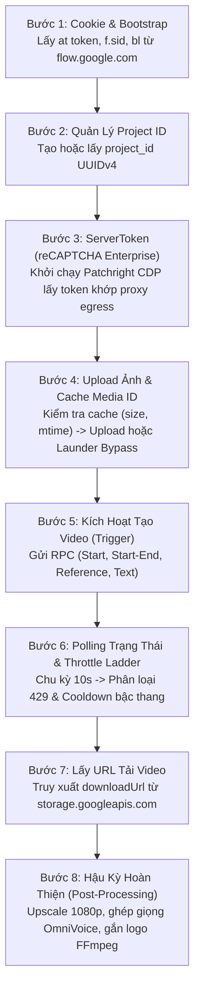

# Phân Tích Kiến Trúc & Thuật Toán Tạo Video Google Flow (AutoVeo3)

Tài liệu này tổng hợp chi tiết toàn bộ kiến trúc, quy trình vận hành, bảng tra cứu endpoint/RPC, cấu trúc payload và các thuật toán chống chặn (bypass) của phần mềm **AutoVeo3** khi tương tác với nền tảng **Google Flow** (Google Labs Veo 3.1).

---

## 1. Tổng Quan Kiến Trúc (Dual-API Approach)

Hệ thống AutoVeo3 sử dụng cơ chế truyền tải kép với 2 giao thức song song:

1. **Google Flow Batchexecute Protocol (Giao thức chính — `flow.google.com`)**:
   - Sử dụng cơ chế RPC boq chuẩn của Google qua endpoint `batchexecute`.
   - Dữ liệu gửi đi dưới dạng chuỗi JSON lồng nhau: `f.req=[[[rpcid, json_str, null, "generic"]]]&at=...`.
   - Ổn định nhất, là giao thức chính thức mà frontend Web Flow sử dụng.
2. **Google AISandbox PA REST API (Giao thức RESTful — `aisandbox-pa.googleapis.com`)**:
   - Sử dụng các API RESTful JSON chuẩn qua Bearer token / Session cookie.
   - Đi kèm các custom headers kiểm thực trình duyệt của Google (`x-browser-validation`, `x-browser-channel`).

---

## 2. Sơ Đồ Quy Trình Tạo Video (Workflow 8 Bước)



### Giải thích chi tiết các bước:

1. **Bước 1 — Cookie & Bootstrap**:
   - Phần mềm đọc cookie Google (`__Secure-1PSID`, `SID`, `HSID`, `SSID`, `APISID`, `SAPISID`).
   - Gửi yêu cầu `GET https://flow.google.com/` để trích xuất `window.WIZ_global_data`:
     - `SNlM0e`: Token bảo mật XSRF (`at`).
     - `FdrFJe`: Session ID (`f.sid`).
     - `cfb2h`: Build Label (`bl`), ví dụ `boq_flow-web-ui_20260901`.
     - `app`: Frontend app ID (`AiSandboxAngularFrontend`).
2. **Bước 2 — Quản lý Project**:
   - Đảm bảo phiên làm việc có `project_id` chuẩn định dạng UUIDv4. Nếu chưa có, kích hoạt RPC `jHPbke` (`create_project`).
3. **Bước 3 — Lấy Token reCAPTCHA Enterprise (`ServerToken`)**:
   - Trình duyệt ngầm `patchright` mở trang `https://flow.google.com/project/{project_id}`.
   - Thực thi sinh token cho action tương ứng (`VIDEO_GENERATION`, `UPLOAD_IMAGE`, `IMAGE_GENERATION`).
4. **Bước 4 — Chuẩn bị ảnh & Upload**:
   - Kiểm tra cache `media_id_cache` (dựa trên đường dẫn, kích thước file và thời gian sửa đổi).
   - Nếu chưa có, gửi qua RPC `maseQ` hoặc API REST `uploadImage`.
   - Nếu bị dính lỗi 429 trên cổng upload $\rightarrow$ chuyển sang cơ chế **Launder Upload Bypass**.
5. **Bước 5 — Kích hoạt tạo Video**:
   - Đóng gói dữ liệu prompt, aspect ratio, media ID vào payload RPC tương ứng.
   - Nhận về `operation_name` hoặc `media_name` (dạng `media/xxxx`).
6. **Bước 6 — Polling & Xử lý Rate Limit**:
   - Quét trạng thái mỗi 10 giây qua RPC `jwpduf` (hoặc `batchCheckAsyncVideoGenerationStatus`).
   - Quản lý lỗi HTTP 429 qua bảng bậc thang `throttle_ladder`.
7. **Bước 7 — Lấy link tải và Download**:
   - Gọi RPC `as29s` hoặc `uurnC` để lấy direct URL từ `storage.googleapis.com`.
   - Tải file video `.mp4` về thư mục tạm.
8. **Bước 8 — Hậu kỳ video**:
   - AI Upscale lên 1080p nếu cấu hình yêu cầu.
   - Ghép giọng đọc AI (OmniVoice) khớp thời lượng video bằng FFmpeg `atempo`.
   - Ghép chữ ký, watermark, logo, sticker lên video.

---

## 3. Danh Mục Endpoint & Bảng Mã RPC Google Flow

### 3.1. Google Flow Batchexecute (`flow.google.com`)

* **URL Request**:
  ```http
  POST https://flow.google.com/_/{app}/data/batchexecute?rpcids={rpcid}&source-path={source_path}&bl={bl}&f.sid={fsid}&hl=vi&_reqid={reqid}&rt=c
  ```
* **Headers**:
  ```http
  accept: */*
  content-type: application/x-www-form-urlencoded;charset=UTF-8
  origin: https://flow.google.com
  referer: https://flow.google.com/project/{project_id}
  user-agent: Mozilla/5.0 (Windows NT 10.0; Win64; x64) AppleWebKit/537.36 (KHTML, like Gecko) Chrome/144.0.0.0 Safari/537.36
  x-same-domain: 1
  ```
* **Body Form Data**:
  ```http
  f.req=[[["{rpcid}","{json_payload_string}",null,"generic"]]]&at={at_token}
  ```

#### Bảng tra cứu RPC ID (`flow.flow_batch_client.RPC`):

| Tên Logic | RPC ID | Action reCAPTCHA | Chức năng chính |
| :--- | :---: | :---: | :--- |
| `create_project` | `jHPbke` | — | Tạo Project ID mới |
| `delete_project` | `QI2zvc` | — | Xóa project |
| `list_projects` | `UpteDb` | — | Lấy danh sách project đã có |
| `get_project` | `ngNC2` | — | Lấy thông tin chi tiết project |
| `upload_image` | `maseQ` | `UPLOAD_IMAGE` | Upload ảnh nhị phân Base64 lên Google Flow |
| **`video_start`** | **`eb1hJf`** | `VIDEO_GENERATION` | **Tạo video từ 1 ảnh khởi đầu (Start Frame)** |
| **`video_start_end`** | **`nprQif`** | `VIDEO_GENERATION` | **Tạo video từ 2 ảnh (Start & End Frame Interpolation)** |
| **`video_reference`** | **`MZZa6b`** | `VIDEO_GENERATION` | **Tạo video từ ảnh tham chiếu người mẫu / sản phẩm (R2V)** |
| **`video_text`** | **`YhhmEf`** | `VIDEO_GENERATION` | **Tạo video thuần Text (Text-to-Video)** |
| **`video_extend`** | **`fZytfe`** | `VIDEO_GENERATION` | **Nối dài thêm video (Video Extend)** |
| **`video_upscale`** | **`p0UkFb`** | `VIDEO_GENERATION` | **Upscale video lên độ phân giải 1080p** |
| **`poll_status`** | **`jwpduf`** | — | **Polling kiểm tra tiến độ video** |
| `get_media` | `as29s` | — | Lấy metadata đối tượng media |
| `get_media_url` | `uurnC` | — | Lấy direct download link `.mp4` |
| `get_credits` | `nzlxg` | — | Lấy hạn mức credit / tier của account |
| `get_workflow` | `e1OaUd` | — | Lấy chi tiết workflow session |
| `get_workflows_batch` | `vrrFtb` | — | Lấy danh sách workflow theo lô |
| `get_models` | `HTrJv` | — | Lấy danh sách model khả dụng |
| `generate_images` | `ogiZ0b` | `IMAGE_GENERATION` | Sinh ảnh Imagen (dùng cho bypass launder) |

---

### 3.2. Google AISandbox PA REST API (`aisandbox-pa.googleapis.com`)

| Tên Endpoint | Method | URL Endpoint |
| :--- | :---: | :--- |
| **Upload Image** | POST | `https://aisandbox-pa.googleapis.com/v1/flow/uploadImage` |
| **Generate Start Image** | POST | `https://aisandbox-pa.googleapis.com/v1/video:batchAsyncGenerateVideoStartImage` |
| **Generate Start & End** | POST | `https://aisandbox-pa.googleapis.com/v1/video:batchAsyncGenerateVideoStartAndEndImage` |
| **Generate Reference** | POST | `https://aisandbox-pa.googleapis.com/v1/video:batchAsyncGenerateVideoReferenceImages` |
| **Extend Video** | POST | `https://aisandbox-pa.googleapis.com/v1/video:batchAsyncGenerateVideoExtendVideo` |
| **Check Status** | POST | `https://aisandbox-pa.googleapis.com/v1/video:batchCheckAsyncVideoGenerationStatus` |
| **Get Media Info** | GET | `https://aisandbox-pa.googleapis.com/v1/media/{media_name}` |

* **Headers Bắt Buộc của AISandbox**:
  ```http
  authorization: Bearer {token}
  content-type: text/plain;charset=UTF-8
  origin: https://labs.google
  referer: https://labs.google/
  x-browser-channel: stable
  x-browser-copyright: Copyright 2026 Google LLC. All Rights reserved.
  x-browser-validation: 6vBe6m53rjVWhApaDlVjSdbmJTE=
  x-browser-year: 2026
  ```

---

## 4. Chi Tiết Cấu Trúc Payload

Các payload của Batchexecute được chuẩn hóa thành mảng đa chiều như sau:

### 4.1. Tạo video từ 1 ảnh khởi đầu (RPC `eb1hJf`):
```python
[
  [None, None, [[[prompt]]]],
  model_key,       # "veo_3_1_fast" hoặc "veo_3_1_i2v_s_fast_portrait_ultra_fl"
  aspect_ratio,    # 1: Vuông (1:1), 2: Dọc (9:16), 3: Ngang (16:9)
  None,
  [None, first_media_id, None, None, None, None],
  [None, None, None, None, str(uuid.uuid4()).upper(), str(uuid.uuid4()).upper()]
]
```

### 4.2. Tạo video nội suy từ 2 ảnh Start & End (RPC `nprQif`):
```python
[
  [None, None, [[[prompt]]]],
  model_key,       # "veo_3_1_fast" hoặc "veo_3_1_interpolation_lite_low_priority"
  aspect_ratio,
  None,
  [None, first_media_id, None, None, None, None],
  [None, last_media_id, None, None, None, None],
  [None, None, None, None, str(uuid.uuid4()).upper(), str(uuid.uuid4()).upper()]
]
```

### 4.3. Tạo video từ ảnh tham chiếu R2V (RPC `MZZa6b`):
```python
[
  [None, None, [[[prompt]]]],
  [
    [None, media_id_model, None, None, None, None],
    [None, media_id_product, None, None, None, None]
  ],
  model_key,       # "veo_3_1_r2v_lite_low_priority"
  aspect_ratio,
  None,
  [None, None, None, None, str(uuid.uuid4()).upper(), str(uuid.uuid4()).upper()]
]
```

### 4.4. Nối dài video — Extend (RPC `fZytfe`):
```python
[
  [None, source_media_id],
  [None, None, [[[prompt]]]],
  model_key,       # "veo_3_1_extension_lite_low_priority"
  aspect_ratio,
  None,
  [None, None, None, None, str(uuid.uuid4()).upper(), str(uuid.uuid4()).upper()]
]
```

### 4.5. Upscale video lên 1080p (RPC `p0UkFb`):
```python
[
  [None, source_media_id],
  None,
  1,
  20770,
  [None, None, None, None, str(uuid.uuid4()).upper(), str(uuid.uuid4()).upper()],
  None,
  2, # resolution indicator (1: 720p, 2: 1080p, 3: 4K)
  None, ..., None, # 26 phần tử None
  "veo_3_1_upsampler_1080p"
]
```

---

## 5. Các Thuật Toán Cốt Lõi

### 5.1. Thuật toán vượt reCAPTCHA Enterprise (`ServerToken` + `LocalProxyBridge`)
* **Thách thức**: Google kiểm tra nghiêm ngặt tính toàn vẹn của token reCAPTCHA Enterprise. Nếu IP sinh reCAPTCHA khác IP gửi request RPC, Google lập tức chặn với mã lỗi `RESOURCE_EXHAUSTED` hoặc `PERMISSION_DENIED`.
* **Cơ chế hoạt động**:
  1. **CDP Fingerprint Injection**: Dùng thư viện `patchright` kết hợp `browserforge` để tiêm thông số WebGL, Canvas, AudioContext, User-Agent thật vào Chromium không đầu (headless).
  2. **Đồng bộ IP qua LocalProxyBridge**: Xây dựng một local TCP relay. Cả phiên Chromium ngầm và request Python đều kết nối qua cùng một cổng bridge trỏ về proxy của tài khoản, bảo đảm tuyệt đối trùng khớp egress IP.
  3. **Ràng buộc Token (Token Binding)**:
     Token được đóng gói vào object `FlowRecaptchaToken` có các thuộc tính:
     - `flow_action`: Khóa đúng action (`VIDEO_GENERATION`, `UPLOAD_IMAGE`).
     - `flow_project_id`: Khóa đúng UUID của dự án.
     - `flow_proxy_url`: Khóa proxy egress.
     - `claim_for_flow_request()`: Cơ chế khóa đơn dụng (single-use), chỉ cho phép 1 request tiêu thụ token, ngăn lỗi token tái sử dụng.

### 5.2. Thuật toán chống chặn TLS/JA3 Fingerprint (`safe_curl`)
* Không dùng `requests` hoặc `urllib` mặc định của Python (do có chữ ký TLS Client Hello đặc thù dễ bị bot-detection nhận diện).
* Nhúng trực tiếp module Rust **`pyreqwest_impersonate`** để giả lập chữ ký TLS, bộ cipher suite và HTTP/2 settings giống hệt Chrome thật (`chrome_126`, `safari_16`).

### 5.3. Thuật toán Quản lý Bậc Thang Rate Limit (`flow.throttle_ladder`)
* **Thang giãn cách trừng phạt (Cooldown Ladder)**:
  $$\text{COOLDOWN\_LADDER} = (10\text{s}, 30\text{s}, 120\text{s}, 600\text{s}, 1800\text{s})$$
* **Phân loại lỗi**:
  - `PUBLIC_ERROR_USER_REQUESTS_THROTTLED` $\rightarrow$ Xếp vào nhóm `THROTTLE`.
  - `UNUSUAL_ACTIVITY` $\rightarrow$ Phạt cách ly cố định 600 giây (`10 phút`).
* **Chiến thuật xử lý Worker**:
  - **Streak 1 (10s) & Streak 2 (30s)**: Do thời gian $\le 60$ giây $\rightarrow$ worker thực hiện **`retry_inline`** (ngủ tại chỗ trong thread và thử lại ngay).
  - **Streak $\ge 3$ (120s $\rightarrow$ 1800s)**: Thời gian $> 60$ giây $\rightarrow$ worker thực hiện **`defer_throttle`** (đưa job về lại hàng đợi để tài khoản khác thực hiện, đưa tài khoản hiện tại vào chế độ nghỉ).
* **Xoay vòng Model khi hết Quota (Model Rotation Fallback)**:
  - Khi model chính (`_F2F_FAST_MODEL = veo_3_1_i2v_s_fast_portrait_ultra_fl`) báo hết hạn mức trong ngày $\rightarrow$ tự động hạ cấp chuyển sang model thứ cấp (`_F2F_LOW_MODEL = veo_3_1_interpolation_lite_low_priority`) để tiếp tục tiến trình mà không làm gián đoạn hàng đợi.

### 5.4. Thuật toán "Rửa ảnh" Bypass 429 Upload (`flow.bypass_upload_429`)
* **Thách thức**: Google thường xuyên áp đặt rate-limit riêng cho endpoint upload ảnh (`maseQ` / `uploadImage`), khiến tài khoản không thể nạp ảnh mới dù quota tạo video vẫn còn.
* **Cơ chế "Rửa ảnh" (Image Laundering)**:
  - Khi gặp lỗi 429 upload, hàm `launder_upload` chuyển sang gọi RPC sinh ảnh `ogiZ0b` (`generate_images`) với ảnh gốc làm reference kèm prompt chuẩn:
    > *"Reproduce the reference image exactly as-is. Keep the identical subject, framing, crop, composition, camera angle, zoom level, background and all visual details. Do not zoom, pan, recrop, re-pose, or change anything about the content. If the reference has any added border, frame, padding, margin, or colored bars around the edges, remove them so the photo fills the frame edge-to-edge. Return an exact visual duplicate of the photo content with no surrounding border."*
  - Ảnh được tạo trực tiếp trên hạ tầng đám mây của Google, do đó hệ thống tự sinh một `media_id` nội bộ trong dự án mà **không cần thông qua endpoint upload ảnh đang bị chặn**.

### 5.5. Thuật toán Bộ Nhớ Đệm Media ID (`flow.media_id_cache`)
* Lưu trữ và tra cứu theo tuple duy nhất:
  $$( \text{image\_path},\, \text{file\_size},\, \text{mtime},\, \text{project\_id},\, \text{profile\_id} )$$
* Ngăn chặn hoàn toàn việc upload lại cùng 1 ảnh, triệt tiêu nguy cơ lãng phí băng thông và kích hoạt bộ đếm hạn mức của Google.

---

## 6. Danh Sách Các Model Google Veo Được Hỗ Trợ

| Mã Model Định Danh | Mục Đích Sử Dụng |
| :--- | :--- |
| `veo_3_1_fast` | Model tạo video nhanh mặc định |
| `veo_3_1_i2v_s_fast_portrait_ultra_fl` | Model Image-to-Video chất lượng cao cho khung hình dọc (9:16) |
| `veo_3_1_interpolation_lite_low_priority` | Model nội suy Start & End frame (mức ưu tiên thấp, dùng khi hết quota) |
| `veo_3_1_r2v_lite_low_priority` | Model Reference-to-Video tạo từ ảnh tham chiếu người mẫu/sản phẩm |
| `veo_3_1_extension_lite_low_priority` | Model nối dài thời lượng video (Extend) |
| `veo_3_1_upsampler_1080p` | Model AI nâng cấp độ nét video lên 1080p |

---

## 7. Thuật Toán Cào & Tải Ảnh Shopee Qua URL (`dlimages`)

Quy trình tự động hóa bóc tách ảnh chất lượng cao từ link Shopee nằm trong module `dlimages.cp312-win_amd64.pyd`.

### 7.1. Chiêu thức vượt rào chống cào (Bypass Shopee SPA Shell)
* **Vấn đề**: Shopee là nền tảng Single Page Application (React). Request bằng bot/curl thông thường chỉ nhận về HTML rỗng hoặc bị chặn HTTP 403 / Captcha DataDome.
* **Giải pháp**: Giả lập **Facebook Social Crawler** để kích hoạt máy chủ Shopee trả về trang **Server-Side Rendered (SSR pre-rendered)**:
  ```python
  CRAWLER_UA = "facebookexternalhit/1.1 (+http://www.facebook.com/externalhit_uatext.php)"
  FALLBACK_UAS = [
      "facebookexternalhit/1.1;line-poker/1.0",
      "WhatsApp/2.21.12.21 A"
  ]
  CRAWLER_HEADERS = {
      "User-Agent": CRAWLER_UA,
      "Accept": "text/html,application/xhtml+xml,application/xml;q=0.9,*/*;q=0.8",
      "Accept-Language": "vi-VN,vi;q=0.9,en;q=0.8"
  }
  ```
* **TLS Fingerprint Impersonation**: Nhúng thư viện Rust `pyreqwest_impersonate` giả lập chính xác chữ ký TLS/JA3 và giao thức HTTP/2 của Chrome 124 (`chrome_124`).

### 7.2. Chuẩn hóa link Shopee (`get_standard_shopee_url`)
* **Phân giải Redirect**: Nếu gặp link rút gọn (`s.shopee.vn`, `shp.ee`, `vn.shp.ee`), gửi request theo dõi redirect (`allow_redirects=True`) để lấy URL cuối cùng.
* **Bóc tách định danh**:
  - Regex SEO URL: `r'i\.(\d+)\.(\d+)'` $\rightarrow$ `(shop_id, item_id)`
  - Regex Direct URL: `r'product/(\d+)/(\d+)'` $\rightarrow$ `(shop_id, item_id)`
* **Chuẩn hóa link**: Đưa về dạng quy chuẩn `https://shopee.vn/product/{shop_id}/{item_id}` và ghi nhận vào cơ sở dữ liệu `shopee-affiliate.db`.

### 7.3. Thuật toán khôi phục ảnh gốc từ CDN Shopee (`_extract_product_images`)
* **Cắt bỏ bộ nén resize (`_norm`)**:
  Ảnh trên web Shopee bị nén kích thước nhỏ kèm tham số resize:
  `down-vn.img.susercontent.com/file/{image_hash}@resize_w900`
  Hàm `_norm()` dùng Regex bóc tách `image_hash` và loại bỏ đuôi `@resize_w\d+` để khôi phục URL ảnh gốc độ phân giải 1024x1024:
  `https://down-vn.img.susercontent.com/file/{image_hash}`
* **Lọc bỏ ảnh rác**: Dùng danh sách loại trừ để bỏ logo, icon, banner, huy hiệu thanh toán:
  `EXCLUDE_ALT_PATTERNS = ['logo', 'app', 'icon', 'visit shop', 'arrow', 'shopee', 'payment', 'badge', 'banner']`
* **Fallback OpenGraph**: Nếu thẻ `` không có, tự động fallback sang trích xuất `<meta property="og:image" content="...">`.
* **Giới hạn số ảnh**: Lọc trùng lặp và giữ lại tối đa `MAX_IMAGES_PER_PRODUCT = 3` ảnh rõ nhất.

### 7.4. Quy chuẩn lưu trữ & Cấu trúc thư mục
* Thư mục lưu sản phẩm:
  `video-resources/{shop_id}-{item_id}/images/`
* File ảnh chính dùng làm Start Frame cho Google Veo / Imagen:
  `001_product_source.jpg`
* File ảnh phụ: lưu kèm tên sản phẩm đã chuẩn hóa:
  `0000000_{product_name_sanitized}.jpg`

### 7.5. Kiểm soát tần suất (Rate Limiting & Retry Loop)
* `BATCH_SIZE = 10` sản phẩm / đợt.
* `STAGGER_DELAY = 0.8s – 1.5s` ngẫu nhiên giữa các request trong lô.
* `BATCH_DELAY = 2.0s – 4.0s` ngẫu nhiên giữa các đợt.
* Vòng lặp thử lại 3 lượt (`[L1]`, `[L2-Retry]`, `[L3-Retry]`):
  - Lỗi `HTTP 403`: Reset session, xoay vòng User-Agent sang `FALLBACK_UAS` (WhatsApp/Line), nghỉ `3s – 6s`.
  - Lỗi `HTTP 500`: Nghỉ 5s rồi thử lại.
  - Cập nhật trạng thái SQLite: `images_status = 'pending' | 'processing' | 'done' | 'failed'`.

---

## 8. Kiến Trúc Bản Quyền & Bảo Mật License (`license` & `license_crypto`)

Phần mềm sử dụng hệ thống bảo vệ bản quyền trực tuyến 3 lớp, biên dịch đóng gói qua Cython 3.2.9 (`.pyd`).

### 8.1. Các tầng mã hóa (Cryptography)
* **Khóa Master ràng buộc phần cứng (HWID)**:
  `get_master_key()` trích xuất mã nhận dạng máy tính (`machine_id`). Dùng Fernet đối xứng (AES-128-CBC + HMAC-SHA256) mã hóa dữ liệu license lưu cục bộ trên đĩa.
* **Chống giả mạo mạng (Certificate Pinning)**:
  Module `license_crypto.make_pinned_session()` tạo HTTP session với certificate pinning, ngăn chặn tuyệt đối các công cụ proxy/bắt gói tin (Fiddler, Charles, MITMProxy).
* **Bảo vệ toàn vẹn Request & Verdict**:
  - Request gửi lên máy chủ đi kèm chữ ký xác thực HMAC (`request_hmac`).
  - Phản hồi từ máy chủ (`signed_verdict`) phải qua bước xác thực chữ ký số ECDSA công khai bằng `license_crypto.verify_verdict()` trước khi được chấp nhận.

### 8.2. Cấu trúc License Verdict
Dữ liệu bản quyền lưu trữ các trường cốt lõi:
* `signature`: Định danh duy nhất của license key.
* `used_signatures`: Danh sách chữ ký đã kích hoạt (chống dùng chung key).
* `plan`: Gói bản quyền (`free_trial`, `pro`, `admin`).
* `limits`: Từ điển giới hạn tài nguyên (số luồng, số tài khoản tối đa).
* `runtime_config`: Cấu hình động do server đẩy xuống máy trạm.
* `expiry` / `expiry_date` / `days_left`: Thời hạn bản quyền.
* `machine_id`: Mã phần cứng máy đã đăng ký.

### 8.3. Giám sát định kỳ (LicenseBackgroundChecker & LicenseSentinel)
Vòng lặp ngầm `_check_loop` chạy xuyên suốt phiên làm việc, tự động xử lý 5 trường hợp vi phạm:
1. **Hết hạn (`expired`)**: Hiển thị popup `_show_expired_popup`, kích hoạt đóng ứng dụng `_force_close_app`.
2. **Bị thu hồi (`revoked`)**: Xóa file license trên máy (`_delete_license_file`) và tắt ứng dụng.
3. **Sai lệch phần cứng (`hw_mismatch`)**: Cảnh báo license bị sao chép sang máy khác.
4. **Phiên bản lỗi thời (`version_outdated`)**: Thông báo cập nhật bản mới.
5. **Lỗi kết nối server (`server_failure`)**: Đếm số lần thất bại, cho phép ân hạn ngắn trước khi cảnh báo.

### 8.4. Kiểm tra toàn vẹn ứng dụng (`_verify_integrity` & Guard)
* Quét mã băm SHA256 của `AutoVeo3.exe`, Python Native Runtime và `extension/manifest.json` đối chiếu với biên lai phát hành gốc `_autoveo3_release_receipt.json`.
* Đặt các điểm gác `verify_license_guard()` tại các hàm then chốt để phát hiện hành vi patch hoặc thay thế (shadowing) module license.

---

## 9. Khả Năng Hỗ Trợ Đa Thị Trường (VN, PH, MY, ID, SG, TH)

Hệ thống AutoVeo3 được thiết kế sẵn cấu trúc đa quốc gia:

### 9.1. Phân vùng thị trường trong Extension & Database
* **Danh mục sàn hỗ trợ trong Extension (`data/extension/background.js`)**:
  - `VN`: `shopee.vn`, `affiliate.shopee.vn`
  - `PH`: `shopee.ph`, `affiliate.shopee.ph`
  - `ID`: `shopee.co.id`, `affiliate.shopee.co.id`
  - `MY`: `shopee.com.my`, `affiliate.shopee.com.my`
  - `SG`: `shopee.sg`, `affiliate.shopee.sg`
  - `TH`: `shopee.co.th`, `affiliate.shopee.co.th`
* **Cột `region`**: Bảng SQLite `products` hỗ trợ lưu mã quốc gia tương ứng để xử lý tiền tệ (VND, PHP, MYR, IDR) và định tuyến request.

### 9.2. Tạo video đa ngôn ngữ với Google Veo 3.1
* **Chỉ thị hình ảnh**: Viết bằng tiếng Anh chuẩn (`Directives`, `Camera Specs`, `Timeline Action`).
* **Khớp khẩu hình & Âm thanh bản địa (`section_6_dialogue`)**:
  Google Veo 3.1 tự động tạo giọng nói và khớp chuyển động môi (lip-sync) theo khai báo trong prompt:
  ```json
  "section_6_dialogue": {
      "language": "English",
      "accent": "Filipino accent",
      "script": "<Dialogue_Script_Here>"
  }
  ```
* **Điều chỉnh thị trường**:
  - **Philippines (PH)**: Ngôn ngữ English / Tagalog, accent Filipino.
  - **Indonesia (ID)**: Ngôn ngữ Indonesian, accent Jakarta / Indonesian.
  - **Malaysia (MY)**: Ngôn ngữ Malay / Malaysian English.

